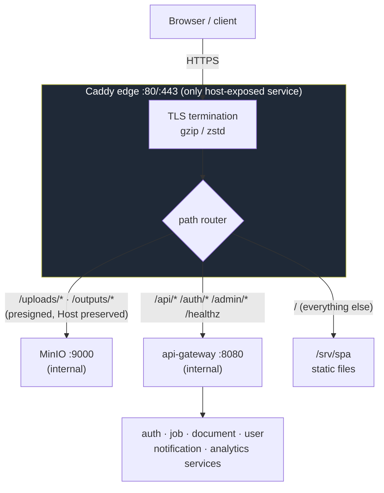
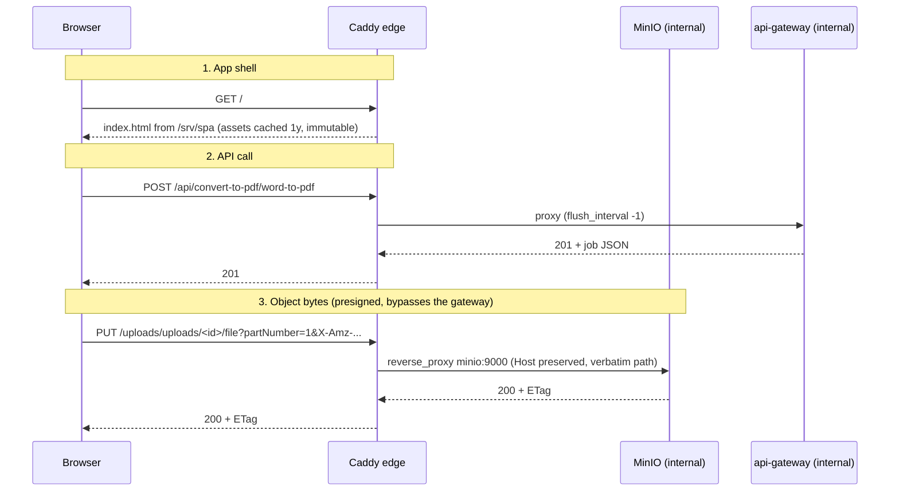

# Caddy Edge

The Caddy edge is the stack's **only host-exposed component** (ports 80/443) and
the public entrypoint for everything. It absorbs two responsibilities the
api-gateway used to carry in-process — serving the SPA and relaying object bytes
to MinIO — so file bandwidth no longer competes with API routing for the
gateway's CPU. Config: [`deployment/caddy/Caddyfile`](../../../deployment/caddy/Caddyfile); service: the `caddy` block in [`deployment/docker-compose.yml`](../../../deployment/docker-compose.yml).

## Responsibilities

1. **TLS termination** — plain HTTP on `:80` for local/dev; automatic HTTPS via
   Let's Encrypt in production (see [TLS modes](#tls-modes)).
2. **SPA static hosting** — serves the built frontend from `/srv/spa` with
   client-side-routing fallback.
3. **Object-byte routing** — proxies `/uploads/* /outputs/*` straight to
   `minio:9000` for presigned uploads/downloads (bytes never touch the gateway).
4. **API proxying** — forwards `/api/* /auth/* /admin/* /healthz` to
   `api-gateway:8080` on the internal network.

## Topology



`/metrics` is **intentionally not routed** — Prometheus scrapes services on the
internal network, so metrics are not internet-reachable.

## Request routing (sequence)



## Route rules (from the Caddyfile)

| Matcher | Paths | Upstream / action | Notes |
|---------|-------|-------------------|-------|
| `@objects` | `/{$S3_BUCKET_UPLOADS}/*`, `/{$S3_BUCKET_OUTPUTS}/*` (default `uploads`/`outputs`) | `reverse_proxy minio:9000` | `header_up Host {host}` (SigV4), `flush_interval -1`, no auth middleware — the presigned signature is the credential |
| `@api` | `/api/*`, `/auth/*`, `/admin/*`, `/healthz` | `reverse_proxy api-gateway:8080` | `flush_interval -1` for SSE streams |
| (fallback) | everything else | `file_server` from `/srv/spa` | `try_files {path} /index.html`; `/assets/*` served `Cache-Control: public, max-age=31536000, immutable` |

### Why Host preservation is load-bearing

Presigned SigV4 URLs are signed against the **public origin the browser uses**
(`PUBLIC_ORIGIN`, i.e. this edge), and the signature covers the `Host` header
and the canonical path. Caddy forwards the **original** `Host` (`header_up Host
{host}`) and the path **verbatim** to `minio:9000`; MinIO recomputes the
signature against what it receives. Rewriting the Host (or stripping the bucket
prefix) would invalidate every presigned URL. See
[object-storage.md](./object-storage.md#presigned-flow-through-the-caddy-edge-same-origin).

## TLS modes

The site address is `{$PUBLIC_DOMAIN::80}`:

- **`PUBLIC_DOMAIN` unset** → the container receives the compose default `:80`
  (`PUBLIC_DOMAIN: ${PUBLIC_DOMAIN:-:80}`) → **plain HTTP on :80** for local/dev.
  > The default is supplied by compose, not by Caddy's `{$VAR:default}` — compose
  > always defines the variable in the container, and Caddy's fallback only
  > applies to an *unset* variable, not a defined-but-empty one.
- **`PUBLIC_DOMAIN=docs.example.com`** → Caddy obtains and renews a certificate
  automatically (Let's Encrypt) and serves **HTTPS on :443** (with :80 redirect).
  Certificates persist in the `caddy_data` volume.

## Deployment

```yaml
caddy:
  image: caddy:2-alpine
  ports: ["80:80", "443:443"]        # the only published ports in the stack
  environment:
    PUBLIC_DOMAIN: ${PUBLIC_DOMAIN:-:80}
    S3_BUCKET_UPLOADS: ${S3_BUCKET_UPLOADS:-uploads}
    S3_BUCKET_OUTPUTS: ${S3_BUCKET_OUTPUTS:-outputs}
  volumes:
    - ./caddy/Caddyfile:/etc/caddy/Caddyfile:ro
    - ../../fyredocs_frontend/dist:/srv/spa:ro   # SPA build output
    - caddy_data:/data                            # certificates persist here
    - caddy_config:/config
  healthcheck:
    test: ["CMD", "wget", "-qO-", "http://localhost/healthz"]
  depends_on: [api-gateway, minio]
```

- The SPA build (`fyredocs_frontend/dist`) is bind-mounted read-only; rebuild the
  frontend and Caddy serves the new assets (immutable-cached under `/assets/*`).
- `S3_BUCKET_*` are passed so the `@objects` matcher tracks any non-default
  bucket names.
- Health: the edge's own `/healthz` proxies through to the gateway, so a healthy
  Caddy container also implies the gateway is reachable.

## Operational notes

- **Adapt errors are fatal & crash-loop.** Caddy validates the whole Caddyfile
  at startup; a bad global option or an empty site address makes it exit and
  restart. Check `docker compose logs caddy` for `adapting config … error`.
- **Local HTTPS**: leave `PUBLIC_DOMAIN` unset (plain HTTP) — Let's Encrypt
  can't issue for `localhost`.
- **Metrics**: not exposed at the edge by design; scrape services internally.

## Related documentation

- [Object Storage](./object-storage.md) — presigned flow, buckets, SigV4 Host preservation
- [API Gateway](../services/api-gateway.md) — the internal service behind the edge
- [Compose files layout](./compose-files.md) — where the edge fits in the stack
- [System overview diagram](../mermaid/system-overview.md)
