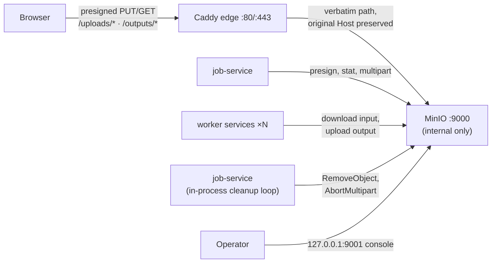

# Object Storage (MinIO)

All file bytes — raw uploads and processed outputs — live in S3-compatible
object storage (MinIO in the default deployment). The previous shared bind
mount (`../files/uploads`, `../files/outputs`) and the `volume-init` container
are gone: services are stateless with respect to files, which is what makes
worker replicas and multi-host deployment possible.

## Topology



The api-gateway is **not** in the object-byte path — it is internal-only and API-routing only. Object bytes flow browser → Caddy edge → MinIO.

- **`minio`** (pinned image, `minio/minio:RELEASE.2025-04-22T22-12-26Z`) runs
  with a named volume `minio_data`. Port `9000` (S3 API) is **not published**;
  only the admin console is exposed on `127.0.0.1:9001`.
- **`minio-init`** (`minio/mc`) is a one-shot bootstrap container: it creates
  the buckets, **clears any pre-existing bucket lifecycle rule** (retention is
  DB-driven, see below), and provisions the scoped application user. Every
  service that touches objects has
  `depends_on: minio-init: condition: service_completed_successfully`.
- Services authenticate with the **scoped app credentials**
  (`S3_ACCESS_KEY`/`S3_SECRET_KEY`), never the MinIO root user. The attached
  policy grants read/write/delete + multipart actions on the two fyredocs
  buckets only.

## Buckets and key scheme

| Bucket | Keys | Written by | Deleted by |
|--------|------|------------|------------|
| `uploads` | `uploads/<uploadId>/<fileName>` | browser (presigned PUT / multipart parts) | job-service cleanup loop |
| `outputs` | `jobs/<jobId>/<outputName>` | worker services | job-service cleanup loop (DB-driven only) |

`file_metadata.path` stores the **object key** (no leading `/`). The `kind`
column selects the bucket: `input` → uploads, `output` → outputs. Rows whose
path still begins with `/` are legacy filesystem paths from before the
migration — the cleanup loop skips them and they are moved by the one-off
script [`scripts/migrate-files-to-minio.sh`](../../../scripts/migrate-files-to-minio.sh)
(dry-run by default, `--execute` to apply).

## Presigned flow through the Caddy edge (same-origin)

Browsers never talk to MinIO directly. `job-service` presigns URLs against
`S3_PUBLIC_ENDPOINT` — the **public origin browsers actually use**
(`${PUBLIC_ORIGIN:-http://localhost}`, i.e. the **Caddy edge**). The edge
reverse-proxies the two bucket path prefixes straight to MinIO (see the
`@objects` route in `deployment/caddy/Caddyfile`):

```
PUT  https://<origin>/uploads/uploads/<id>/<file>?uploadId=…&partNumber=…&X-Amz-…
GET  https://<origin>/outputs/jobs/<jobId>/<file>?X-Amz-…
```

Two properties of the edge route are **load-bearing for SigV4**:

1. **Path forwarded verbatim** — no prefix stripping; the signature covers
   the canonical path `/{bucket}/{key}`.
2. **Host header preserved** — SigV4 includes `Host` in the signed canonical
   request. The URL was signed for the edge origin, so Caddy forwards the
   *original* `Host` header (`header_up Host {host}`) instead of rewriting it
   to `minio:9000`. MinIO recomputes the signature against the received Host;
   a rewritten Host would invalidate every presigned URL.

The bucket route needs no auth middleware (the signature is the credential),
has no application body-size limit (file bytes flow here), and streams with
`flush_interval -1` so large multipart parts pass through without buffering.
The api-gateway is not involved — it is internal-only and never sees object
bytes. `/api/upload/*` on the gateway is JSON-only (init/complete/parts) under
the standard 1 MiB body limit.

Benefits of same-origin routing at the edge: no CORS configuration on MinIO,
HttpOnly cookies keep working, one TLS certificate, no extra public port.

## Retention — DB-driven, no bucket lifecycle rules

There are **no MinIO bucket expiry lifecycle rules** on either bucket.
`minio-init` explicitly clears any pre-existing rule (`mc ilm rule remove
--all`) so a stale bucket-side expiry can't wipe inputs early. Retention is
**entirely DB-driven** by job-service's in-process cleanup loop, keyed off each
job's `expires_at` (per-plan TTLs), so free/pro inputs and outputs live exactly
as long as their job — a fixed bucket-age rule could not express that.

- `uploads`: no bucket rule. A never-consumed upload is reaped by the cleanup
  loop once its Redis session passes 2× `UPLOAD_TTL`; incomplete multipart
  uploads older than 24h are aborted by the loop's `abortStaleMultipartUploads`
  phase (not a bucket `AbortIncompleteMultipartUpload` rule).
- `outputs`: no bucket rule. Deletion is DB-driven — the cleanup loop removes
  the object when the owning `processing_jobs` row passes `expires_at`.

The cleanup loop is the single mechanism keeping storage bounded:

- expired job → `RemoveObject` per `file_metadata` row (input + output);
- expired Redis upload session → `AbortMultipart` (when the session has an
  `s3UploadId`) and `RemoveObject` for the never-consumed object (consumption
  is checked via `file_metadata WHERE path = <key>`);
- `abortStaleMultipartUploads`: `ListIncompleteUploads(uploads, 24h)` →
  `AbortMultipart` each, every cycle under the same distributed lock.

## Multi-host deployment

The single-host default keeps MinIO entirely private behind the Caddy edge. To
split hosts (or move to AWS S3/R2):

1. **Publish the S3 endpoint** (or use the provider's endpoint): expose port
   `9000` behind TLS, e.g. `https://s3.example.com`.
2. **Flip `S3_PUBLIC_ENDPOINT`** on job-service to that public origin.
   Presigned URLs are then signed for — and fetched directly from — the
   storage host; the edge's `/uploads /outputs` route becomes unused (it can
   stay, it is inert without traffic).
3. Configure CORS on the bucket for the app origin (only needed once browsers
   talk to storage cross-origin).
4. Workers/cleanup keep using the internal `S3_ENDPOINT`; nothing else
   changes because `shared/storage` separates the internal client from the
   public presigning client.

Swapping MinIO for AWS S3/R2 is an env-var change (`S3_ENDPOINT`,
`S3_REGION`, credentials); `shared/storage` carries no MinIO-specific logic.

## Scaling notes

- **Workers are horizontally scalable** now that no shared filesystem exists:
  `convert-to-pdf` ships with `deploy.replicas: 2` as the example. Resource
  limits are **per replica** (2 × 1G/2cpu = 2G/4cpu budget). Workers get a
  `tmpfs /tmp (1g)` for conversion scratch space — subprocess tools
  (LibreOffice, Ghostscript…) need real local files, which are downloaded
  from and uploaded back to MinIO per job.
- **NATS payloads are keys, not bytes**: `JOBS_DISPATCH` enforces
  `MaxMsgSize=64KiB` and `MaxBytes=1GiB`; the other streams cap at 256 MiB
  (`shared/natsconn`).
- MinIO itself scales vertically here (1G/1cpu limits); for real load move to
  distributed MinIO or a managed object store.

## Environment variables (consumed by `shared/storage`)

| Variable | Default | Purpose |
|----------|---------|---------|
| `S3_ENDPOINT` | — (required) | Internal data-plane endpoint, e.g. `minio:9000` |
| `S3_PUBLIC_ENDPOINT` | falls back to `S3_ENDPOINT` | Origin presigned URLs are signed for (the Caddy edge / public origin) |
| `S3_ACCESS_KEY` / `S3_SECRET_KEY` | — (required) | Scoped app credentials created by `minio-init` |
| `S3_USE_SSL` | `false` | TLS to the internal endpoint |
| `S3_BUCKET_UPLOADS` | `uploads` | Raw upload bucket |
| `S3_BUCKET_OUTPUTS` | `outputs` | Processed output bucket |
| `S3_REGION` | `us-east-1` | Pins SigV4 signing region (MinIO ignores it) |

Edge-only: the object-byte upstream (`minio:9000`) is set in
`deployment/caddy/Caddyfile`, not via an env var — the api-gateway has no
`MINIO_URL`. Job-service-only: `UPLOAD_PART_SIZE_MB` (default `8`) — presigned
multipart part size.

Compose/`minio-init`-only (not read by services): `MINIO_IMAGE`,
`MINIO_MC_IMAGE` (pinned image tags). There are no uploads-bucket lifecycle env
vars — retention is DB-driven (see above). Every value above has a compose
default — nothing is hardcoded; all are overridable from the root `.env` (the
single env file `deploy.sh` loads).

## Related documentation

- [Caddy edge](../../../deployment/caddy/Caddyfile) — the `/uploads /outputs` object-byte routes
- [API Gateway](../services/api-gateway.md) — internal API routing (no object bytes)
- [Job Service](../services/job-service.md#background-cleanup-loop) — in-process cleanup: object deletion phases
- [System overview diagram](../mermaid/system-overview.md)
