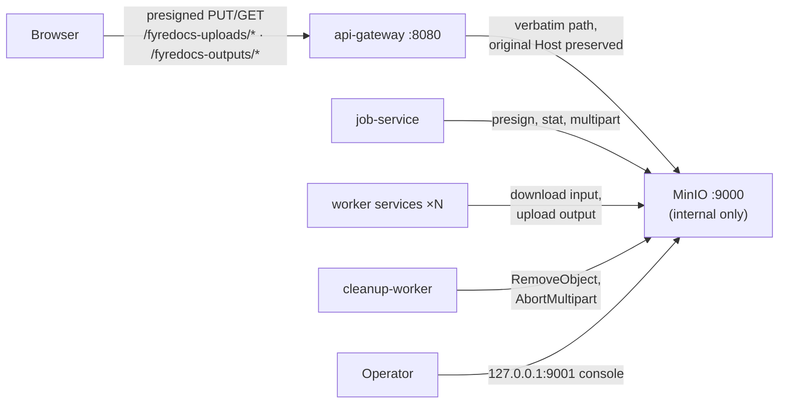

# Object Storage (MinIO)

All file bytes — raw uploads and processed outputs — live in S3-compatible
object storage (MinIO in the default deployment). The previous shared bind
mount (`../files/uploads`, `../files/outputs`) and the `volume-init` container
are gone: services are stateless with respect to files, which is what makes
worker replicas and multi-host deployment possible.

## Topology



- **`minio`** (pinned image, `minio/minio:RELEASE.2025-04-22T22-12-26Z`) runs
  with a named volume `minio_data`. Port `9000` (S3 API) is **not published**;
  only the admin console is exposed on `127.0.0.1:9001`.
- **`minio-init`** (`minio/mc`) is a one-shot bootstrap container: it creates
  the buckets, applies lifecycle rules, and provisions the scoped application
  user. Every service that touches objects has
  `depends_on: minio-init: condition: service_completed_successfully`.
- Services authenticate with the **scoped app credentials**
  (`S3_ACCESS_KEY`/`S3_SECRET_KEY`), never the MinIO root user. The attached
  policy grants read/write/delete + multipart actions on the two fyredocs
  buckets only.

## Buckets and key scheme

| Bucket | Keys | Written by | Deleted by |
|--------|------|------------|------------|
| `fyredocs-uploads` | `uploads/<uploadId>/<fileName>` | browser (presigned PUT / multipart parts) | lifecycle (2 d) + cleanup-worker |
| `fyredocs-outputs` | `jobs/<jobId>/<outputName>` | worker services | cleanup-worker (DB-driven only) |

`file_metadata.path` stores the **object key** (no leading `/`). The `kind`
column selects the bucket: `input` → uploads, `output` → outputs. Rows whose
path still begins with `/` are legacy filesystem paths from before the
migration — the cleanup-worker skips them and they are moved by the one-off
script [`scripts/migrate-files-to-minio.sh`](../../../scripts/migrate-files-to-minio.sh)
(dry-run by default, `--execute` to apply).

## Presigned flow through the gateway (same-origin)

Browsers never talk to MinIO directly. `job-service` presigns URLs against
`S3_PUBLIC_ENDPOINT` — the **public origin browsers actually use** (default
`http://localhost:8080`, i.e. the api-gateway). The gateway reverse-proxies
the two bucket path prefixes straight to MinIO:

```
PUT  https://<origin>/fyredocs-uploads/uploads/<id>/<file>?uploadId=…&partNumber=…&X-Amz-…
GET  https://<origin>/fyredocs-outputs/jobs/<jobId>/<file>?X-Amz-…
```

Two properties of the proxy are **load-bearing for SigV4**:

1. **Path forwarded verbatim** — no prefix stripping; the signature covers
   the canonical path `/{bucket}/{key}`.
2. **Host header preserved** — SigV4 includes `Host` in the signed canonical
   request. The URL was signed for the gateway origin, so the gateway forwards
   the *original* `Host` header instead of rewriting it to `minio:9000` (which
   the gateway's service routes do). MinIO recomputes the signature against
   the received Host; a rewritten Host would invalidate every presigned URL.

The bucket routes additionally bypass auth middleware (the signature is the
credential), have **no body-size limit** (file bytes flow here), strip
client-supplied identity headers, stream with `FlushInterval=-1`, and use a
transport with `MaxIdleConnsPerHost=50` because multipart parts arrive in
parallel. With the presigned flow in place, `/api/upload/*` is JSON-only
(init/complete) and now gets the standard 1 MiB body limit.

Benefits of same-origin proxying: no CORS configuration on MinIO, HttpOnly
cookies keep working, one TLS certificate, no extra public port.

## Lifecycle rules

Applied by `minio-init` via `mc ilm import` (the `mc ilm rule add` CLI has no
flag for aborting incomplete multipart uploads, so the full document is
imported):

```json
{"Rules":[{
  "ID": "expire-stale-uploads",
  "Status": "Enabled",
  "Filter": {"Prefix": ""},
  "Expiration": {"Days": 2},
  "AbortIncompleteMultipartUpload": {"DaysAfterInitiation": 1}
}]}
```

- `fyredocs-uploads`: objects expire after `UPLOAD_EXPIRE_DAYS` (**default 2**);
  incomplete multipart uploads are aborted after `UPLOAD_ABORT_INCOMPLETE_DAYS`
  (**default 1**). Uploads are consumed into jobs within minutes, so anything
  older is abandoned. Both are set on `minio-init` and overridable via the
  deployment `.env`.
- `fyredocs-outputs`: **no lifecycle rule.** Pro-plan outputs never expire;
  deletion is exclusively DB-driven (cleanup-worker removes the object when
  the owning `processing_jobs` row passes `expires_at`).

The cleanup-worker provides defense in depth ahead of the lifecycle backstop:

- expired job → `RemoveObject` per `file_metadata` row (input + output);
- expired Redis upload session → `AbortMultipart` (when the session has an
  `s3UploadId`) and `RemoveObject` for the never-consumed object (consumption
  is checked via `file_metadata WHERE path = <key>`);
- `abortStaleMultipartUploads`: `ListIncompleteUploads(uploads, 24h)` →
  `AbortMultipart` each, every cycle under the same distributed lock.

## Multi-host deployment

The single-host default keeps MinIO entirely private behind the gateway. To
split hosts (or move to AWS S3/R2):

1. **Publish the S3 endpoint** (or use the provider's endpoint): expose port
   `9000` behind TLS, e.g. `https://s3.example.com`.
2. **Flip `S3_PUBLIC_ENDPOINT`** on job-service to that public origin.
   Presigned URLs are then signed for — and fetched directly from — the
   storage host; the gateway bucket proxy becomes unused (it can stay, it is
   inert without traffic).
3. Configure CORS on the bucket for the app origin (only needed once browsers
   talk to storage cross-origin).
4. Workers/cleanup keep using the internal `S3_ENDPOINT`; nothing else
   changes because `shared/storage` separates the internal client from the
   public presigning client.

Swapping MinIO for AWS S3/R2 is an env-var change (`S3_ENDPOINT`,
`S3_REGION`, credentials); `shared/storage` carries no MinIO-specific logic.

## Scaling notes

- **Workers are horizontally scalable** now that no shared filesystem exists:
  `convert-to-pdf` ships with `deploy.replicas: 2` as the example. Resource
  limits are **per replica** (2 × 1G/2cpu = 2G/4cpu budget). Workers get a
  `tmpfs /tmp (1g)` for conversion scratch space — subprocess tools
  (LibreOffice, Ghostscript…) need real local files, which are downloaded
  from and uploaded back to MinIO per job.
- **NATS payloads are keys, not bytes**: `JOBS_DISPATCH` enforces
  `MaxMsgSize=64KiB` and `MaxBytes=1GiB`; the other streams cap at 256 MiB
  (`shared/natsconn`).
- MinIO itself scales vertically here (1G/1cpu limits); for real load move to
  distributed MinIO or a managed object store.

## Environment variables (consumed by `shared/storage`)

| Variable | Default | Purpose |
|----------|---------|---------|
| `S3_ENDPOINT` | — (required) | Internal data-plane endpoint, e.g. `minio:9000` |
| `S3_PUBLIC_ENDPOINT` | falls back to `S3_ENDPOINT` | Origin presigned URLs are signed for (the gateway / public origin) |
| `S3_ACCESS_KEY` / `S3_SECRET_KEY` | — (required) | Scoped app credentials created by `minio-init` |
| `S3_USE_SSL` | `false` | TLS to the internal endpoint |
| `S3_BUCKET_UPLOADS` | `fyredocs-uploads` | Raw upload bucket |
| `S3_BUCKET_OUTPUTS` | `fyredocs-outputs` | Processed output bucket |
| `S3_REGION` | `us-east-1` | Pins SigV4 signing region (MinIO ignores it) |

Gateway-only: `MINIO_URL` (default `http://minio:9000`) — upstream for the
bucket proxy routes. Job-service-only: `UPLOAD_PART_SIZE_MB` (default `8`) —
presigned multipart part size.

Compose/`minio-init`-only (not read by services): `MINIO_IMAGE`,
`MINIO_MC_IMAGE` (pinned image tags), `UPLOAD_EXPIRE_DAYS` (default `2`) and
`UPLOAD_ABORT_INCOMPLETE_DAYS` (default `1`) for the uploads-bucket lifecycle.
Every value above has a compose default — nothing is hardcoded; all are
overridable from `deployment/.env`.

## Related documentation

- [API Gateway](../services/API_GATEWAY.md) — bucket proxy routes
- [Cleanup Worker](../services/CLEANUP_WORKER.md) — object deletion phases
- [System overview diagram](../mermaid/system-overview.md)
