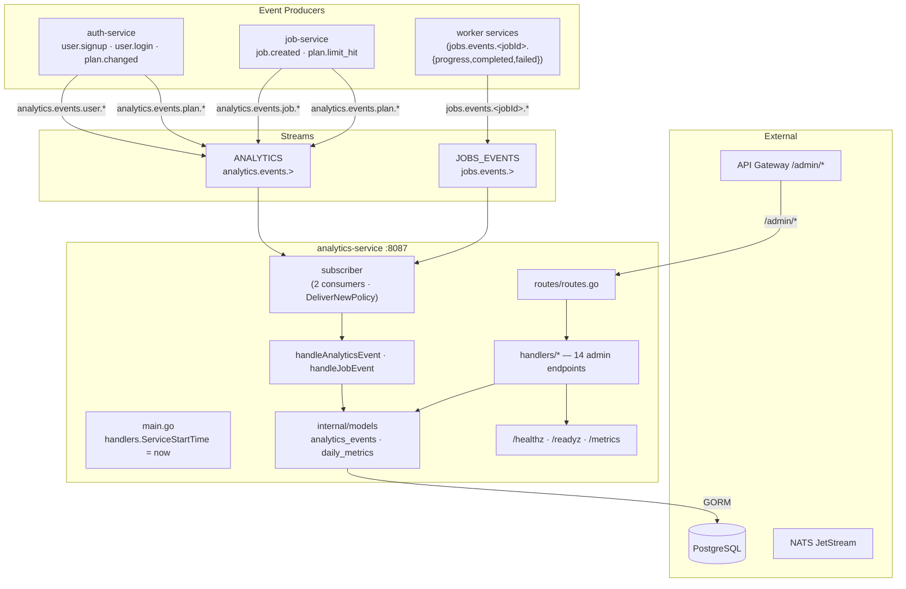
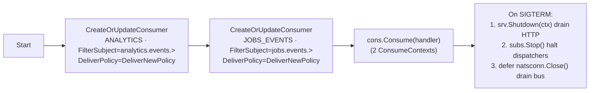
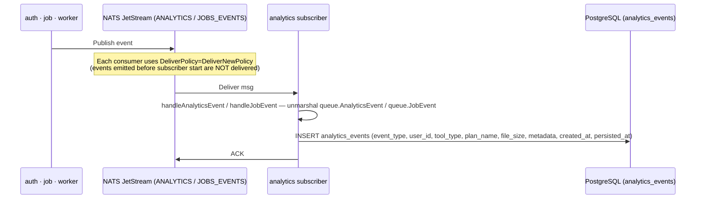
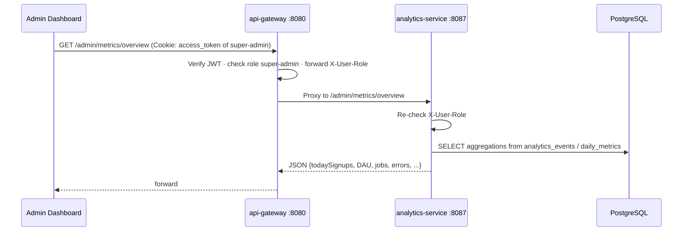
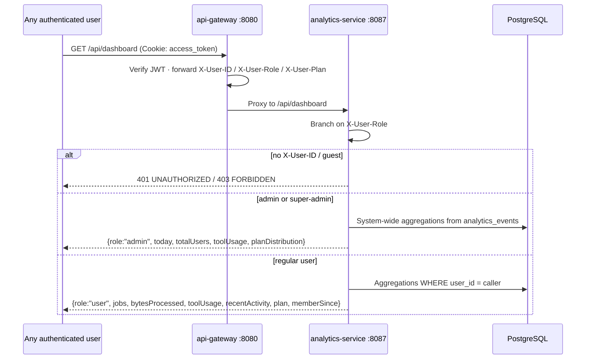

# Analytics Service — Architecture Diagram

```mermaid
graph TB
    subgraph "analytics-service :8087"
        MAIN["main.go<br/>handlers.ServiceStartTime = now"]
        SUB["subscriber<br/>(2 consumers · DeliverNewPolicy)"]
        DISPATCHER["handleAnalyticsEvent · handleJobEvent"]
        HANDLERS["handlers/* — 14 admin endpoints"]
        ROUTES["routes/routes.go"]
        MODELS["internal/models<br/>analytics_events · daily_metrics"]
        STARTPROBE["/healthz · /readyz · /metrics"]
    end

    subgraph "External"
        PG[(PostgreSQL)]
        NATS["NATS JetStream"]
        GW["API Gateway /admin/*"]
    end

    subgraph "Streams"
        AN["ANALYTICS<br/>analytics.events.>"]
        JE["JOBS_EVENTS<br/>jobs.events.>"]
    end

    subgraph "Event Producers"
        AUTH["auth-service<br/>user.signup · user.login · plan.changed"]
        JOB["job-service<br/>job.created · plan.limit_hit"]
        WORKERS["worker services<br/>(jobs.events.&lt;jobId&gt;.{progress,completed,failed})"]
    end

    AUTH -->|analytics.events.user.*| AN
    AUTH -->|analytics.events.plan.*| AN
    JOB  -->|analytics.events.job.*| AN
    JOB  -->|analytics.events.plan.*| AN
    WORKERS -->|jobs.events.&lt;jobId&gt;.*| JE

    AN --> SUB
    JE --> SUB
    SUB --> DISPATCHER --> MODELS
    MODELS -->|GORM| PG

    GW -->|/admin/*| ROUTES
    ROUTES --> HANDLERS
    HANDLERS --> MODELS
    HANDLERS --> STARTPROBE
```

## Subscriber Lifecycle

```mermaid
flowchart LR
    A["Start"] --> B["CreateOrUpdateConsumer<br/>ANALYTICS · FilterSubject=analytics.events.&gt;<br/>DeliverPolicy=DeliverNewPolicy"]
    B --> C["CreateOrUpdateConsumer<br/>JOBS_EVENTS · FilterSubject=jobs.events.&gt;<br/>DeliverPolicy=DeliverNewPolicy"]
    C --> D["cons.Consume(handler)<br/>(2 ConsumeContexts)"]
    D --> E["On SIGTERM:<br/>1. srv.Shutdown(ctx) drain HTTP<br/>2. subs.Stop() halt dispatchers<br/>3. defer natsconn.Close() drain bus"]
```

## Event → Persistence

```mermaid
sequenceDiagram
    participant Producer as auth · job · worker
    participant NATS as NATS JetStream (ANALYTICS / JOBS_EVENTS)
    participant Sub as analytics subscriber
    participant DB as PostgreSQL (analytics_events)

    Producer->>NATS: Publish event
    Note over NATS: Each consumer uses DeliverPolicy=DeliverNewPolicy<br/>(events emitted before subscriber start are NOT delivered)
    NATS->>Sub: Deliver msg
    Sub->>Sub: handleAnalyticsEvent / handleJobEvent — unmarshal queue.AnalyticsEvent / queue.JobEvent
    Sub->>DB: INSERT analytics_events (event_type, user_id, tool_type, plan_name, file_size, metadata, created_at, persisted_at)
    Sub->>NATS: ACK
```

## Admin Read Path

```mermaid
sequenceDiagram
    participant Admin as Admin Dashboard
    participant GW as api-gateway :8080
    participant AS as analytics-service :8087
    participant DB as PostgreSQL

    Admin->>GW: GET /admin/metrics/overview (Cookie: access_token of super-admin)
    GW->>GW: Verify JWT · check role super-admin · forward X-User-Role
    GW->>AS: Proxy to /admin/metrics/overview
    AS->>AS: Re-check X-User-Role
    AS->>DB: SELECT aggregations from analytics_events / daily_metrics
    AS-->>GW: JSON {todaySignups, DAU, jobs, errors, ...}
    GW-->>Admin: forward
```

## Unified Dashboard Read Path (role-aware)

```mermaid
sequenceDiagram
    participant U as Any authenticated user
    participant GW as api-gateway :8080
    participant AS as analytics-service :8087
    participant DB as PostgreSQL

    U->>GW: GET /api/dashboard (Cookie: access_token)
    GW->>GW: Verify JWT · forward X-User-ID / X-User-Role / X-User-Plan
    GW->>AS: Proxy to /api/dashboard
    AS->>AS: Branch on X-User-Role
    alt no X-User-ID / guest
        AS-->>U: 401 UNAUTHORIZED / 403 FORBIDDEN
    else admin or super-admin
        AS->>DB: System-wide aggregations from analytics_events
        AS-->>U: {role:"admin", today, totalUsers, toolUsage, planDistribution}
    else regular user
        AS->>DB: Aggregations WHERE user_id = caller
        AS-->>U: {role:"user", jobs, bytesProcessed, toolUsage, recentActivity, plan, memberSince}
    end
```
