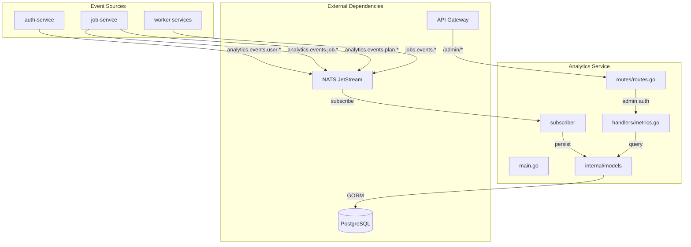
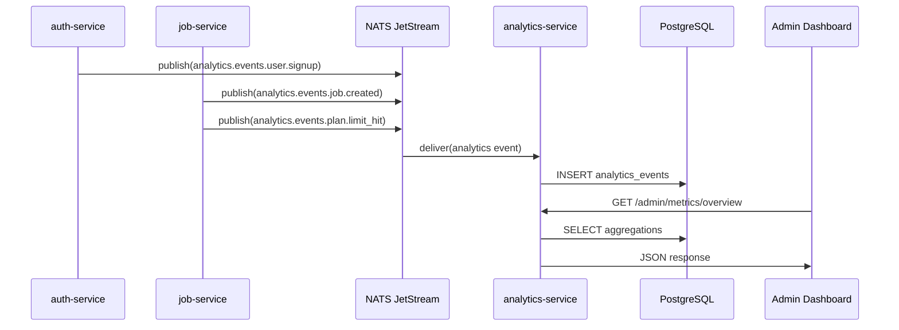

# Analytics Service — Architecture Diagram

```mermaid
graph TB
    subgraph "Analytics Service"
        MAIN[main.go]
        SUB[subscriber]
        HANDLERS[handlers/metrics.go]
        ROUTES[routes/routes.go]
        MODELS[internal/models]
    end

    subgraph "External Dependencies"
        PG[(PostgreSQL)]
        NATS[NATS JetStream]
        GW[API Gateway]
    end

    subgraph "Event Sources"
        AUTH[auth-service]
        JOB[job-service]
        WORKERS[worker services]
    end

    AUTH -->|analytics.events.user.*| NATS
    JOB -->|analytics.events.job.*| NATS
    JOB -->|analytics.events.plan.*| NATS
    WORKERS -->|jobs.events.*| NATS

    NATS -->|subscribe| SUB
    SUB -->|persist| MODELS
    MODELS -->|GORM| PG

    GW -->|/admin/*| ROUTES
    ROUTES -->|admin auth| HANDLERS
    HANDLERS -->|query| MODELS
```

## Data Flow

```mermaid
sequenceDiagram
    participant Auth as auth-service
    participant Job as job-service
    participant NATS as NATS JetStream
    participant Analytics as analytics-service
    participant DB as PostgreSQL
    participant Admin as Admin Dashboard

    Auth->>NATS: publish(analytics.events.user.signup)
    Job->>NATS: publish(analytics.events.job.created)
    Job->>NATS: publish(analytics.events.plan.limit_hit)

    NATS->>Analytics: deliver(analytics event)
    Analytics->>DB: INSERT analytics_events

    Admin->>Analytics: GET /admin/metrics/overview
    Analytics->>DB: SELECT aggregations
    Analytics->>Admin: JSON response
```
