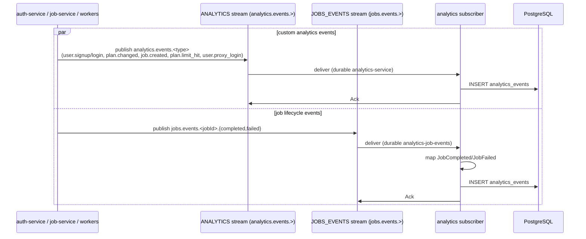
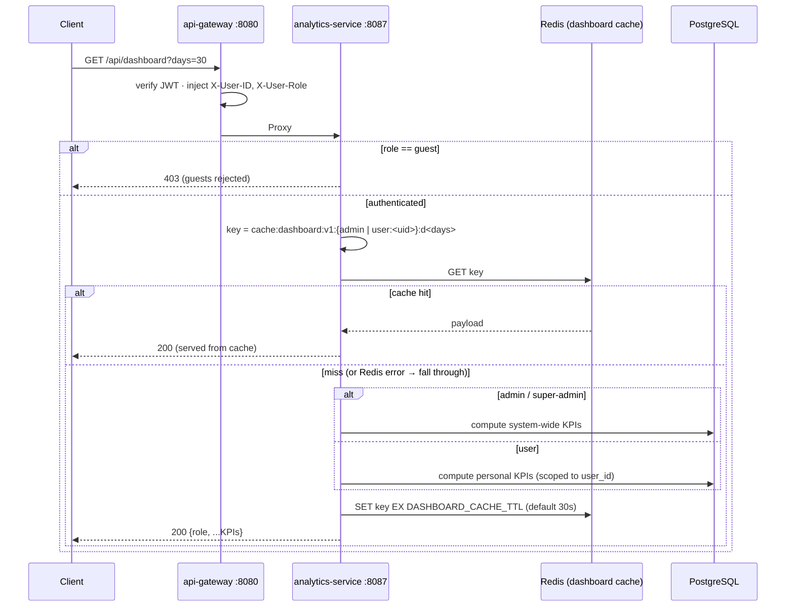
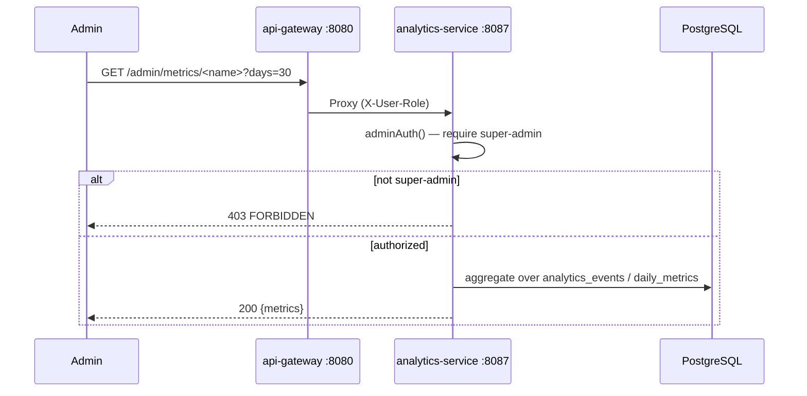

# Analytics Service -- Sequence Diagrams

Request and event flows through the `analytics-service` (port 8087). It ingests events from two NATS streams and serves role-aware dashboards + super-admin metrics.

## Event Ingestion (NATS subscribers)

## Unified Dashboard (role-aware, cached)

## Admin Metrics Query (super-admin)

