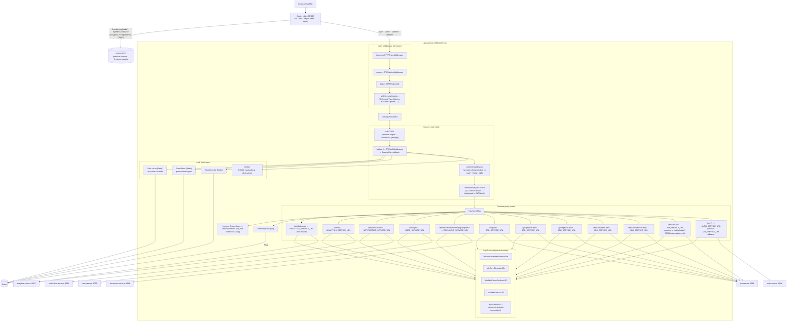
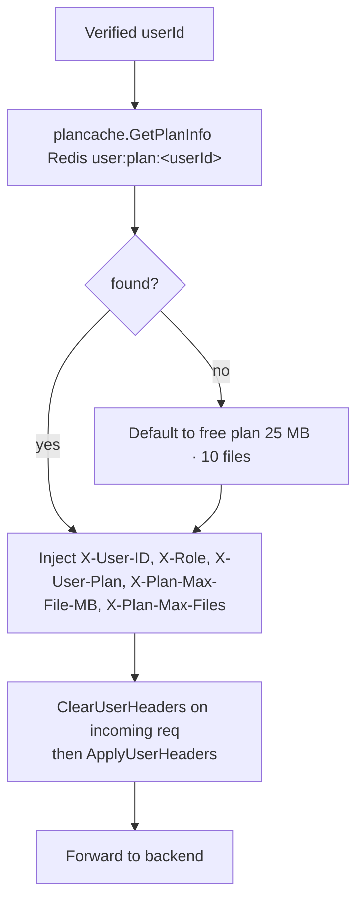
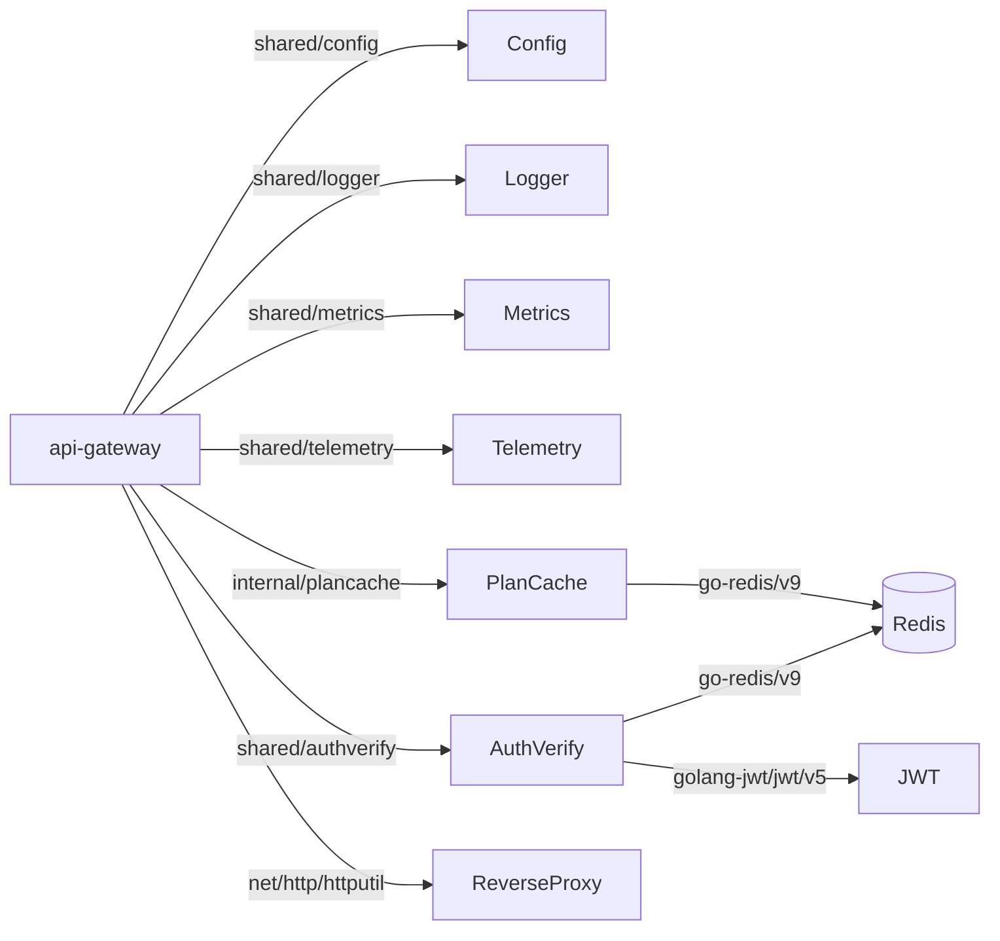

# API Gateway -- Architecture

Internal structure and component diagram of the `api-gateway` service (port 8080, internal-only).

The public edge is **Caddy** (`deployment/caddy/Caddyfile`, :80/:443): it terminates TLS, serves the SPA, routes presigned object paths (`/fyredocs-uploads/*`, `/fyredocs-outputs/*`) directly to MinIO, and proxies `/api/*`, `/auth/*`, `/admin/*`, `/healthz` to this gateway. The gateway no longer serves the SPA or relays MinIO bytes.

## Component Diagram

## Middleware Execution Order

```mermaid
flowchart LR
    A[Incoming Request<br/>via Caddy edge] --> B[telemetry.<br/>HTTPTraceMiddleware]
    B --> C[metrics.<br/>HTTPMetricsMiddleware]
    C --> D[logger.<br/>HTTPRequestID]
    D --> E[withSecurityHeaders]
    E --> F[withCORS<br/>preflight short-circuit]
    F --> G[authverify.<br/>HTTPAuthMiddleware<br/>+ ResolvePlan]
    G --> RL[ratelimit.Middleware<br/>per-plan /api/* · 429]
    RL --> H[withMaxBodySize 1 MiB<br/>all service routes]
    H --> I[http.ServeMux<br/>route match]
    I --> J[httputil.<br/>ReverseProxy<br/>FlushInterval=-1]
    J --> K[Backend Service]
```

Presigned object traffic (`/fyredocs-uploads/*`, `/fyredocs-outputs/*`) is routed by Caddy directly to MinIO and never enters this chain.

## Plan Header Injection

## Dependency Graph

