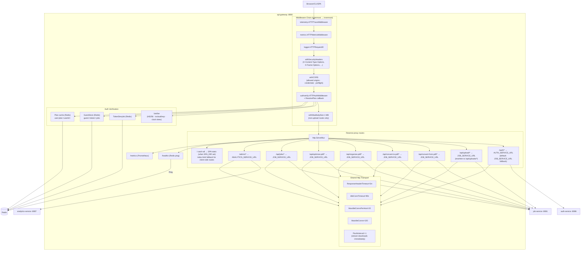
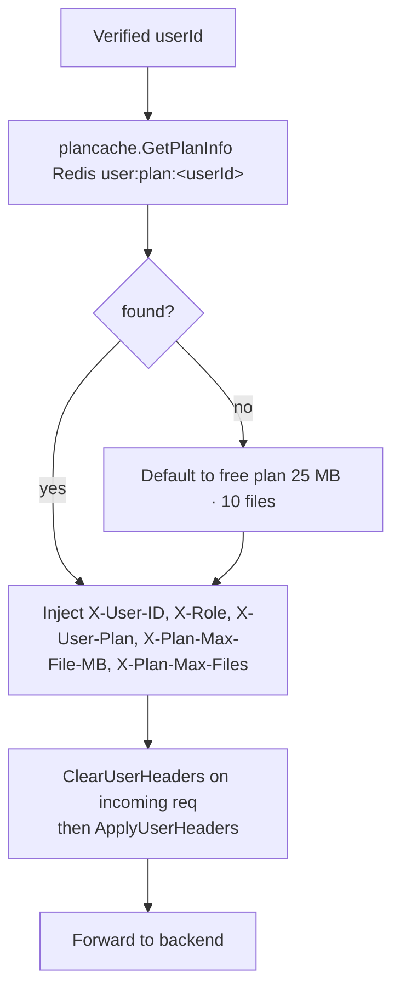

# API Gateway -- Architecture

Internal structure and component diagram of the `api-gateway` service (port 8080).

## Component Diagram



## Middleware Execution Order

```mermaid
flowchart LR
    A[Incoming<br/>Request] --> B[telemetry.<br/>HTTPTraceMiddleware]
    B --> C[metrics.<br/>HTTPMetricsMiddleware]
    C --> D[logger.<br/>HTTPRequestID]
    D --> E[withSecurityHeaders]
    E --> F[withCORS<br/>(preflight short-circuit)]
    F --> G[authverify.<br/>HTTPAuthMiddleware<br/>+ ResolvePlan]
    G --> H[withMaxBodySize 1 MB<br/>(skipped on /api/upload/*)]
    H --> I[http.ServeMux<br/>(route match)]
    I --> J[httputil.<br/>ReverseProxy<br/>(FlushInterval=-1)]
    J --> K[Backend Service]
```

## Plan Header Injection



## Dependency Graph

```mermaid
graph LR
    GW[api-gateway] --> |shared/config| Config
    GW --> |shared/logger| Logger
    GW --> |shared/metrics| Metrics
    GW --> |shared/telemetry| Telemetry
    GW --> |internal/authverify| AuthVerify
    GW --> |internal/plancache| PlanCache

    AuthVerify --> |go-redis/v9| Redis[(Redis)]
    AuthVerify --> |golang-jwt/jwt/v5| JWT
    PlanCache --> |go-redis/v9| Redis

    GW --> |net/http/httputil| ReverseProxy
    GW --> |net/http (FileServer)| StaticFS
```
