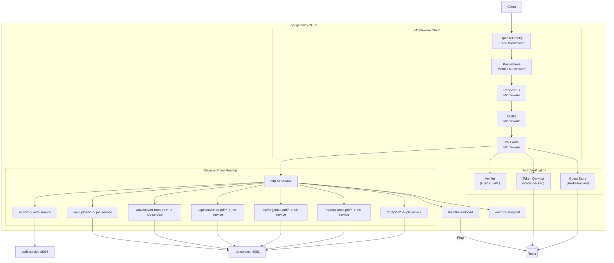
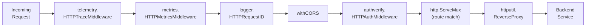
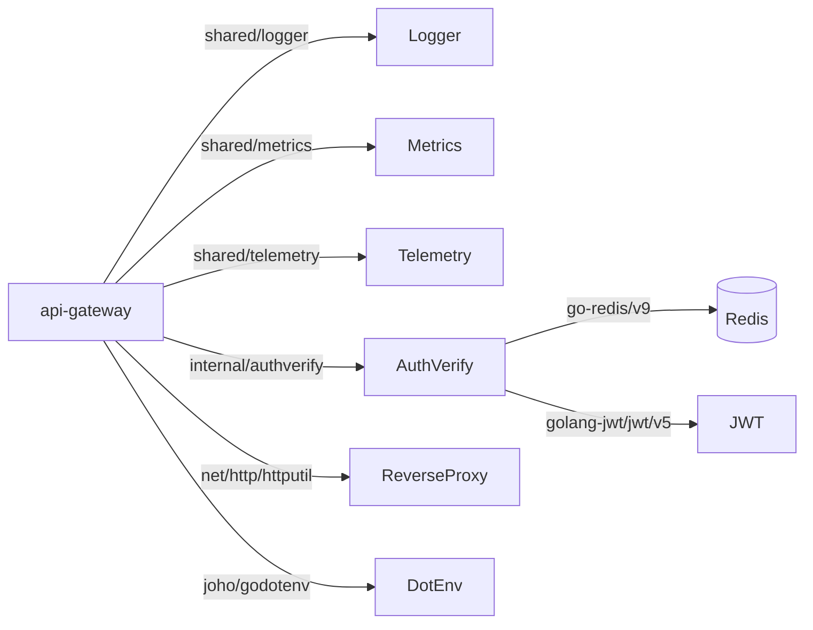

# API Gateway -- Architecture

Internal structure and component diagram of the `api-gateway` service (port 8080).

## Component Diagram

```mermaid
graph TB
    subgraph api-gateway[" api-gateway :8080 "]
        direction TB

        subgraph Middleware["Middleware Chain"]
            TRACE["OpenTelemetry<br/>Trace Middleware"]
            METRICS["Prometheus<br/>Metrics Middleware"]
            REQID["Request ID<br/>Middleware"]
            CORS["CORS<br/>Middleware"]
            AUTHMW["JWT Auth<br/>Middleware"]
        end

        subgraph Auth["Auth Verification"]
            VERIFIER["Verifier<br/>(HS256 JWT)"]
            DENYLIST["Token Denylist<br/>(Redis-backed)"]
            GUESTSTORE["Guest Store<br/>(Redis-backed)"]
        end

        subgraph Routing["Reverse Proxy Routing"]
            MUX["http.ServeMux"]
            PROXY_AUTH["/auth/* -> auth-service"]
            PROXY_UPLOAD["/api/upload/* -> job-service"]
            PROXY_CFP["/api/convert-from-pdf/* -> job-service"]
            PROXY_CTP["/api/convert-to-pdf/* -> job-service"]
            PROXY_ORG["/api/organize-pdf/* -> job-service"]
            PROXY_OPT["/api/optimize-pdf/* -> job-service"]
            PROXY_JOBS["/api/jobs/* -> job-service"]
        end

        HEALTH["/healthz endpoint"]
        METRICEP["/metrics endpoint"]
    end

    Client["Client"] --> TRACE --> METRICS --> REQID --> CORS --> AUTHMW --> MUX

    AUTHMW --> VERIFIER
    AUTHMW --> DENYLIST
    AUTHMW --> GUESTSTORE

    MUX --> PROXY_AUTH
    MUX --> PROXY_UPLOAD
    MUX --> PROXY_CFP
    MUX --> PROXY_CTP
    MUX --> PROXY_ORG
    MUX --> PROXY_OPT
    MUX --> PROXY_JOBS
    MUX --> HEALTH
    MUX --> METRICEP

    DENYLIST --> Redis[(Redis)]
    GUESTSTORE --> Redis
    HEALTH -->|Ping| Redis

    PROXY_AUTH --> AuthSvc["auth-service :8086"]
    PROXY_UPLOAD --> JobSvc["job-service :8081"]
    PROXY_CFP --> JobSvc
    PROXY_CTP --> JobSvc
    PROXY_ORG --> JobSvc
    PROXY_OPT --> JobSvc
    PROXY_JOBS --> JobSvc
```

## Middleware Execution Order

```mermaid
flowchart LR
    A["Incoming<br/>Request"] --> B["telemetry.<br/>HTTPTraceMiddleware"]
    B --> C["metrics.<br/>HTTPMetricsMiddleware"]
    C --> D["logger.<br/>HTTPRequestID"]
    D --> E["withCORS"]
    E --> F["authverify.<br/>HTTPAuthMiddleware"]
    F --> G["http.ServeMux<br/>(route match)"]
    G --> H["httputil.<br/>ReverseProxy"]
    H --> I["Backend<br/>Service"]
```

## Dependency Graph

```mermaid
graph LR
    GW[api-gateway] --> |shared/logger| Logger
    GW --> |shared/metrics| Metrics
    GW --> |shared/telemetry| Telemetry
    GW --> |internal/authverify| AuthVerify

    AuthVerify --> |go-redis/v9| Redis[(Redis)]
    AuthVerify --> |golang-jwt/jwt/v5| JWT

    GW --> |net/http/httputil| ReverseProxy
    GW --> |joho/godotenv| DotEnv
```
