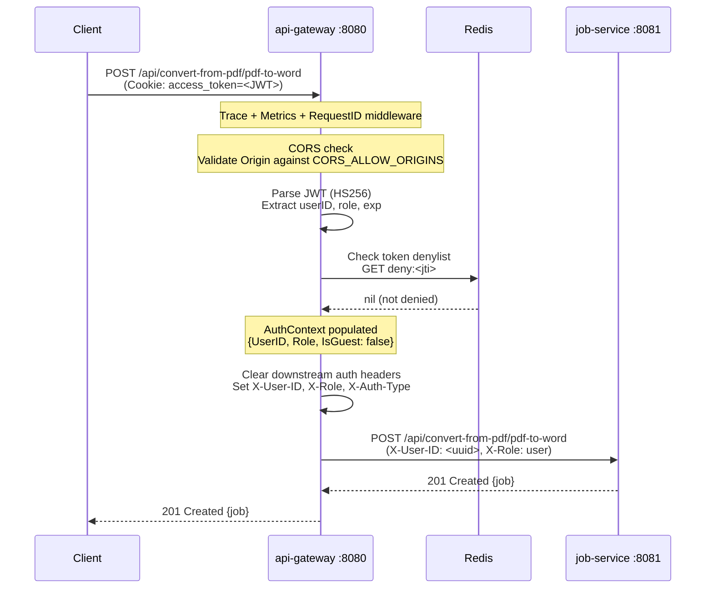
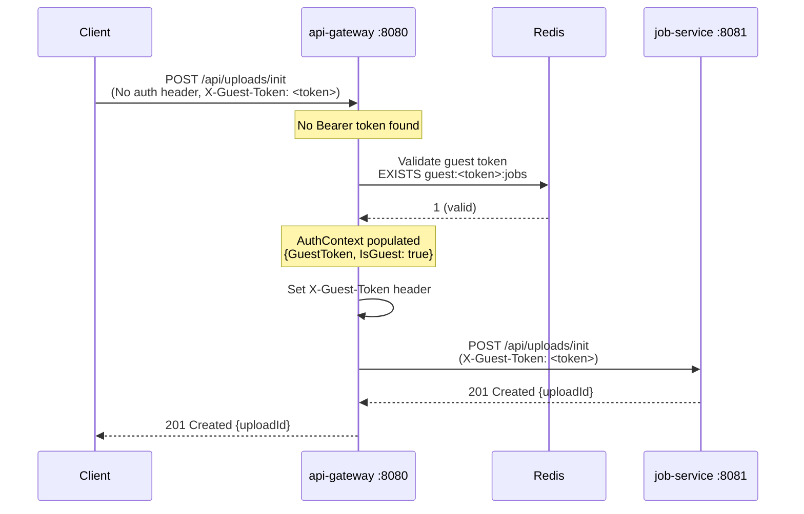
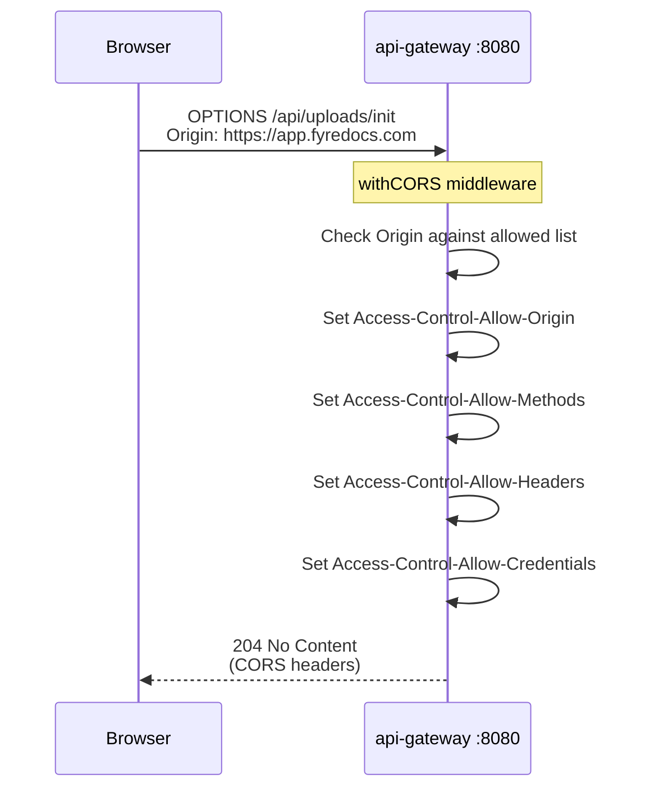
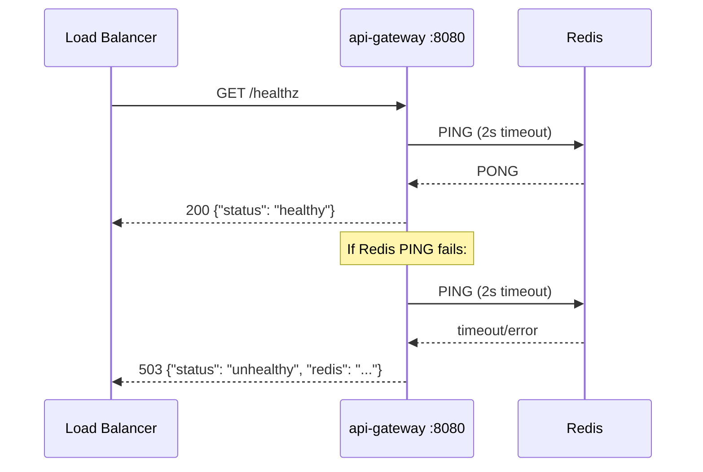

# API Gateway -- Sequence Diagrams

Request flows through the `api-gateway` service.

## Authenticated Request to Job Service

## Guest (Unauthenticated) Request

## CORS Preflight

## Health Check

