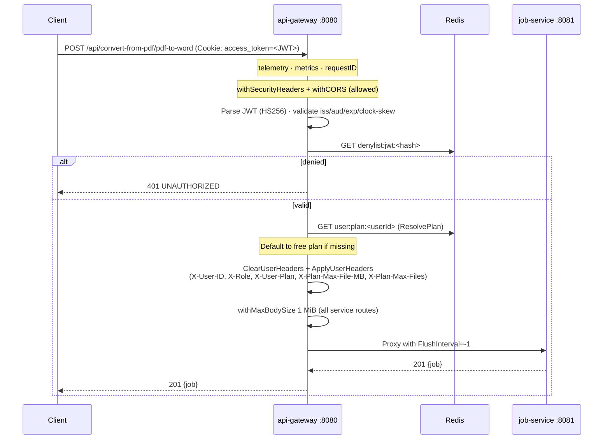
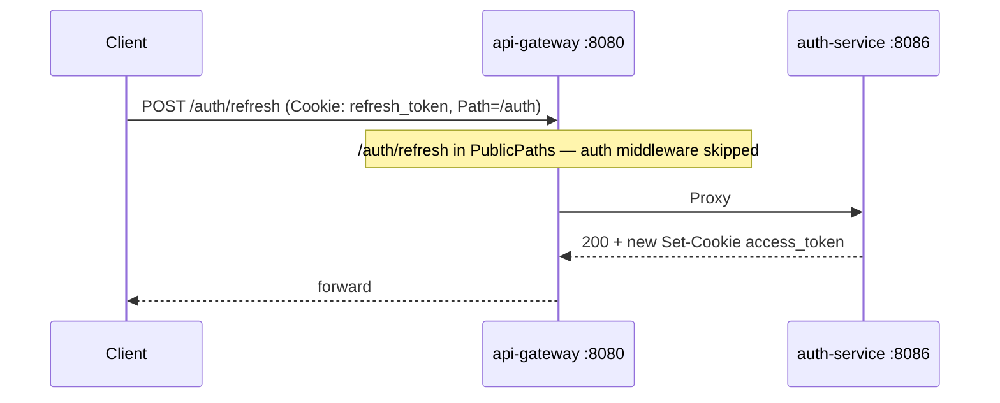
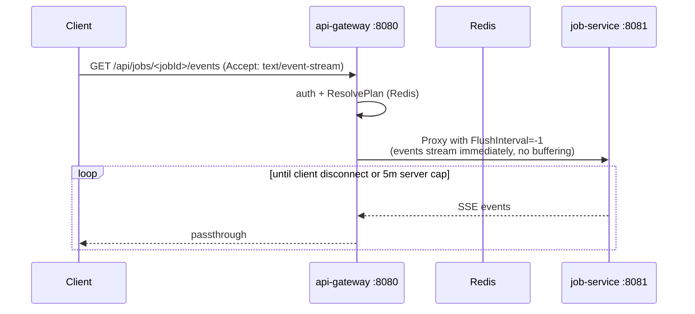
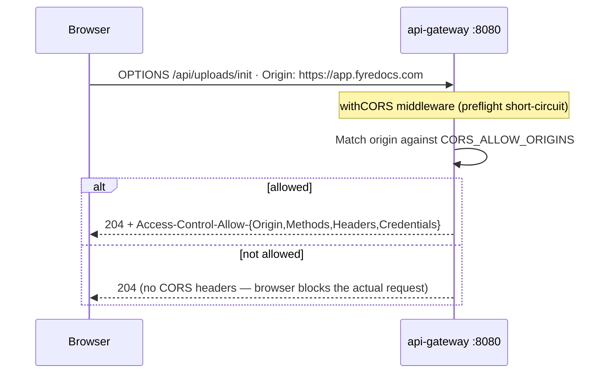
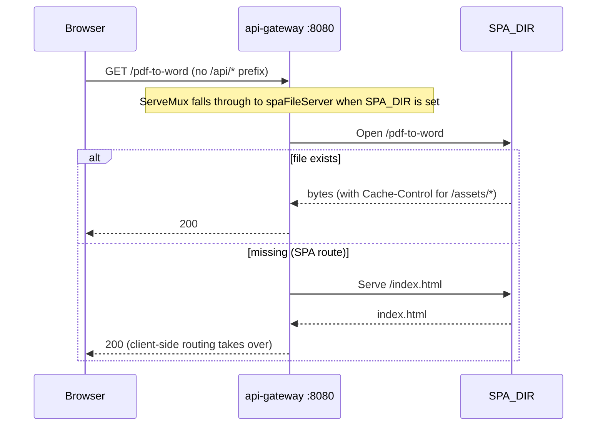
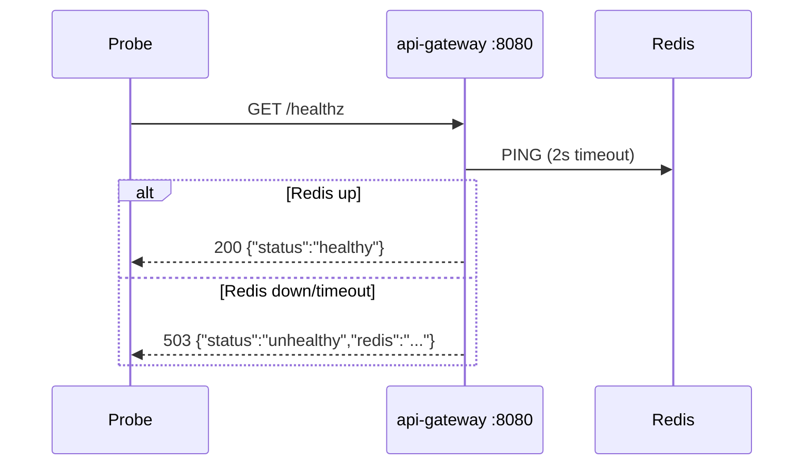

# API Gateway -- Sequence Diagrams

Request flows through the `api-gateway` service (port 8080).

## Authenticated Request — proxied to job-service



## Guest (no auth) → cookie issuance + scoped access

```mermaid
sequenceDiagram
    participant Client
    participant GW as api-gateway :8080
    participant Redis
    participant JobSvc as job-service :8081

    Client->>GW: POST /api/upload/init (no auth)
    Note over GW: No Authorization header, no access_token cookie
    alt has guest_token cookie
        GW->>Redis: EXISTS guest:<token>:jobs
        alt unknown / expired
            GW->>GW: Issue NEW guest_token cookie (HttpOnly, Secure)
            GW->>Redis: SET guest:<token>:jobs
        end
    else no guest_token
        GW->>GW: Generate new guest UUID; Set-Cookie guest_token=<uuid>
        GW->>Redis: SET guest:<token>:jobs
    end
    Note over GW: AuthContext IsGuest=true · X-Guest-Token forwarded
    GW->>JobSvc: Proxy → /api/uploads/init (path rewritten, JSON ≤ 1 MiB)
    JobSvc-->>GW: 201 {uploadId, presigned URLs}
    GW-->>Client: 201 {uploadId, presigned URLs} + Set-Cookie guest_token (when newly issued)
```

## Presigned Object Traffic — MinIO bucket proxy

```mermaid
sequenceDiagram
    participant Browser
    participant GW as api-gateway :8080
    participant M as MinIO :9000 (internal only)

    Note over Browser: presigned URL from job-service,<br/>signed for the GATEWAY origin (S3_PUBLIC_ENDPOINT)

    Browser->>GW: PUT /fyredocs-uploads/uploads/&lt;id&gt;/&lt;file&gt;?partNumber=N&X-Amz-Signature=...
    Note over GW: root mux matches bucket prefix BEFORE CORS/auth —<br/>signature is the credential
    Note over GW: Director: path verbatim (no strip),<br/>req.Host = original Host (SigV4 signs it),<br/>identity headers stripped
    GW->>M: relay bytes (minioTransport, MaxIdleConnsPerHost=50, FlushInterval=-1)
    M->>M: recompute SigV4 against received Host + path
    M-->>GW: 200 + ETag
    GW-->>Browser: 200 + ETag

    Browser->>GW: GET /fyredocs-outputs/jobs/&lt;jobId&gt;/&lt;file&gt;?X-Amz-Signature=...
    GW->>M: relay
    M-->>Browser: object bytes (streamed, no buffering)
```

## Refresh Token Rotation — passes through to auth-service



## SSE Stream — long-lived proxy



## CORS Preflight



## SPA Static Hosting



## Health Check


