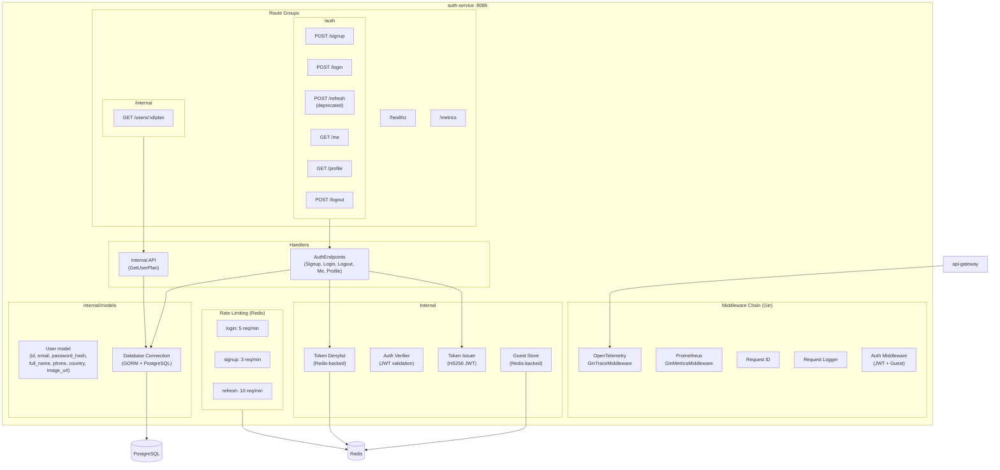
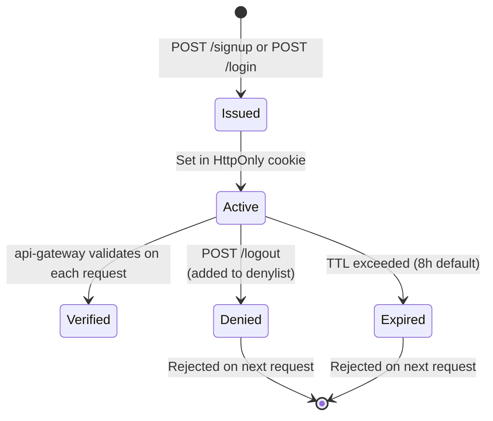
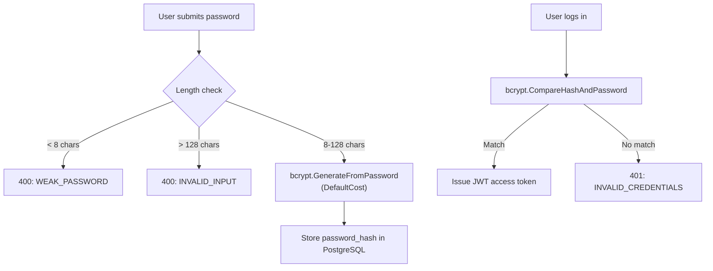
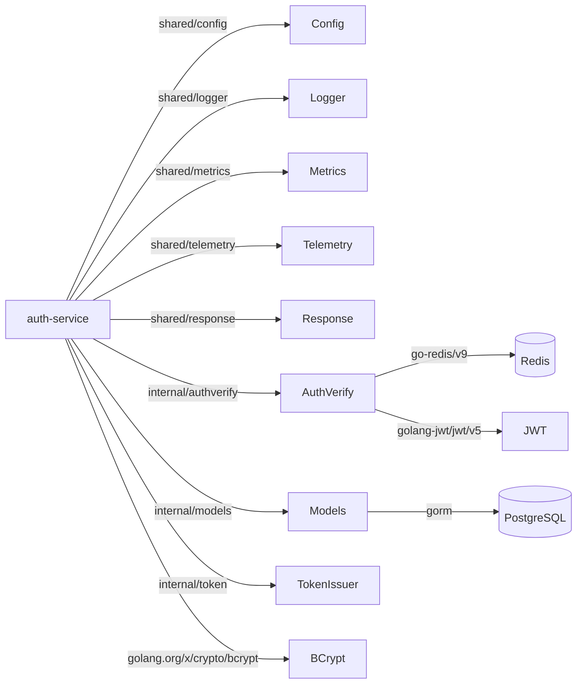

# Auth Service -- Architecture

Internal structure and component diagram of the `auth-service` (port 8086).

## Component Diagram

## Token Lifecycle

## Password Security Flow

## Dependency Graph

