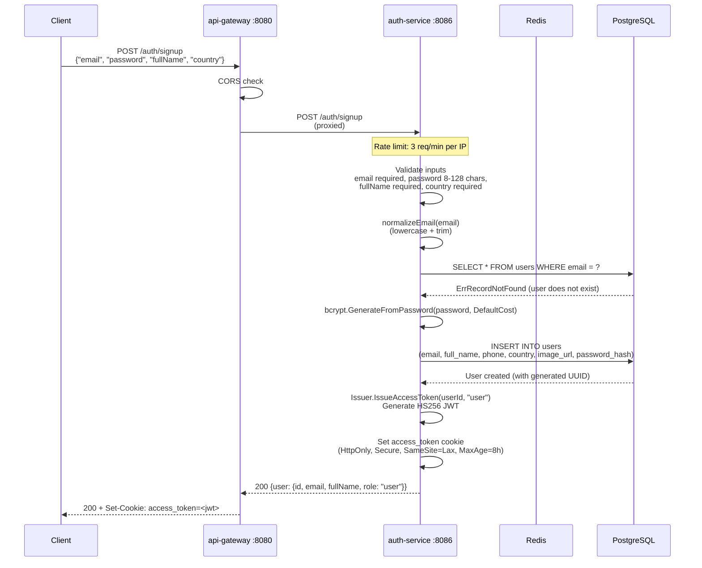
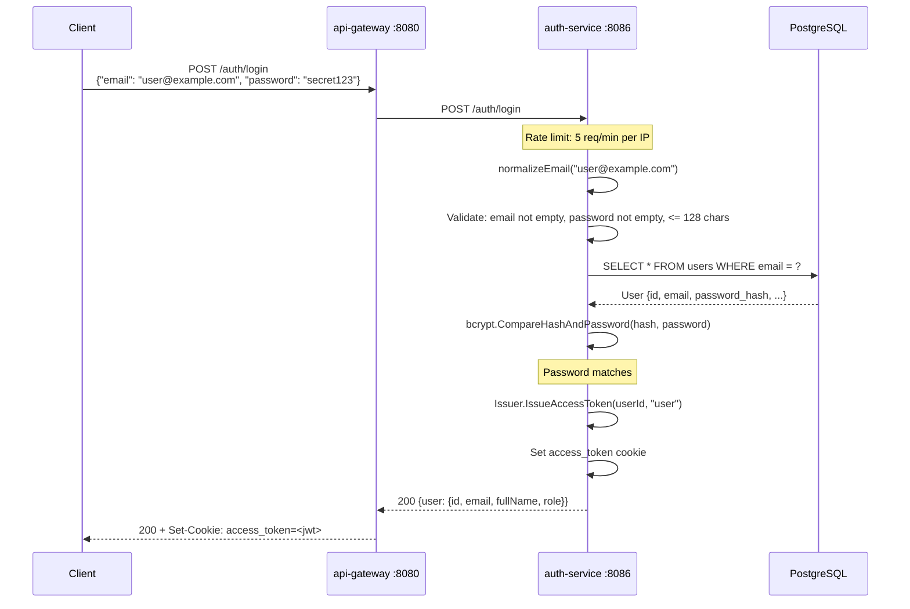
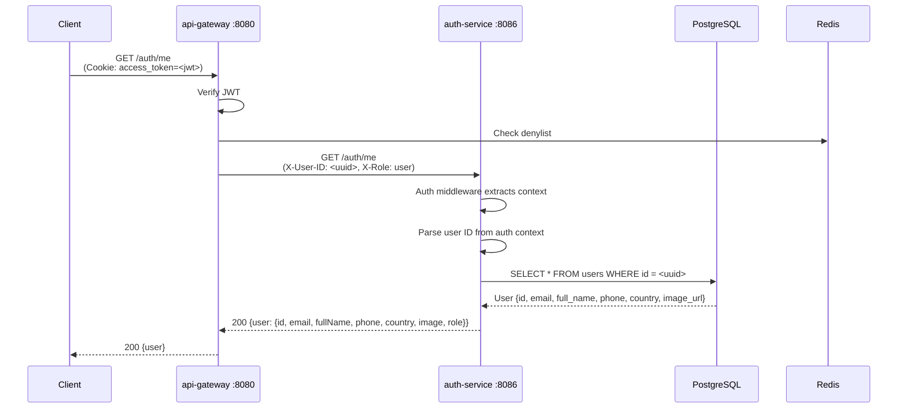
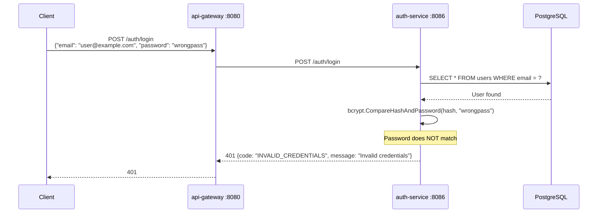
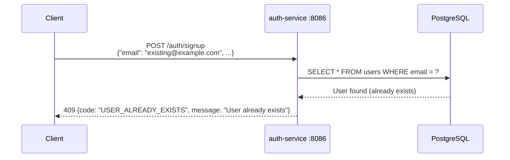
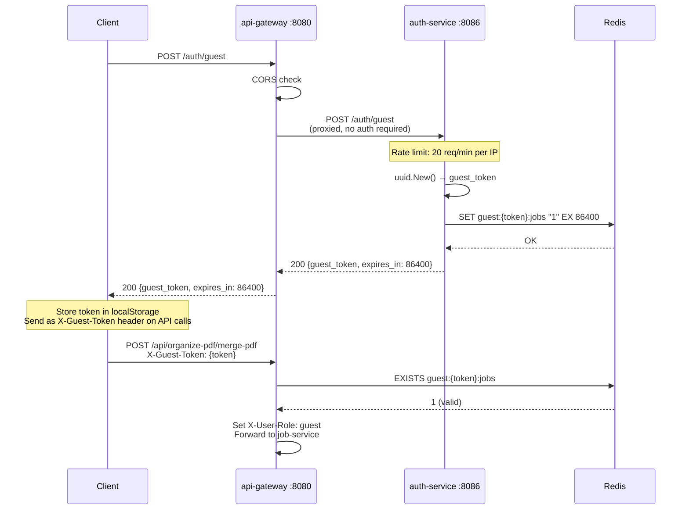

# Auth Service -- Sequence Diagrams

Request flows through the `auth-service`.

## User Signup



## User Login



## User Logout

```mermaid
sequenceDiagram
    participant Client
    participant GW as api-gateway :8080
    participant AS as auth-service :8086
    participant Redis

    Client->>GW: POST /auth/logout<br/>(Cookie: access_token=<jwt>)

    GW->>GW: Verify JWT, populate auth context
    GW->>AS: POST /auth/logout<br/>(X-User-ID: <uuid>)

    AS->>AS: Extract auth context<br/>Verify user is authenticated

    AS->>AS: Extract access token from<br/>Authorization header or context

    AS->>AS: Parse token expiration (unverified)<br/>Calculate remaining TTL

    AS->>Redis: SET deny:<token_hash> EX <remaining_ttl>
    Note over Redis: Token added to denylist

    AS->>AS: Clear access_token cookie<br/>(Set-Cookie with MaxAge=-1)

    AS-->>GW: 204 No Content
    GW-->>Client: 204 + Set-Cookie: access_token=; Max-Age=-1
```

## Get Current User (Me)



## Failed Login (Wrong Password)



## Duplicate Signup



## Guest Session Creation


