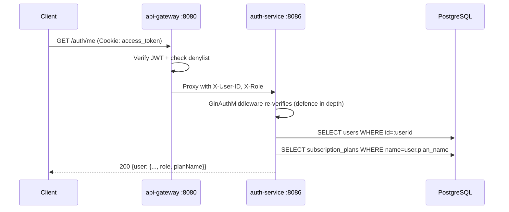
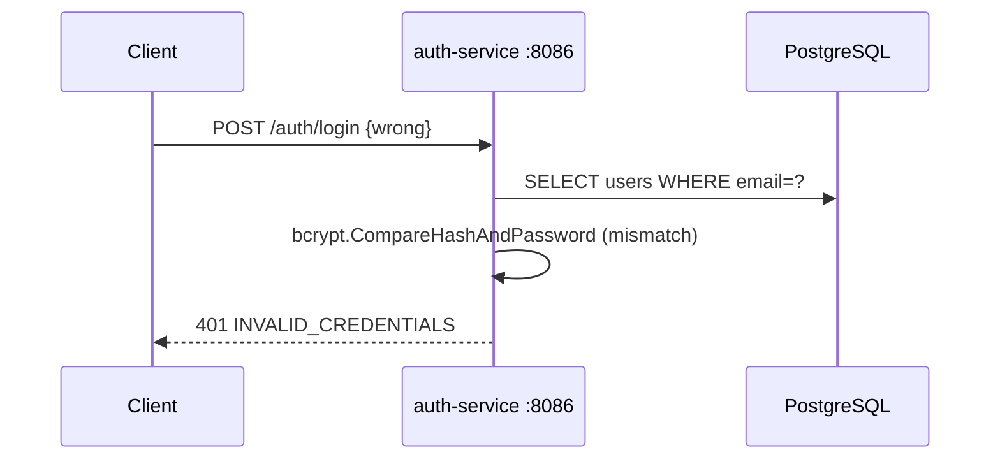
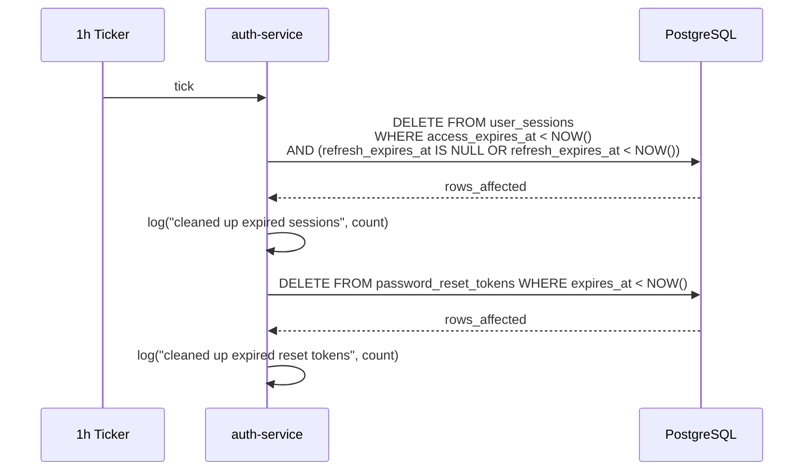

# Auth Service -- Sequence Diagrams

Request flows through the `auth-service` (port 8086).

## User Signup

```mermaid
sequenceDiagram
    participant Client
    participant GW as api-gateway :8080
    participant AS as auth-service :8086
    participant Redis
    participant PG as PostgreSQL
    participant NATS

    Client->>GW: POST /auth/signup {email, password, fullName, country, phone?, image?}
    GW->>AS: Proxy

    Note over AS: Rate limit ratelimit:signup:&lt;ip&gt; (3/min)

    AS->>AS: Validate inputs (email · password 8-128 · fullName · country)
    AS->>AS: normalizeEmail(email)
    AS->>PG: SELECT users WHERE email=?
    PG-->>AS: ErrRecordNotFound
    AS->>AS: bcrypt.GenerateFromPassword(password)
    AS->>PG: INSERT users (id=UUIDv7, email, full_name, phone, country, image_url, password_hash, plan_name='free')
    AS->>NATS: Publish analytics.events.user.signup
    AS->>PG: SELECT subscription_plans WHERE name=user.plan_name (fallback to free)

    AS->>AS: IssueAccessToken (jti=sessionId, role) + IssueRefreshToken
    AS->>PG: INSERT user_sessions (id=jti, user_id, access_token_hash, refresh_token_hash, expiries)
    AS->>Redis: SET user:plan:&lt;userId&gt; EX accessTTL

    AS-->>GW: 200 {user, accessExpiresAt} + Set-Cookie access_token (Path=/) + Set-Cookie refresh_token (Path=/auth)
    GW-->>Client: forward
```

## User Login

```mermaid
sequenceDiagram
    participant Client
    participant GW as api-gateway :8080
    participant AS as auth-service :8086
    participant PG as PostgreSQL
    participant Redis
    participant NATS

    Client->>GW: POST /auth/login {email, password}
    GW->>AS: Proxy

    Note over AS: Rate limit ratelimit:login:&lt;ip&gt; (5/min)

    AS->>AS: normalizeEmail · validate not empty · password ≤ 128
    AS->>PG: SELECT users WHERE email=?
    alt not found
        AS-->>Client: 401 INVALID_CREDENTIALS
    else found
        AS->>AS: bcrypt.CompareHashAndPassword
        alt mismatch
            AS-->>Client: 401 INVALID_CREDENTIALS
        else match
            AS->>PG: SELECT subscription_plans WHERE name=user.plan_name
            AS->>NATS: Publish analytics.events.user.login
            AS->>AS: IssueAccessToken + IssueRefreshToken
            AS->>PG: INSERT user_sessions
            AS->>Redis: SET user:plan:&lt;userId&gt; EX accessTTL
            AS-->>Client: 200 {user, accessExpiresAt} + Set-Cookie access_token & refresh_token
        end
    end
```

## Refresh-Token Rotation

```mermaid
sequenceDiagram
    participant Client
    participant GW as api-gateway :8080
    participant AS as auth-service :8086
    participant PG as PostgreSQL (user_sessions)
    participant Redis

    Client->>GW: POST /auth/refresh (Cookie: refresh_token)
    GW->>AS: Proxy
    Note over AS: Rate limit ratelimit:refresh:&lt;ip&gt; (10/min)

    AS->>AS: Read refresh cookie · reject if missing
    AS->>AS: Issuer.VerifyRefreshToken → userId

    AS->>PG: FindSessionByRefreshHash(SHA256(refresh)) WHERE refresh_expires_at > NOW
    alt not found / expired
        AS-->>Client: 401 INVALID_REFRESH_TOKEN
    else session valid
        AS->>PG: SELECT users WHERE id=userId
        AS->>PG: SELECT subscription_plans WHERE name=user.plan_name
        AS->>Redis: SET user:plan:&lt;userId&gt; EX accessTTL
        AS->>AS: IssueAccessToken (new) — refresh hash stays
        AS->>PG: UPDATE user_sessions SET access_token_hash=?, access_expires_at=? WHERE id=session.id
        AS-->>Client: 200 {user, accessExpiresAt} + new Set-Cookie access_token
    end
```

## User Logout

```mermaid
sequenceDiagram
    participant Client
    participant GW as api-gateway :8080
    participant AS as auth-service :8086
    participant PG as PostgreSQL
    participant Redis

    Client->>GW: POST /auth/logout (Cookie: access_token)
    GW->>GW: Verify JWT · populate auth context
    GW->>AS: Proxy with X-User-ID

    AS->>AS: Extract access token (Authorization or cookie)
    AS->>PG: DELETE FROM user_sessions WHERE access_token_hash = SHA256(token)
    AS->>Redis: SET denylist:jwt:&lt;hash&gt; EX remaining-ttl
    AS->>Redis: DEL user:plan:&lt;userId&gt;
    AS->>AS: Clear access_token (Path=/) and refresh_token (Path=/auth) cookies
    AS-->>Client: 204 No Content
```

## Get Current User (Me)



## Change Plan

```mermaid
sequenceDiagram
    participant Client
    participant GW as api-gateway :8080
    participant AS as auth-service :8086
    participant PG as PostgreSQL
    participant Redis
    participant NATS

    Client->>GW: PUT /auth/plan {"planName":"pro"}
    GW->>AS: Proxy (auth-required)

    AS->>PG: SELECT users WHERE id=:userId
    AS->>PG: SELECT subscription_plans WHERE name=:plan
    alt plan missing or same as current
        AS-->>Client: 400 INVALID_PLAN / SAME_PLAN
    else change
        AS->>PG: UPDATE users SET plan_name=:plan WHERE id=:userId
        AS->>Redis: SET user:plan:&lt;userId&gt; (new limits) EX accessTTL
        AS->>NATS: Publish analytics.events.plan.changed {oldPlan, newPlan}
        AS-->>Client: 200 {user}
    end
```

## Internal Admin — Revoke All User Sessions

```mermaid
sequenceDiagram
    participant Admin as Internal caller
    participant AS as auth-service :8086
    participant PG as PostgreSQL
    participant Redis

    Admin->>AS: POST /internal/users/:id/revoke-sessions
    AS->>PG: DELETE FROM user_sessions WHERE user_id=:id RETURNING * (still active)
    PG-->>AS: revoked sessions[]
    loop For each revoked
        AS->>Redis: SET denylist:jwt:&lt;access_token_hash&gt; EX remaining
    end
    AS-->>Admin: 200 {revokedCount}
```

## Failed Login (Wrong Password)



## Forgot Password — Issue Reset Token

```mermaid
sequenceDiagram
    participant Client
    participant GW as api-gateway :8080
    participant AS as auth-service :8086
    participant Redis
    participant PG as PostgreSQL
    participant M as Resend / NoopMailer

    Client->>GW: POST /auth/forgot-password {email}
    GW->>AS: Proxy

    Note over AS: Rate limit ratelimit:forgot_password:&lt;ip&gt; (3/min)

    AS->>AS: normalizeEmail(email)
    AS->>PG: SELECT users WHERE email=?

    alt User not found / DB error
        Note over AS: STILL respond 200 (no enumeration)
    else User found
        AS->>PG: DELETE FROM password_reset_tokens WHERE user_id=?
        AS->>AS: rand 32 bytes -> base64url (raw)
        AS->>PG: INSERT password_reset_tokens (id=UUIDv7, user_id, token_hash=SHA256(raw), expires_at=NOW()+PASSWORD_RESET_TOKEN_TTL, request_ip)
        AS-->>M: SendPasswordReset(to, ${APP_BASE_URL}/reset-password?token=raw, ip, ttl)  [async, 15s timeout]
    end

    AS-->>GW: 200 "If an account exists for this email, a reset link has been sent."
    GW-->>Client: forward
```

## Reset Password — Consume Token

```mermaid
sequenceDiagram
    participant Client
    participant GW as api-gateway :8080
    participant AS as auth-service :8086
    participant Redis
    participant PG as PostgreSQL
    participant NATS

    Client->>GW: POST /auth/reset-password {token, newPassword}
    GW->>AS: Proxy

    Note over AS: Rate limit ratelimit:reset_password:&lt;ip&gt; (5/min)

    AS->>AS: Validate token non-empty + password length [8,128]
    AS->>PG: SELECT password_reset_tokens WHERE token_hash=SHA256(token) AND expires_at>NOW()

    alt not found / expired
        AS-->>Client: 400 INVALID_OR_EXPIRED_TOKEN
    else valid
        AS->>AS: bcrypt.GenerateFromPassword(newPassword)
        AS->>PG: BEGIN
        AS->>PG: UPDATE users SET password_hash=? WHERE id=user_id
        AS->>PG: DELETE FROM password_reset_tokens WHERE user_id=user_id
        AS->>PG: DELETE FROM user_sessions WHERE user_id=user_id RETURNING * (active only)
        AS->>PG: COMMIT
        loop For each revoked session
            AS->>Redis: SET denylist:jwt:&lt;access_token_hash&gt; EX remaining
        end
        AS->>Redis: DEL user:plan:&lt;user_id&gt;
        AS->>NATS: Publish analytics.events.user.password_reset_completed
        AS-->>Client: 200 "Password updated. Please sign in."
    end
```

## Background — Expired Session & Reset-Token Cleanup


