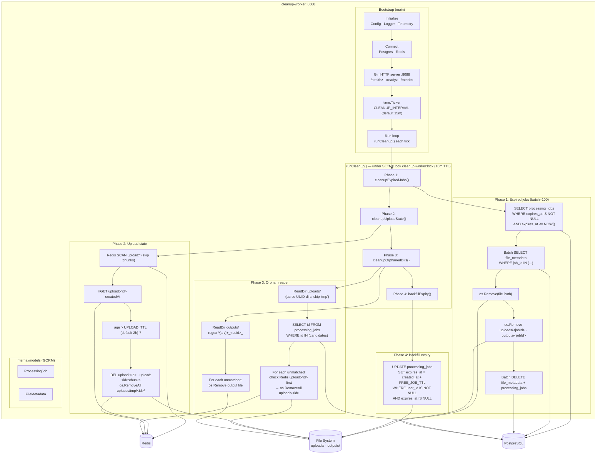
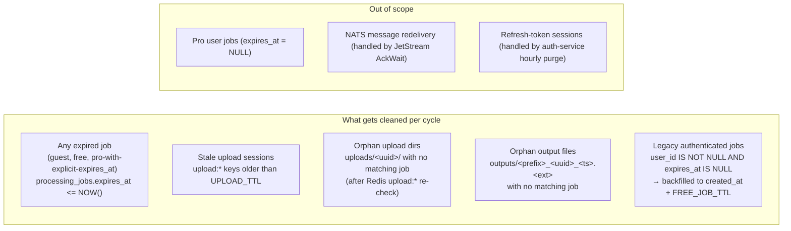
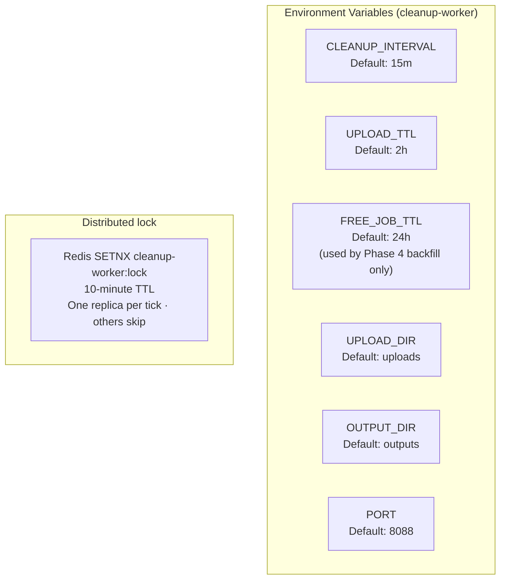
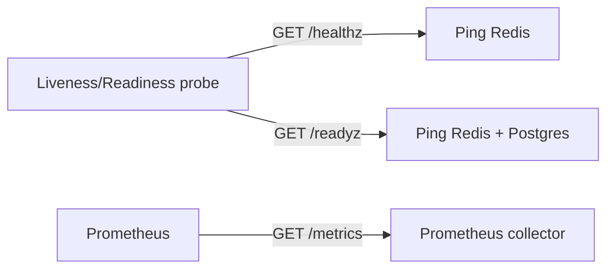

# Cleanup Worker -- Architecture

Internal structure and component diagram of the `cleanup-worker` service.

## Component Diagram

```mermaid
graph TB
    subgraph cleanup-worker[" cleanup-worker :8088 "]
        direction TB

        subgraph Bootstrap["Bootstrap (main)"]
            INIT["Initialize<br/>Config · Logger · Telemetry"]
            CONNECT["Connect<br/>Postgres · Redis"]
            HTTP["Gin HTTP server :8088<br/>/healthz · /readyz · /metrics"]
            TICKER["time.Ticker<br/>CLEANUP_INTERVAL (default 15m)"]
            LOOP["Run loop<br/>runCleanup() each tick"]
        end

        subgraph Cleanup["runCleanup() — under SETNX lock cleanup-worker:lock (10m TTL)"]
            P1["Phase 1: cleanupExpiredJobs()"]
            P2["Phase 2: cleanupUploadState()"]
            P3["Phase 3: cleanupOrphanedDirs()"]
            P4["Phase 4: backfillExpiry()"]
        end

        subgraph P1Detail["Phase 1: Expired jobs (batch=100)"]
            P1A["SELECT processing_jobs<br/>WHERE expires_at IS NOT NULL<br/>AND expires_at <= NOW()"]
            P1B["Batch SELECT file_metadata<br/>WHERE job_id IN (...)"]
            P1C["os.Remove(file.Path)"]
            P1D["os.Remove uploads/&lt;jobId&gt; · outputs/&lt;jobId&gt;"]
            P1E["Batch DELETE file_metadata + processing_jobs"]
        end

        subgraph P2Detail["Phase 2: Upload state"]
            P2A["Redis SCAN upload:* (skip :chunks)"]
            P2B["HGET upload:&lt;id&gt; createdAt"]
            P2C["age > UPLOAD_TTL (default 2h) ?"]
            P2D["DEL upload:&lt;id&gt; · upload:&lt;id&gt;:chunks<br/>os.RemoveAll uploads/tmp/&lt;id&gt;/"]
        end

        subgraph P3Detail["Phase 3: Orphan reaper"]
            P3A["ReadDir uploads/<br/>(parse UUID dirs, skip 'tmp')"]
            P3B["SELECT id FROM processing_jobs<br/>WHERE id IN (candidates)"]
            P3C["For each unmatched:<br/>check Redis upload:&lt;id&gt; first<br/>→ os.RemoveAll uploads/&lt;id&gt;"]
            P3D["ReadDir outputs/<br/>regex ^[a-z]+_&lt;uuid&gt;_"]
            P3E["For each unmatched:<br/>os.Remove output file"]
        end

        subgraph P4Detail["Phase 4: Backfill expiry"]
            P4A["UPDATE processing_jobs<br/>SET expires_at = created_at + FREE_JOB_TTL<br/>WHERE user_id IS NOT NULL<br/>AND expires_at IS NULL"]
        end

        subgraph Models["internal/models (GORM)"]
            JM["ProcessingJob"]
            FM["FileMetadata"]
        end
    end

    INIT --> CONNECT --> HTTP --> TICKER --> LOOP
    LOOP --> P1 --> P2 --> P3 --> P4

    P1 --> P1A --> P1B --> P1C --> P1D --> P1E
    P2 --> P2A --> P2B --> P2C --> P2D
    P3 --> P3A --> P3B --> P3C
    P3 --> P3D --> P3E
    P4 --> P4A

    P1A & P1B & P1E & P3B & P4A --> PG[(PostgreSQL)]
    P2A & P2B & P2D --> RD[(Redis)]
    P3C --> RD
    P1C & P1D & P2D & P3C & P3E --> Disk[(File System<br/>uploads/ · outputs/)]
```

## Cleanup Targets

```mermaid
graph LR
    subgraph Targets["What gets cleaned per cycle"]
        A["Any expired job<br/>(guest, free, pro-with-explicit-expires_at)<br/>processing_jobs.expires_at <= NOW()"]
        B["Stale upload sessions<br/>upload:* keys older than UPLOAD_TTL"]
        C["Orphan upload dirs<br/>uploads/&lt;uuid&gt;/ with no matching job<br/>(after Redis upload:* re-check)"]
        D["Orphan output files<br/>outputs/&lt;prefix&gt;_&lt;uuid&gt;_&lt;ts&gt;.&lt;ext&gt;<br/>with no matching job"]
        E["Legacy authenticated jobs<br/>user_id IS NOT NULL AND expires_at IS NULL<br/>→ backfilled to created_at + FREE_JOB_TTL"]
    end

    subgraph NotCleaned["Out of scope"]
        F["Pro user jobs (expires_at = NULL)"]
        G["NATS message redelivery (handled by JetStream AckWait)"]
        H["Refresh-token sessions (handled by auth-service hourly purge)"]
    end
```

## Configuration

```mermaid
graph TD
    subgraph EnvVars["Environment Variables (cleanup-worker)"]
        A["CLEANUP_INTERVAL<br/>Default: 15m"]
        B["UPLOAD_TTL<br/>Default: 2h"]
        C["FREE_JOB_TTL<br/>Default: 24h<br/>(used by Phase 4 backfill only)"]
        D["UPLOAD_DIR<br/>Default: uploads"]
        E["OUTPUT_DIR<br/>Default: outputs"]
        F["PORT<br/>Default: 8088"]
    end

    subgraph Locking["Distributed lock"]
        L["Redis SETNX cleanup-worker:lock<br/>10-minute TTL<br/>One replica per tick · others skip"]
    end
```

## HTTP Surface

```mermaid
graph LR
    Probe[Liveness/Readiness probe] -->|GET /healthz| HZ[Ping Redis]
    Probe -->|GET /readyz| RZ[Ping Redis + Postgres]
    Prom[Prometheus] -->|GET /metrics| MX[Prometheus collector]
```
