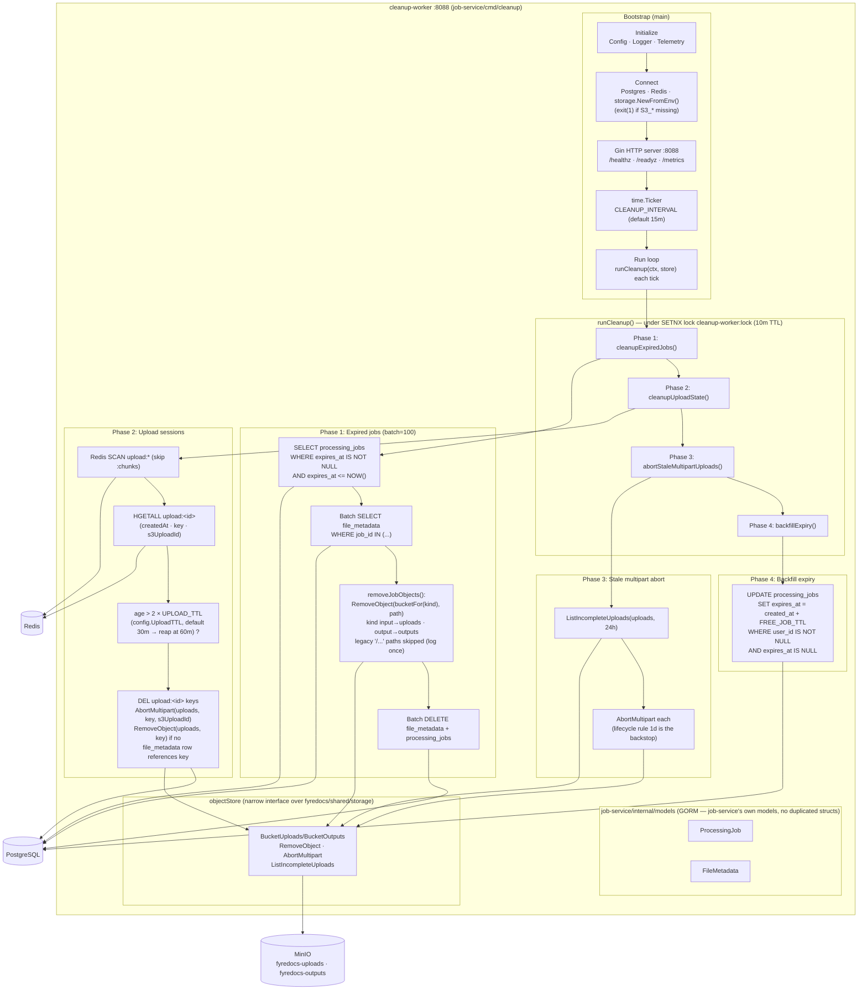
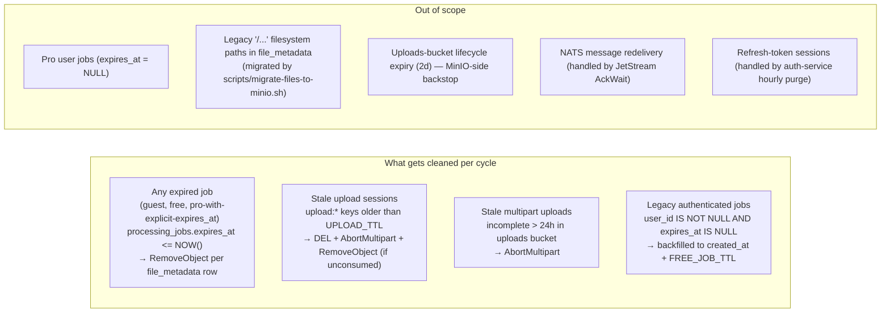
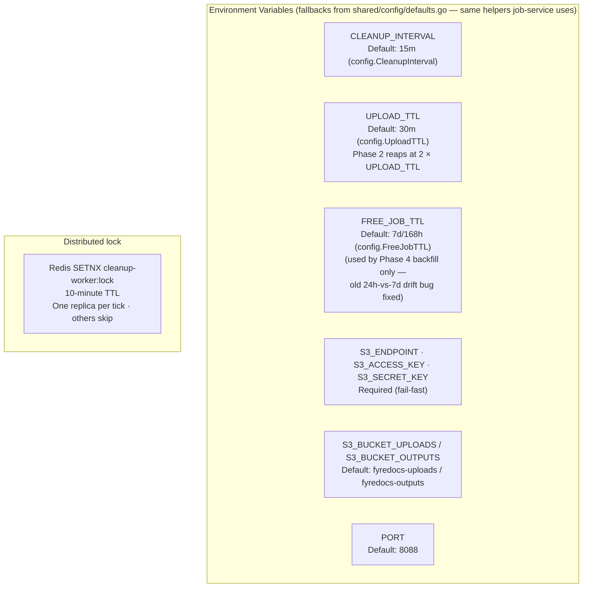
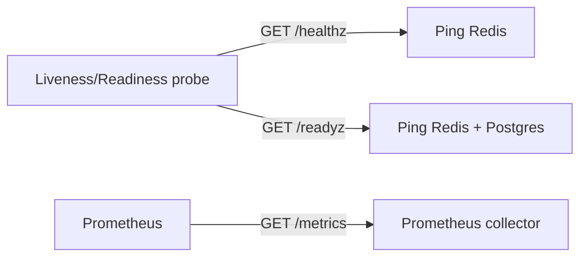

# Cleanup Worker -- Architecture

Internal structure and component diagram of the `cleanup-worker` container — **job-service's cleanup binary** (`job-service/cmd/cleanup`, sweep logic in `job-service/internal/cleanup`, built from `job-service/Dockerfile.cleanup`). It uses job-service's own GORM models directly and reads TTL fallbacks from `shared/config/defaults.go`.

## Component Diagram

## Cleanup Targets

## Configuration

## HTTP Surface

