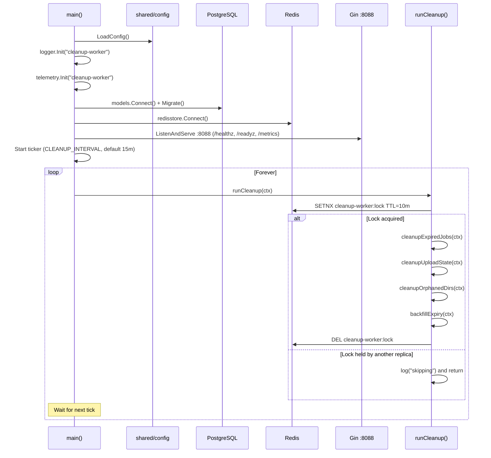
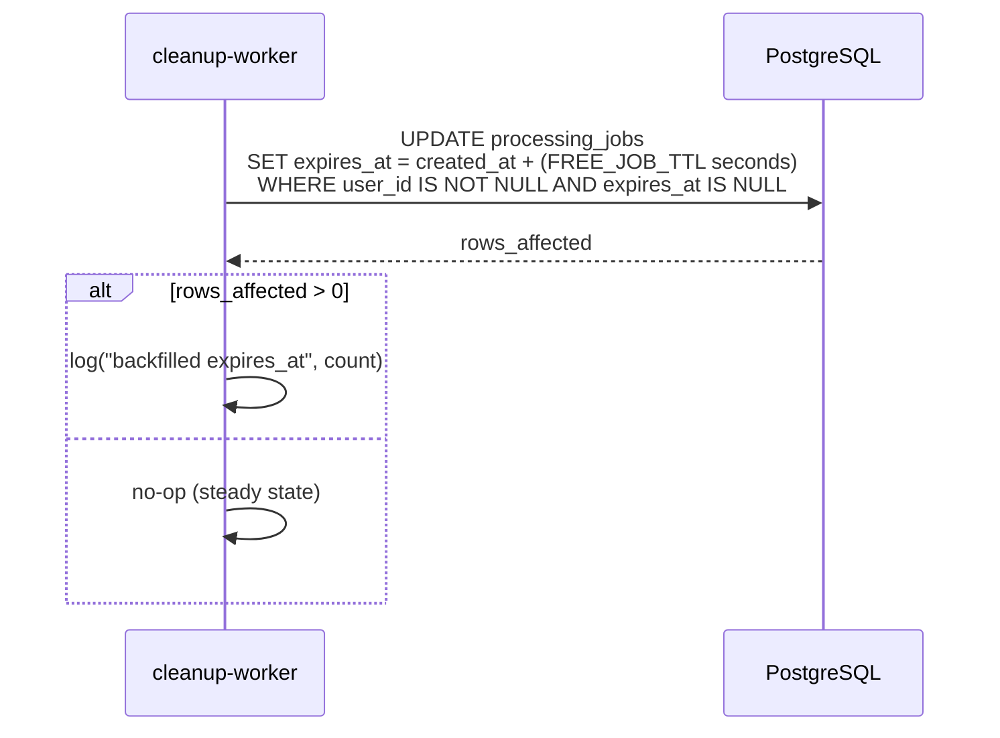
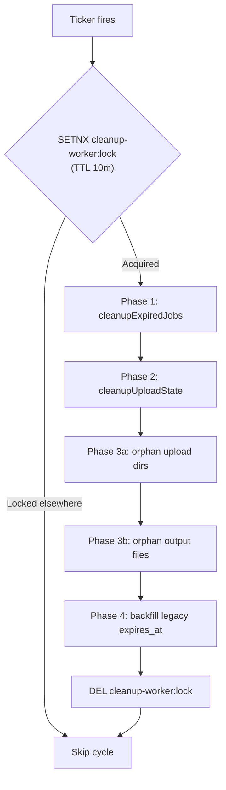
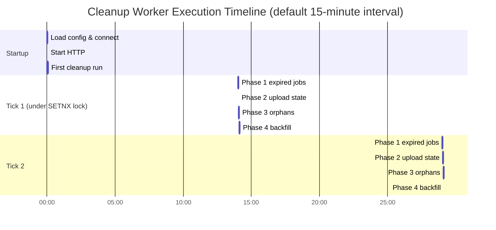

# Cleanup Worker -- Sequence Diagrams

Execution flows for the `cleanup-worker` background service.

## Startup and Main Loop



## Phase 1 — cleanupExpiredJobs

```mermaid
sequenceDiagram
    participant CW as cleanup-worker
    participant PG as PostgreSQL
    participant Disk as File System

    loop Until batch < 100
        CW->>PG: SELECT * FROM processing_jobs<br/>WHERE expires_at IS NOT NULL<br/>AND expires_at <= NOW() LIMIT 100
        PG-->>CW: jobs[]

        alt no rows
            CW->>CW: return
        end

        CW->>PG: SELECT * FROM file_metadata WHERE job_id IN (jobIds[])
        PG-->>CW: files[]

        Note over CW: group files by job_id
        loop For each job
            loop For each file
                CW->>Disk: os.Remove(file.Path)
            end
            CW->>Disk: os.Remove uploads/&lt;jobId&gt;/
            CW->>Disk: os.Remove outputs/&lt;jobId&gt;/
        end

        CW->>PG: DELETE FROM file_metadata WHERE job_id IN (jobIds[])
        CW->>PG: DELETE FROM processing_jobs WHERE id IN (jobIds[])
    end
```

## Phase 2 — cleanupUploadState

```mermaid
sequenceDiagram
    participant CW as cleanup-worker
    participant R as Redis
    participant Disk as File System

    CW->>R: SCAN 0 MATCH upload:* COUNT 100
    R-->>CW: keys

    loop For each key (skip :chunks)
        CW->>R: HGET upload:&lt;id&gt; createdAt
        R-->>CW: RFC3339 timestamp
        CW->>CW: time.Since(createdAt) > UPLOAD_TTL (2h)?

        alt Yes — stale
            CW->>R: DEL upload:&lt;id&gt; upload:&lt;id&gt;:chunks
            alt id parses as UUID
                CW->>Disk: os.RemoveAll(uploads/tmp/&lt;id&gt;/)
            end
        else No — keep
            CW->>CW: skip
        end
    end
```

## Phase 3 — cleanupOrphanedDirs

```mermaid
sequenceDiagram
    participant CW as cleanup-worker
    participant Disk as File System
    participant PG as PostgreSQL
    participant R as Redis

    Note over CW: Phase 3a — uploads/
    CW->>Disk: ReadDir(uploads/)
    Disk-->>CW: entries

    Note over CW: Collect UUID-named dirs (skip 'tmp')
    CW->>PG: SELECT id FROM processing_jobs WHERE id IN (candidates)
    PG-->>CW: existingIds[]

    loop For each candidate not in existingIds
        CW->>R: EXISTS upload:&lt;id&gt;
        alt active upload session
            CW->>CW: skip (a job will consume this soon)
        else no active session
            CW->>Disk: os.RemoveAll(uploads/&lt;id&gt;/)
        end
    end

    Note over CW: Phase 3b — outputs/
    CW->>Disk: ReadDir(outputs/)
    Disk-->>CW: entries

    Note over CW: Match regex ^[a-z]+_&lt;uuid&gt;_
    CW->>PG: SELECT id FROM processing_jobs WHERE id IN (extracted jobIds)
    PG-->>CW: existingIds[]

    loop For each output file with unmatched jobId
        CW->>Disk: os.Remove(outputs/&lt;file&gt;)
    end
```

## Phase 4 — backfillExpiry



## Decision Flow (one tick)



## Timing Diagram


