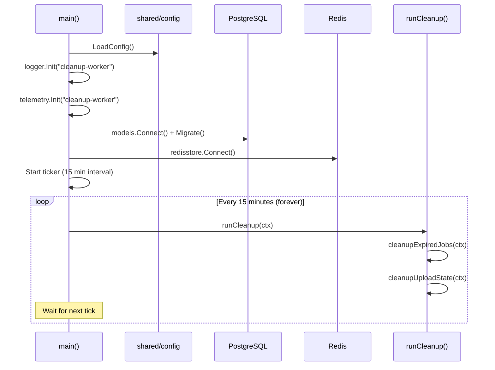
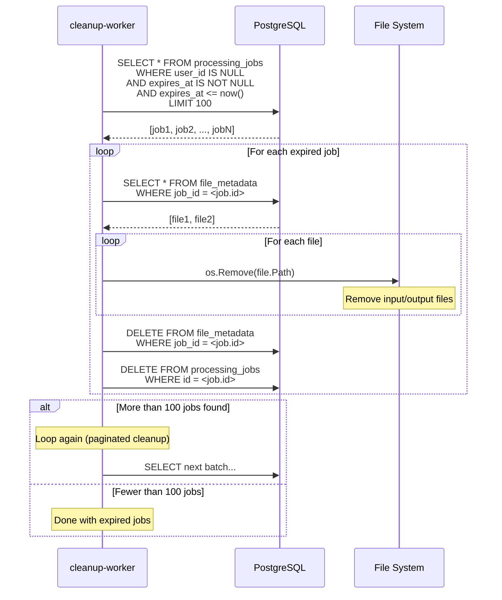
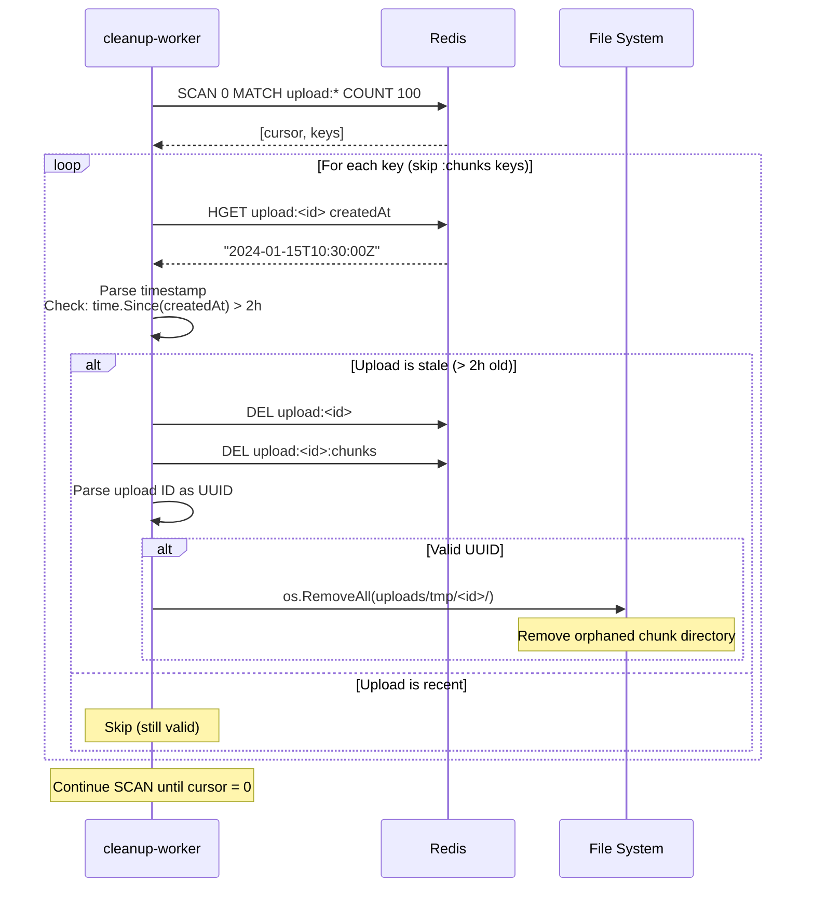
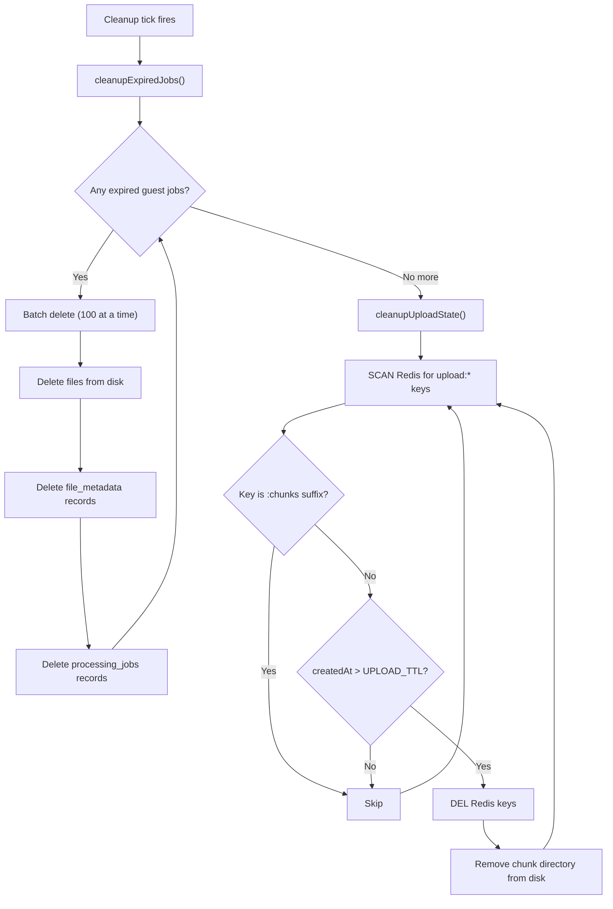
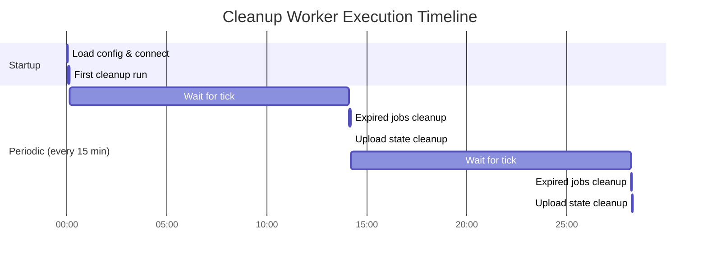

# Cleanup Worker -- Sequence Diagrams

Execution flows for the `cleanup-worker` background service.

## Main Loop

## Cleanup Expired Guest Jobs

## Cleanup Stale Upload State

## Cleanup Decision Flow

## Timing Diagram

