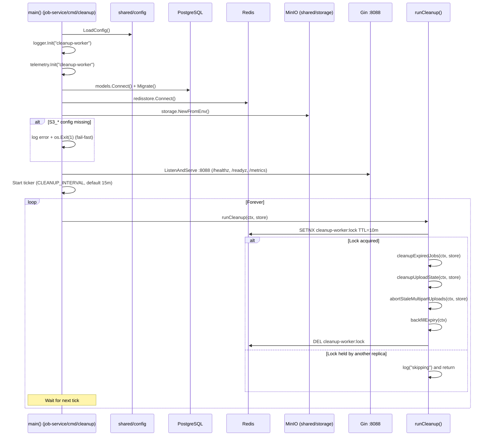
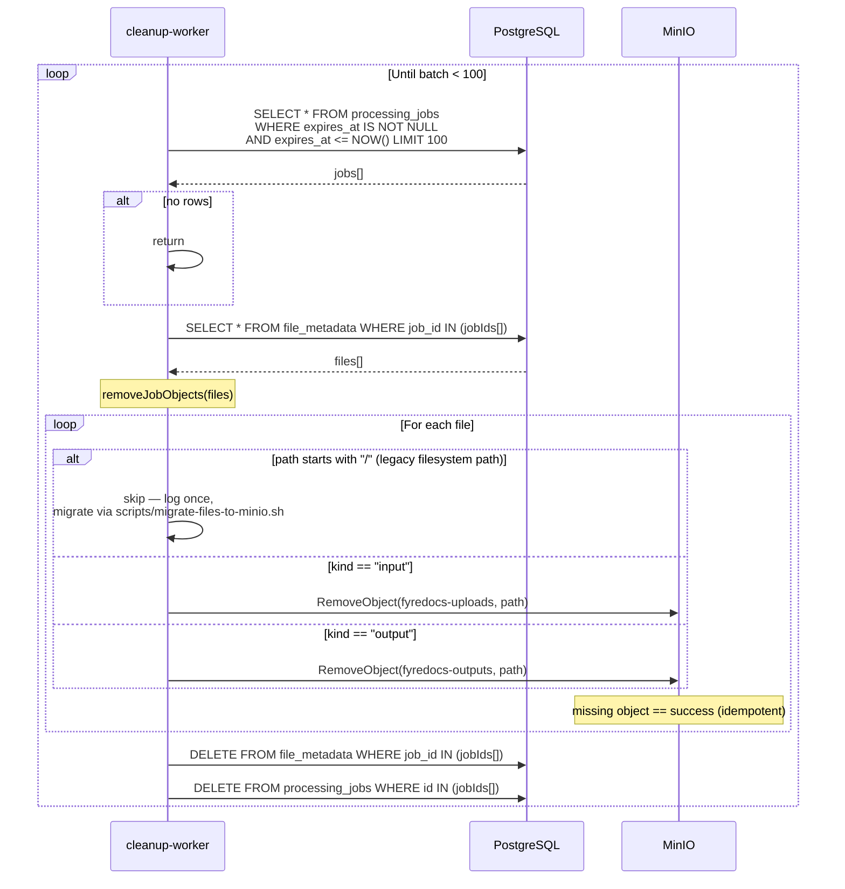
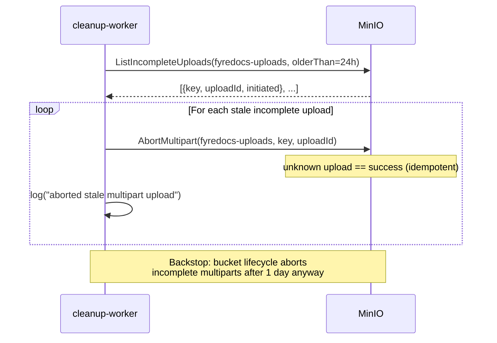
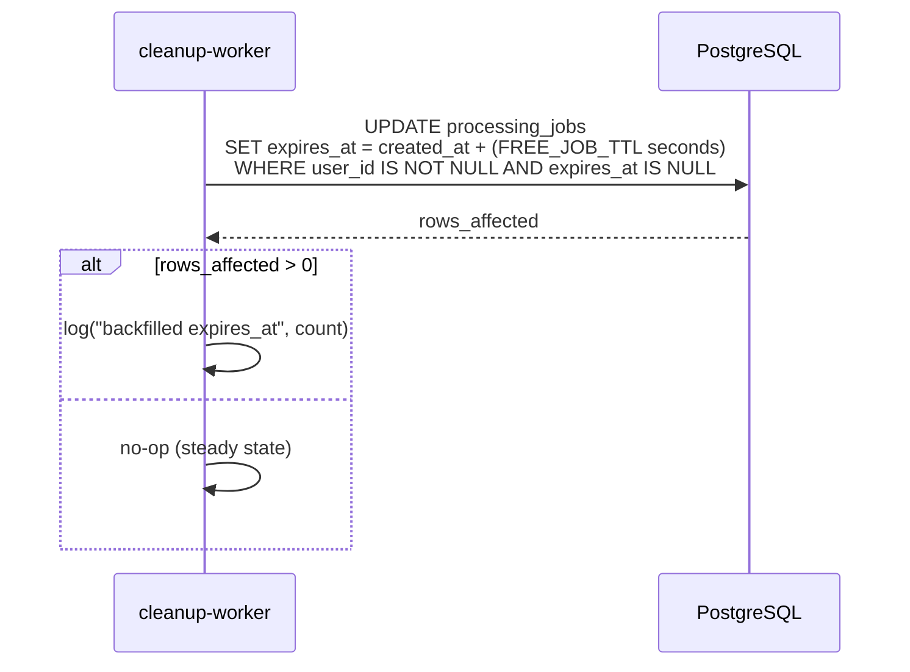
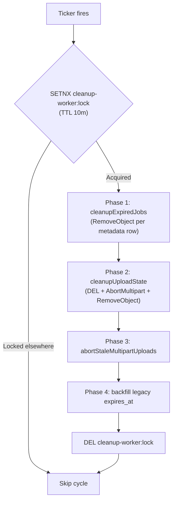
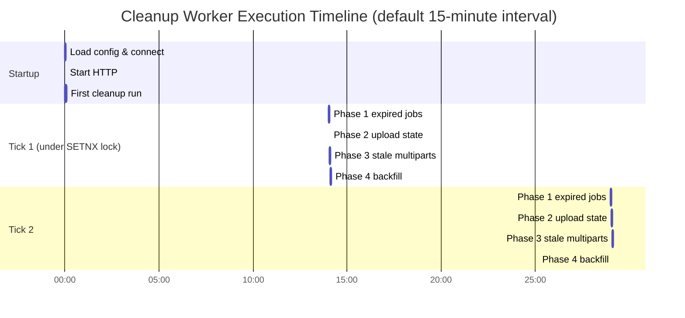

# Cleanup Worker -- Sequence Diagrams

Execution flows for the `cleanup-worker` container — job-service's cleanup binary (`job-service/cmd/cleanup`, logic in `job-service/internal/cleanup`, models from `job-service/internal/models`, TTL fallbacks from `shared/config/defaults.go`).

## Startup and Main Loop



## Phase 1 — cleanupExpiredJobs



## Phase 2 — cleanupUploadState

```mermaid
sequenceDiagram
    participant CW as cleanup-worker
    participant R as Redis
    participant PG as PostgreSQL
    participant S3 as MinIO

    CW->>R: SCAN 0 MATCH upload:* COUNT 100
    R-->>CW: keys

    loop For each key (skip :chunks)
        CW->>R: HGETALL upload:&lt;id&gt;
        R-->>CW: {createdAt, key, s3UploadId, ...}
        CW->>CW: time.Since(createdAt) > 2 × UPLOAD_TTL?<br/>(config.UploadTTL, default 30m → 60m)

        alt Yes — stale
            CW->>R: DEL upload:&lt;id&gt; upload:&lt;id&gt;:chunks
            opt hash has s3UploadId
                CW->>S3: AbortMultipart(fyredocs-uploads, key, s3UploadId)
            end
            CW->>PG: SELECT count(*) FROM file_metadata WHERE path = &lt;key&gt;
            alt count == 0 (never consumed by a job)
                CW->>S3: RemoveObject(fyredocs-uploads, key)
            else consumed — referenced by a job
                CW->>CW: keep object (Phase 1 cleans it with the job)
            end
        else No — keep
            CW->>CW: skip
        end
    end
```

## Phase 3 — abortStaleMultipartUploads



## Phase 4 — backfillExpiry



## Decision Flow (one tick)



## Timing Diagram


