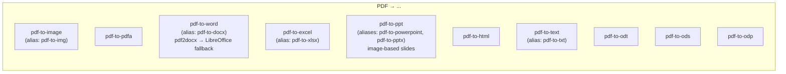
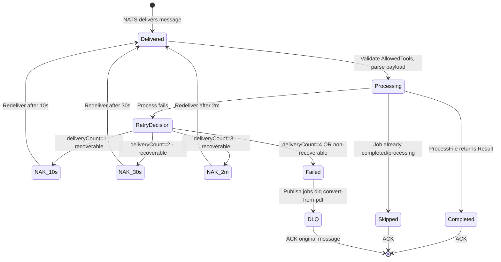

# Convert-from-PDF Service -- Architecture

Internal structure and component diagram of the `convert-from-pdf` service (port 8082).

## Component Diagram

```mermaid
graph TB
    subgraph convert-from-pdf[" convert-from-pdf :8082 "]
        direction TB

        subgraph HTTP["HTTP Server (Gin)"]
            TRACE["OpenTelemetry · GinTraceMiddleware"]
            METRICS["Prometheus · GinMetricsMiddleware"]
            REQID["GinRequestID"]
            LOGGER["GinRequestLogger"]
            RECOVERY["gin.Recovery"]
            HEALTHZ["/healthz"]
            READYZ["/readyz"]
            METRICSEP["/metrics"]
        end

        subgraph Worker["NATS Worker (single-threaded)"]
            CONSUMER["JetStream Pull Consumer<br/>Durable: convert-from-pdf<br/>Filter: jobs.dispatch.convert-from-pdf<br/>MaxDeliver=4 · AckWait=30m<br/>BackOff 10s · 30s · 2m"]
            FETCH["Fetch 1 msg / 30s wait"]
            DISPATCH["processMessage()"]
            DUP_GUARD["Duplicate-job guard"]
            PROG["Progress reporting<br/>(real callback for pdf2docx ticking;<br/>time-based otherwise)"]
        end

        subgraph Processing["processing package"]
            PROC["ProcessFile(toolType, ...)"]

            PDF_IMG["pdftoppm (Poppler)<br/>→ PNG or ZIP of PNGs"]
            PDF2DOCX["pdf2docx (Python primary)"]
            LO_DOCX_FALLBACK["LibreOffice writer_pdf_import<br/>(fallback for pdf-to-word)"]
            LO_XLSX["LibreOffice → xlsx"]
            PDF_PPT_IMG["pdftoppm + pptx builder<br/>(image-based slides)"]
            POP_HTML["pdftohtml (Poppler) → ZIP"]
            POP_TEXT["pdftotext (Poppler)"]
            GS["Ghostscript → PDF/A-2b"]
            LO_ODF["LibreOffice writer_pdf_import<br/>→ odt / ods / odp"]
        end

        subgraph DLQ["DLQ on MaxDeliver exhaustion"]
            DLQ_PUB["Publish jobs.dlq.convert-from-pdf<br/>(JOBS_DLQ · 7d)"]
        end

        subgraph Models["internal/models (GORM)"]
            JOB_MODEL["processing_jobs"]
            FILE_MODEL["file_metadata"]
        end
    end

    NATS["NATS JetStream<br/>JOBS_DISPATCH"] -->|jobs.dispatch.convert-from-pdf| CONSUMER
    CONSUMER --> FETCH --> DISPATCH
    DISPATCH --> DUP_GUARD --> PROG --> PROC

    PROC -->|pdf-to-image / pdf-to-img| PDF_IMG
    PROC -->|pdf-to-word / pdf-to-docx| PDF2DOCX
    PDF2DOCX -.->|on failure or empty output| LO_DOCX_FALLBACK
    PROC -->|pdf-to-excel / pdf-to-xlsx| LO_XLSX
    PROC -->|pdf-to-ppt / pdf-to-powerpoint / pdf-to-pptx| PDF_PPT_IMG
    PROC -->|pdf-to-html| POP_HTML
    PROC -->|pdf-to-text / pdf-to-txt| POP_TEXT
    PROC -->|pdf-to-pdfa| GS
    PROC -->|pdf-to-odt / pdf-to-ods / pdf-to-odp| LO_ODF

    DISPATCH -->|status updates| JOB_MODEL
    DISPATCH -->|file_metadata kind=output| FILE_MODEL
    DISPATCH -->|jobs.events.&lt;jobId&gt;.{processing,completed,failed}| EVENTS["JOBS_EVENTS stream"]
    DISPATCH -.->|on MaxDeliver| DLQ_PUB

    PDF_IMG & PDF2DOCX & LO_DOCX_FALLBACK & LO_XLSX & PDF_PPT_IMG & POP_HTML & POP_TEXT & GS & LO_ODF --> Disk[(File System · outputs/)]
    JOB_MODEL & FILE_MODEL --> PG[(PostgreSQL)]
    HEALTHZ --> Redis[(Redis)]
    HEALTHZ --> NATS
```

## Allowed Tool Types

The whitelist in `main.go:64` is the authoritative source.



## Worker Retry Strategy



## DOCX Path: pdf2docx + LibreOffice fallback


## PPTX Path: image-based slide builder


## Dependency Graph

```mermaid
graph LR
    CFP[convert-from-pdf] --> |shared/config| Config
    CFP --> |shared/logger| Logger
    CFP --> |shared/metrics| Metrics
    CFP --> |shared/telemetry| Telemetry
    CFP --> |shared/natsconn| NATSConn
    CFP --> |shared/redisstore| RedisStore
    CFP --> |shared/queue| Queue
    CFP --> |internal/models| Models
    CFP --> |internal/worker| WorkerPkg
    CFP --> |processing| ProcessingPkg

    NATSConn --> NATS["NATS JetStream"]
    Queue --> NATS
    Models --> |GORM + UUIDv7| PG[(PostgreSQL)]
    RedisStore --> Redis[(Redis)]
    WorkerPkg --> |google/uuid| UUID
    WorkerPkg --> |nats-io/nats.go/jetstream| JetStream
    ProcessingPkg --> |pdf2docx (Python)| Pdf2Docx
    ProcessingPkg --> |libreoffice| LibreOffice
    ProcessingPkg --> |poppler-utils: pdftoppm/pdftotext/pdftohtml| Poppler
    ProcessingPkg --> |Ghostscript: gs| GS
```
