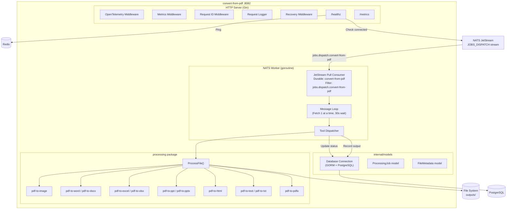
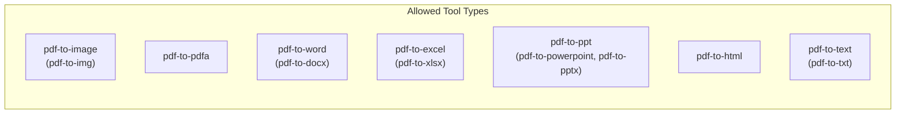
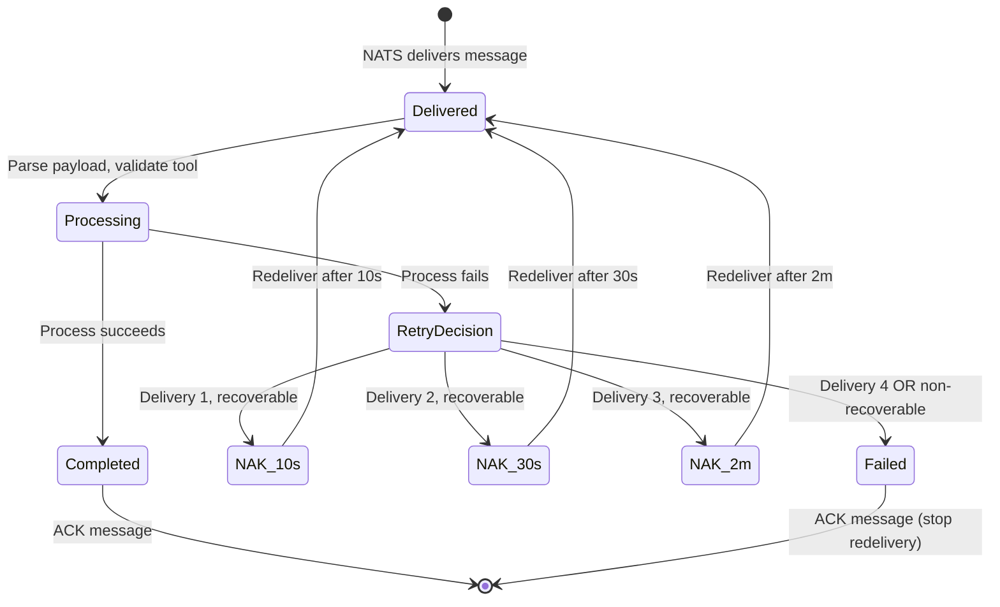

# Convert-from-PDF Service -- Architecture

Internal structure and component diagram of the `convert-from-pdf` service (port 8082).

## Component Diagram

## Allowed Tool Types

## Worker Retry Strategy

