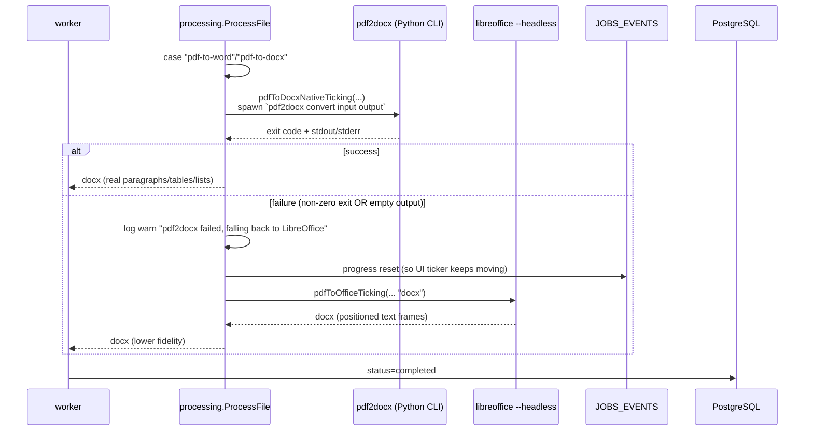
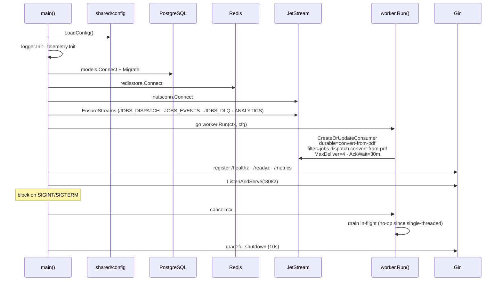
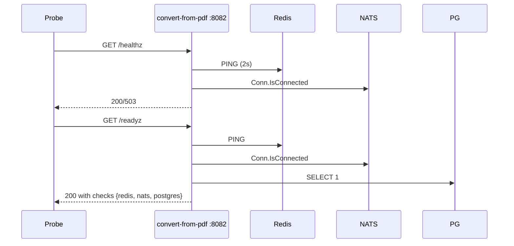

# Convert-from-PDF Service -- Sequence Diagrams

Request flows through the `convert-from-pdf` worker service.

## Job Processing — Happy Path

```mermaid
sequenceDiagram
    participant NATS as JOBS_DISPATCH
    participant W as convert-from-pdf worker
    participant Proc as processing.ProcessFile
    participant Tools as pdf2docx · LibreOffice · poppler · ghostscript
    participant PG as PostgreSQL
    participant Disk as File System
    participant EV as JOBS_EVENTS

    NATS->>W: Pull (1 msg, MaxWait 30s)
    W->>W: Unmarshal JobPayload
    W->>W: Validate AllowedTools[toolType]
    W->>PG: SELECT status — skip if completed/processing
    W->>PG: UPDATE status=processing, progress=20
    W->>EV: jobs.events.&lt;jobId&gt;.processing
    W->>W: Parse options JSON

    W->>Proc: ProcessFile(toolType, inputPaths, options, outputDir, onProgress)
    Proc->>Tools: tool-specific dispatch (see arch diagram)
    Tools-->>Disk: output file
    Proc-->>W: {OutputPath, Metadata{outputExt}}

    W->>PG: DELETE file_metadata WHERE job_id=:id AND kind='output' (idempotent re-run)
    W->>Disk: Stat output → size
    W->>PG: INSERT file_metadata (kind='output', path, size_bytes)
    W->>PG: Merge metadata JSON
    W->>PG: UPDATE status=completed, progress=100, completed_at=NOW(), failure_reason=NULL
    W->>EV: jobs.events.&lt;jobId&gt;.completed (with fileSize)
    W->>NATS: ACK
```

## DOCX Path — pdf2docx + LibreOffice fallback



## PPTX Path — image-based slide builder

```mermaid
sequenceDiagram
    participant W as worker
    participant Proc as processing.ProcessFile
    participant Pop as pdftoppm
    participant Builder as pptx builder
    participant Disk as File System
    participant EV as JOBS_EVENTS

    Proc->>Proc: case "pdf-to-ppt"/"pdf-to-pptx"
    Proc->>Disk: mkdir tmp/&lt;jobId&gt;/
    Proc->>Pop: pdftoppm input.pdf → page-001.png ... page-N.png
    loop For each page image
        Proc->>Builder: addSlideWithImage(pngPath)
        Proc->>EV: progress (i/N) — onProgress callback
    end
    Builder-->>Disk: outputs/&lt;jobId&gt;.pptx
    Proc-->>W: OutputPath
```

## Failure with Retry / DLQ

```mermaid
sequenceDiagram
    participant NATS as JOBS_DISPATCH
    participant W as convert-from-pdf worker
    participant DLQ as JOBS_DLQ
    participant PG as PostgreSQL
    participant EV as JOBS_EVENTS

    NATS->>W: Deliver msg (deliveryCount=N)
    W->>W: ProcessFile fails

    alt N &lt; MaxDeliver (4) — recoverable
        W->>PG: UPDATE status=queued, progress=0,<br/>failure_reason="retrying: &lt;err&gt;"
        W->>NATS: Nak(delay=BackOff[N]) — 10s · 30s · 2m
        Note over NATS: Redeliver after backoff
    else N == MaxDeliver — exhausted
        W->>PG: UPDATE status=failed, progress=0, failure_reason=[CODE] msg
        W->>EV: jobs.events.&lt;jobId&gt;.failed
        W->>DLQ: Publish jobs.dlq.convert-from-pdf
        W->>NATS: ACK (stop redelivery)
    end
```

## Service Startup



## Health & Readiness


