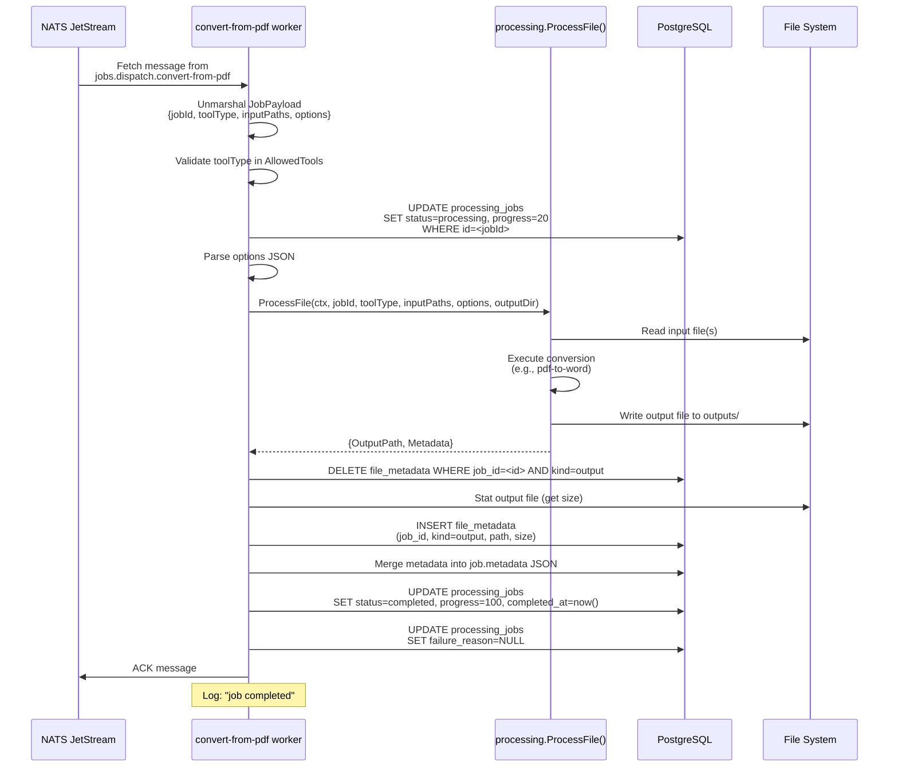
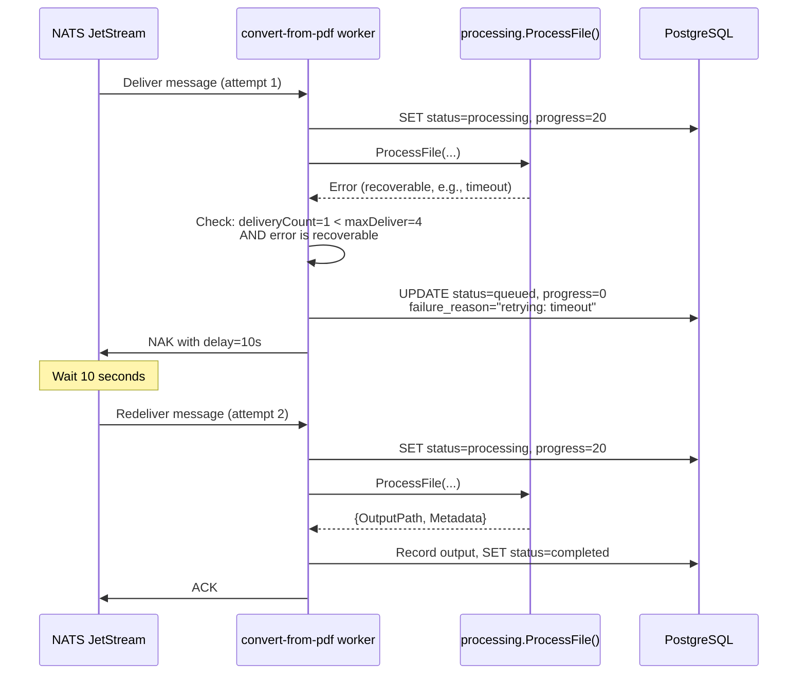
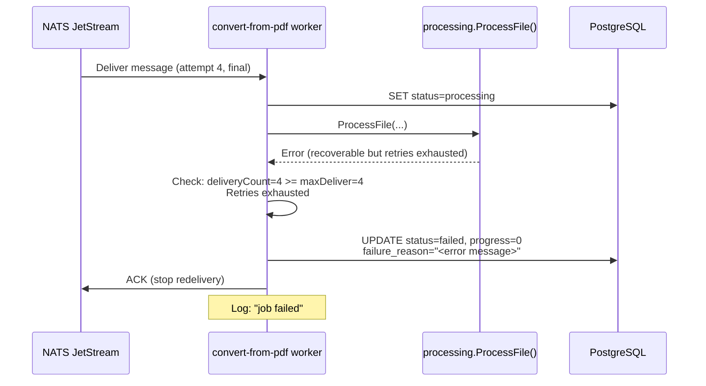
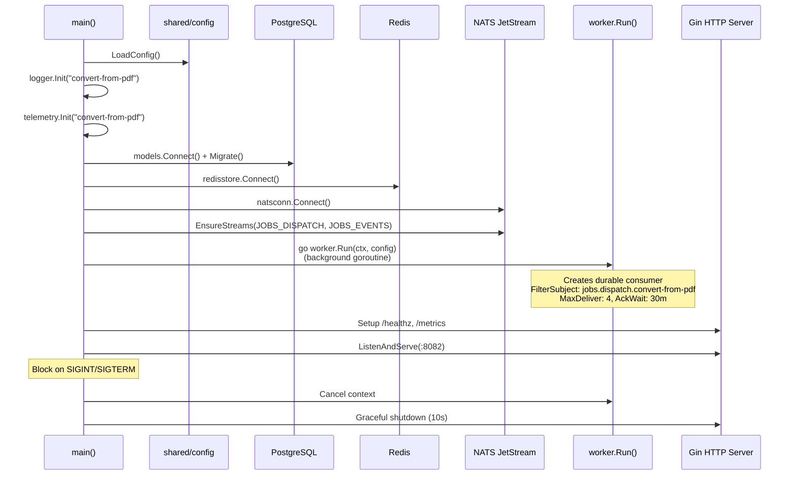

# Convert-from-PDF Service -- Sequence Diagrams

Request flows through the `convert-from-pdf` worker service.

## Job Processing (Happy Path)

## Job Processing (Failure with Retry)

## Job Processing (Permanent Failure)

## Service Startup

