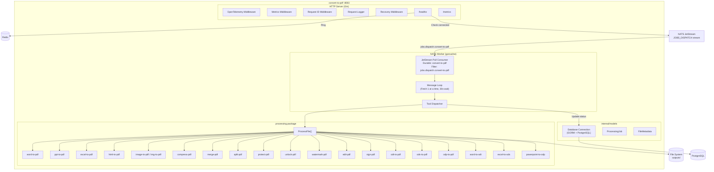
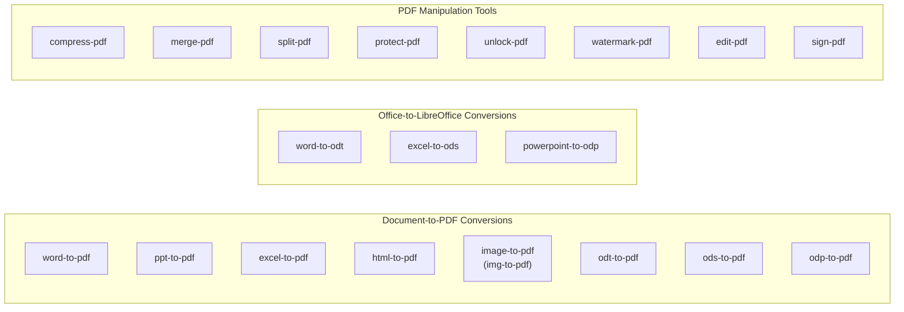
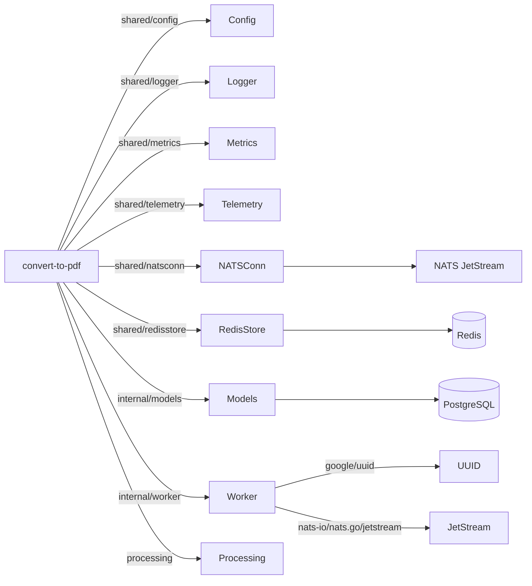

# Convert-to-PDF Service -- Architecture

Internal structure and component diagram of the `convert-to-pdf` service (port 8083).

## Component Diagram

```mermaid
graph TB
    subgraph convert-to-pdf[" convert-to-pdf :8083 "]
        direction TB

        subgraph HTTP["HTTP Server (Gin)"]
            TRACE["OpenTelemetry Middleware"]
            METRICS["Metrics Middleware"]
            REQID["Request ID Middleware"]
            LOGGER["Request Logger"]
            RECOVERY["Recovery Middleware"]
            HEALTHZ["/healthz"]
            METRICSEP["/metrics"]
        end

        subgraph Worker["NATS Worker (goroutine)"]
            CONSUMER["JetStream Pull Consumer<br/>Durable: convert-to-pdf<br/>Filter: jobs.dispatch.convert-to-pdf"]
            MSGLOOP["Message Loop<br/>(Fetch 1 at a time, 30s wait)"]
            DISPATCH["Tool Dispatcher"]
        end

        subgraph Processing["processing package"]
            PROC["ProcessFile()"]
            WORD["word-to-pdf"]
            PPT["ppt-to-pdf"]
            EXCEL["excel-to-pdf"]
            HTML["html-to-pdf"]
            IMG["image-to-pdf / img-to-pdf"]
            COMPRESS["compress-pdf"]
            MERGE["merge-pdf"]
            SPLIT["split-pdf"]
            PROTECT["protect-pdf"]
            UNLOCK["unlock-pdf"]
            WATERMARK["watermark-pdf"]
            EDIT["edit-pdf"]
            SIGN["sign-pdf"]
            ODT_PDF["odt-to-pdf"]
            ODS_PDF["ods-to-pdf"]
            ODP_PDF["odp-to-pdf"]
            WORD_ODT["word-to-odt"]
            EXCEL_ODS["excel-to-ods"]
            PPT_ODP["powerpoint-to-odp"]
        end

        subgraph Models["internal/models"]
            DB_CONN["Database Connection<br/>(GORM + PostgreSQL)"]
            JOB_MODEL["ProcessingJob"]
            FILE_MODEL["FileMetadata"]
        end
    end

    NATS["NATS JetStream<br/>JOBS_DISPATCH stream"] -->|jobs.dispatch.convert-to-pdf| CONSUMER
    CONSUMER --> MSGLOOP --> DISPATCH

    DISPATCH --> PROC
    PROC --> WORD
    PROC --> PPT
    PROC --> EXCEL
    PROC --> HTML
    PROC --> IMG
    PROC --> COMPRESS
    PROC --> MERGE
    PROC --> SPLIT
    PROC --> PROTECT
    PROC --> UNLOCK
    PROC --> WATERMARK
    PROC --> EDIT
    PROC --> SIGN
    PROC --> ODT_PDF
    PROC --> ODS_PDF
    PROC --> ODP_PDF
    PROC --> WORD_ODT
    PROC --> EXCEL_ODS
    PROC --> PPT_ODP

    DISPATCH -->|Update status| DB_CONN
    DB_CONN --> PG[(PostgreSQL)]
    HEALTHZ -->|Ping| Redis[(Redis)]
    HEALTHZ -->|Check connected| NATS
    PROC --> Disk[(File System<br/>outputs/)]
```

## Allowed Tool Types

```mermaid
graph LR
    subgraph ConversionTools["Document-to-PDF Conversions"]
        A["word-to-pdf"]
        B["ppt-to-pdf"]
        C["excel-to-pdf"]
        D["html-to-pdf"]
        E["image-to-pdf<br/>(img-to-pdf)"]
        AA["odt-to-pdf"]
        BB["ods-to-pdf"]
        CC["odp-to-pdf"]
    end

    subgraph OdfTools["Office-to-LibreOffice Conversions"]
        DD["word-to-odt"]
        EE["excel-to-ods"]
        FF["powerpoint-to-odp"]
    end

    subgraph PDFTools["PDF Manipulation Tools"]
        F["compress-pdf"]
        G["merge-pdf"]
        H["split-pdf"]
        I["protect-pdf"]
        J["unlock-pdf"]
        K["watermark-pdf"]
        L["edit-pdf"]
        M["sign-pdf"]
    end
```

## Dependency Graph

```mermaid
graph LR
    CTP[convert-to-pdf] --> |shared/config| Config
    CTP --> |shared/logger| Logger
    CTP --> |shared/metrics| Metrics
    CTP --> |shared/telemetry| Telemetry
    CTP --> |shared/natsconn| NATSConn
    CTP --> |shared/redisstore| RedisStore
    CTP --> |internal/models| Models
    CTP --> |internal/worker| Worker
    CTP --> |processing| Processing

    NATSConn --> NATS["NATS JetStream"]
    Models --> PG[(PostgreSQL)]
    RedisStore --> Redis[(Redis)]
    Worker --> |google/uuid| UUID
    Worker --> |nats-io/nats.go/jetstream| JetStream
```
