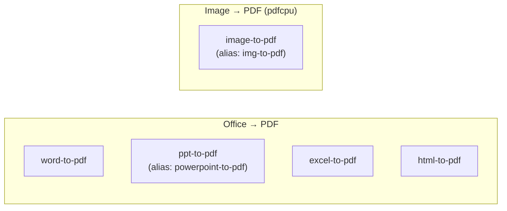
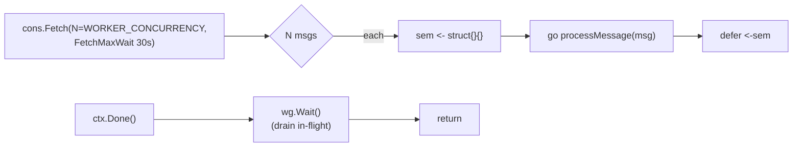
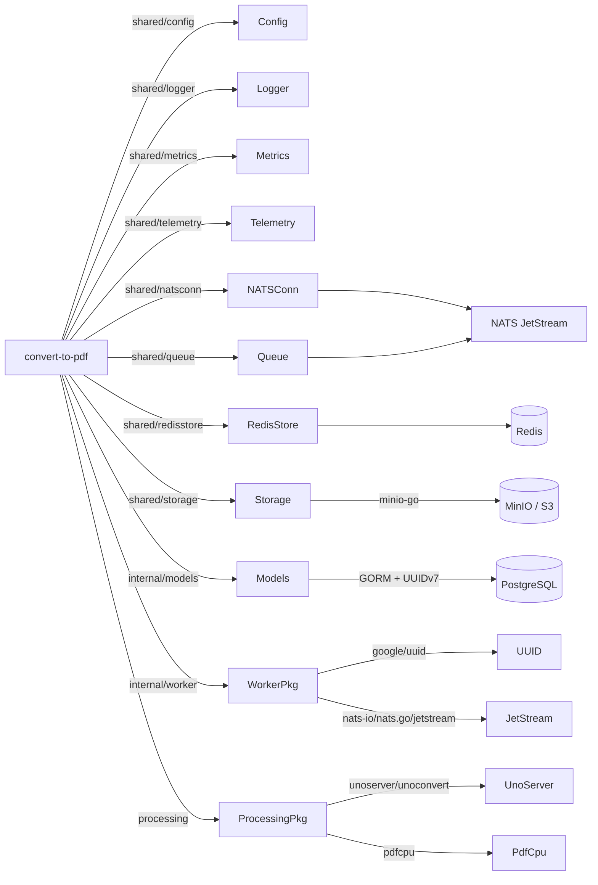

# Convert-to-PDF Service -- Architecture

Internal structure and component diagram of the `convert-to-pdf` service (port 8083).

## Component Diagram

```mermaid
graph TB
    subgraph convert-to-pdf[" convert-to-pdf :8083 "]
        direction TB

        subgraph HTTP["HTTP Server (Gin)"]
            TRACE["OpenTelemetry · GinTraceMiddleware"]
            METRICS["Prometheus · GinMetricsMiddleware"]
            REQID["GinRequestID"]
            LOGGER["GinRequestLogger"]
            RECOVERY["gin.Recovery"]
            HEALTHZ["/healthz"]
            READYZ["/readyz"]
            METRICSEP["/metrics"]
        end

        subgraph Worker["NATS Worker (goroutine pool)"]
            CONSUMER["JetStream Pull Consumer<br/>Durable: convert-to-pdf<br/>Filter: jobs.dispatch.convert-to-pdf<br/>MaxDeliver=4 · AckWait=30m<br/>BackOff 10s · 30s · 2m"]
            FETCH["Fetch up to WORKER_CONCURRENCY (default 2)"]
            SEM["Semaphore chan struct{} sized to WORKER_CONCURRENCY"]
            DISPATCH["processMessage()<br/>(per-msg goroutine)"]
            DUP_GUARD["Duplicate-job guard<br/>(skip if already processing/completed)"]
            STAGE["fetchInputs()<br/>(uploads bucket → scratch/in)"]
            PROG["Time-based progressReporter<br/>(20→90% ease-out · publishes events)"]
            STORE["storeOutput()<br/>(scratch/out → outputs bucket jobs/&lt;jobId&gt;/...)"]
        end

        subgraph Processing["processing package"]
            PROC["ProcessFile(toolType, ...)"]
            OFFICE["officeToPDF()"]
            UNO["unoconvert<br/>(UNOSERVER_HOST:UNOSERVER_PORT)"]
            FALLBACK["libreoffice --headless<br/>(fallback)"]
            IMG["image-to-pdf / img-to-pdf<br/>(pdfcpu, multi-image → multi-page)"]
        end

        subgraph DLQ["DLQ on MaxDeliver exhaustion"]
            DLQ_PUB["Publish jobs.dlq.convert-to-pdf<br/>(JOBS_DLQ stream · 7d)"]
        end

        subgraph Models["internal/models (GORM)"]
            JOB_MODEL["processing_jobs"]
            FILE_MODEL["file_metadata"]
        end
    end

    NATS["NATS JetStream<br/>JOBS_DISPATCH"] -->|jobs.dispatch.convert-to-pdf| CONSUMER
    CONSUMER --> FETCH --> SEM --> DISPATCH
    DISPATCH --> DUP_GUARD
    DUP_GUARD --> STAGE
    STAGE --> PROG
    PROG --> PROC
    PROC --> STORE

    PROC --> OFFICE
    OFFICE --> UNO
    OFFICE -.->|on connect failure| FALLBACK
    PROC --> IMG

    DISPATCH -->|status updates| JOB_MODEL
    DISPATCH -->|jobs.events.&lt;jobId&gt;.{processing,completed,failed}| EVENTS["JOBS_EVENTS stream"]
    DISPATCH -.->|on MaxDeliver| DLQ_PUB

    MINIO[("MinIO / S3<br/>uploads + outputs buckets")]
    STAGE -->|DownloadToFile| MINIO
    STORE -->|UploadFromFile| MINIO
    OFFICE & IMG --> Scratch[(container-local scratch dir<br/>job-&lt;jobId&gt;-* · removed after job)]
    JOB_MODEL & FILE_MODEL --> PG[(PostgreSQL)]

    HEALTHZ -->|PING| Redis[(Redis)]
    HEALTHZ -->|Conn.IsConnected| NATS
    READYZ -->|tcp dial UNOSERVER_PORT| UNO
```

## Allowed Tool Types

The whitelist in `main.go:65` is the authoritative source. Any other tool type is failed with `[UNSUPPORTED_TOOL]` and the message is acked.



> PDF-manipulation tools (compress / merge / split / watermark / sign / etc.) are NOT here — they live in **organize-pdf** (pdfcpu structural ops) and **optimize-pdf** (Ghostscript/Tesseract). See [system-overview](./system-overview.md).

## Concurrency Model



`WORKER_CONCURRENCY` (default 2) defines the maximum simultaneous in-flight jobs. The fetch batch size matches the semaphore capacity so the consumer can't pull more than it can run.

## Dependency Graph


