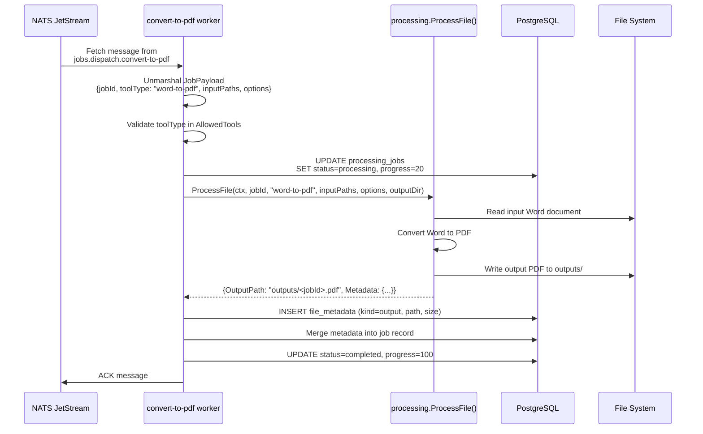
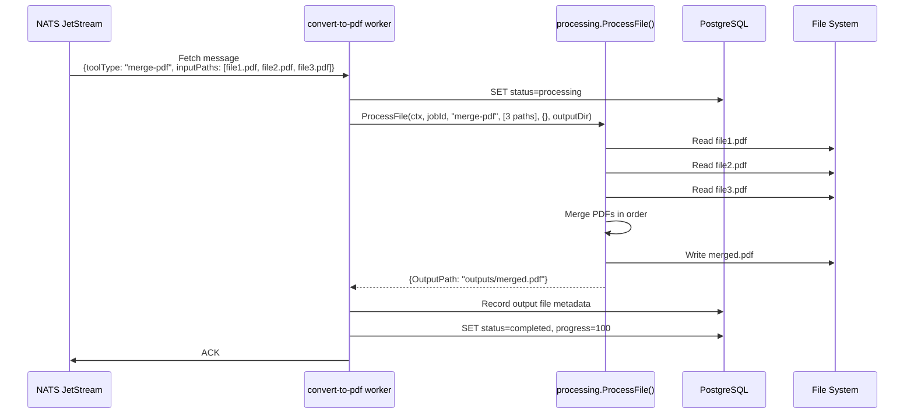
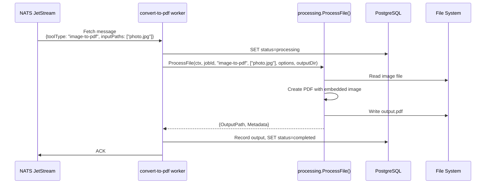
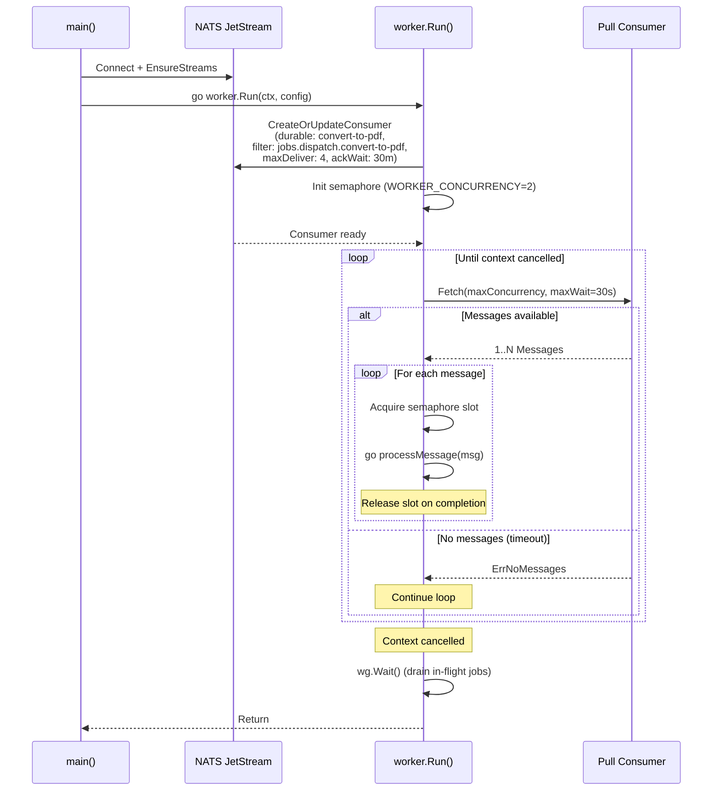

# Convert-to-PDF Service -- Sequence Diagrams

Request flows through the `convert-to-pdf` worker service.

## Job Processing (Happy Path)

## Merge PDF Processing

## Image-to-PDF Conversion

## Worker Lifecycle

