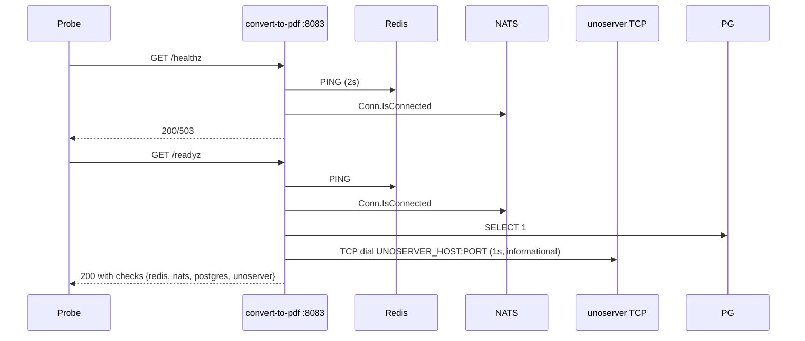

# Convert-to-PDF Service -- Sequence Diagrams

Request flows through the `convert-to-pdf` worker service.

## Job Processing — Office (word/excel/ppt/html)

```mermaid
sequenceDiagram
    participant NATS as JOBS_DISPATCH
    participant W as convert-to-pdf worker
    participant Sem as Semaphore (cap=WORKER_CONCURRENCY)
    participant Proc as processing.ProcessFile
    participant Uno as unoserver / unoconvert
    participant LO as libreoffice --headless (fallback)
    participant PG as PostgreSQL
    participant Disk as File System
    participant EV as JOBS_EVENTS

    NATS->>W: Pull batch (up to WORKER_CONCURRENCY)
    W->>Sem: Acquire slot
    par per message
        W->>W: Unmarshal JobPayload
        W->>W: Validate AllowedTools[toolType]
        W->>PG: SELECT status — skip if completed/processing
        W->>PG: UPDATE status=processing, progress=20
        W->>EV: jobs.events.&lt;jobId&gt;.processing
        W->>W: startProgressReporter(20→90% ease-out)
        W->>Proc: ProcessFile(toolType, inputPaths, ...)
        Proc->>Uno: unoconvert --convert-to pdf input output
        alt unoserver unreachable
            Proc->>LO: libreoffice --headless --convert-to pdf
        end
        Uno-->>Disk: output.pdf
        LO-.->>Disk: output.pdf (fallback path)
        Proc-->>W: {OutputPath, Metadata}
        W->>W: stopProgressReporter
        alt success
            W->>PG: INSERT file_metadata (kind=output)
            W->>PG: UPDATE status=completed, progress=100
            W->>EV: jobs.events.&lt;jobId&gt;.completed (with fileSize)
        else failure
            W->>PG: UPDATE status=failed, failure_reason=[CODE] msg
            W->>EV: jobs.events.&lt;jobId&gt;.failed
            opt MaxDeliver hit
                W->>NATS: Publish jobs.dlq.convert-to-pdf
            end
        end
        W->>NATS: ACK
    end
    W->>Sem: Release slot
```

## Image-to-PDF (multi-image)

```mermaid
sequenceDiagram
    participant NATS as JOBS_DISPATCH
    participant W as convert-to-pdf worker
    participant Proc as processing.ProcessFile
    participant Pdfcpu as pdfcpu
    participant PG as PostgreSQL
    participant Disk as File System
    participant EV as JOBS_EVENTS

    NATS->>W: msg {toolType:image-to-pdf, inputPaths:[a.jpg,b.png,c.webp]}
    W->>PG: status=processing, progress=20
    W->>EV: processing
    W->>W: startProgressReporter (time-based)
    W->>Proc: ProcessFile("image-to-pdf", [3 paths], options)
    Proc->>Disk: Read each image
    Proc->>Pdfcpu: Import images one per page
    Pdfcpu-->>Disk: outputs/&lt;jobId&gt;.pdf (3 pages)
    Proc-->>W: OutputPath
    W->>W: stop reporter
    W->>PG: file_metadata (kind=output)
    W->>PG: status=completed, progress=100
    W->>EV: completed
    W->>NATS: ACK
```

## Worker Lifecycle

```mermaid
sequenceDiagram
    participant Main as main()
    participant NATS as JetStream
    participant W as worker.Run()
    participant Cons as Pull Consumer

    Main->>NATS: Connect + EnsureStreams
    Main->>W: go worker.Run(ctx, cfg)
    W->>NATS: CreateOrUpdateConsumer<br/>durable=convert-to-pdf<br/>filter=jobs.dispatch.convert-to-pdf<br/>MaxDeliver=4 · AckWait=30m<br/>BackOff=10s/30s/2m
    W->>W: Init semaphore (WORKER_CONCURRENCY=2)
    loop Until ctx.Done()
        W->>Cons: Fetch(N, MaxWait 30s)
        alt msgs
            Cons-->>W: 1..N
            loop each
                W->>W: sem &lt;- ; go processMessage(msg) ; defer &lt;-sem
            end
        else no msgs
            Note over W: continue loop (sleep 500ms on fetch error)
        end
    end
    Note over W: ctx cancelled
    W->>W: wg.Wait() — drain in-flight
    W-->>Main: return
```

## Failure Handling — DLQ

```mermaid
sequenceDiagram
    participant W as convert-to-pdf worker
    participant NATS as JOBS_DISPATCH
    participant DLQ as JOBS_DLQ
    participant PG as PostgreSQL

    Note over W: Conversion fails
    W->>PG: UPDATE status=failed, failure_reason=[CODE]...
    W->>W: classifyError → CONVERSION_FAILED / TIMEOUT / OUTPUT_FAILED / INVALID_PAYLOAD
    alt deliveryCount &lt; MaxDeliver (4)
        W->>NATS: Nak(delay=BackOff[deliveryCount])
        Note over NATS: Redeliver after backoff
    else deliveryCount == MaxDeliver
        W->>DLQ: Publish jobs.dlq.convert-to-pdf with original payload + error
        W->>NATS: ACK (drop)
    end
```

## Health & Readiness


