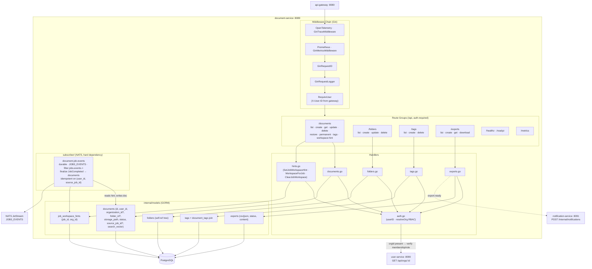
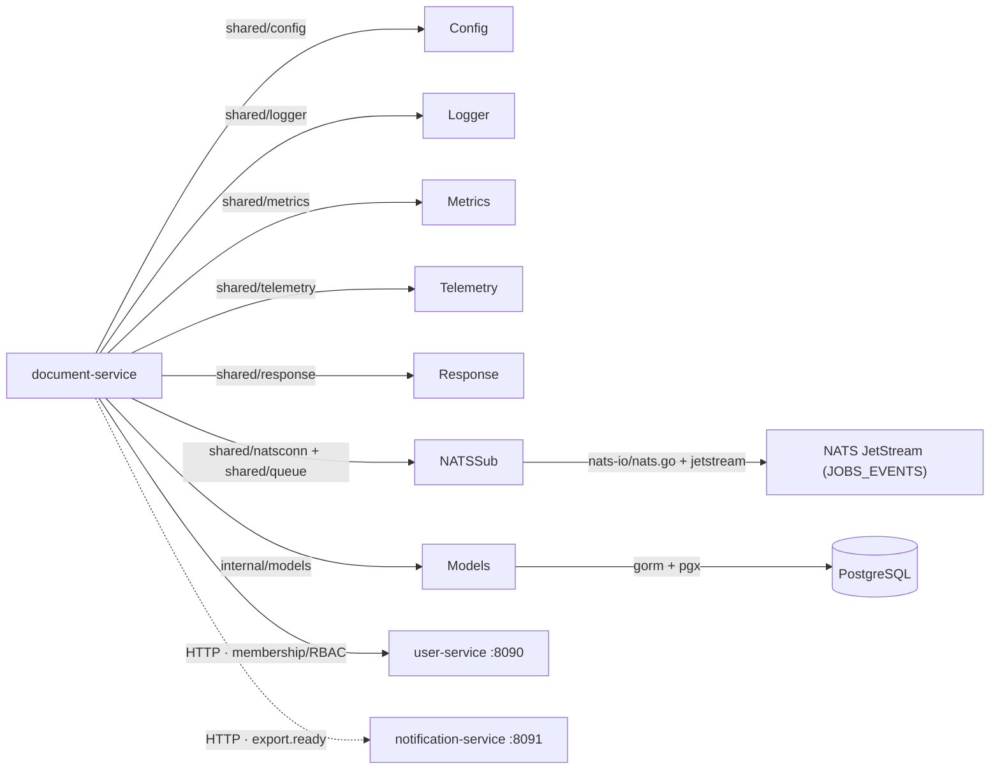

# Document Service -- Architecture

Internal structure and component diagram of the `document-service` (port 8089).

## Component Diagram

```mermaid
graph TB
    subgraph document-service[" document-service :8089 "]
        direction TB

        subgraph Middleware["Middleware Chain (Gin)"]
            TRACE["OpenTelemetry · GinTraceMiddleware"]
            METRICS["Prometheus · GinMetricsMiddleware"]
            REQID["GinRequestID"]
            LOGGER["GinRequestLogger"]
            REQUSER["RequireUser<br/>(X-User-ID from gateway)"]
        end

        subgraph Routes["Route Groups (/api, auth-required)"]
            DOCS["/documents<br/>list · create · get · update · delete<br/>restore · permanent · tags · workspace-hint"]
            FOLDERS["/folders<br/>list · create · update · delete"]
            TAGS["/tags<br/>list · create · delete"]
            EXPORTS["/exports<br/>list · create · get · download"]
            HEALTHZ["/healthz · /readyz"]
            METRICSEP["/metrics"]
        end

        subgraph Handlers
            DH["documents.go"]
            FH["folders.go"]
            TH["tags.go"]
            EH["exports.go"]
            HH["hints.go<br/>(SetJobWorkspaceHint · WorkspaceForJob · ClearJobWorkspace)"]
            AUTHH["auth.go<br/>(userID · resolveOrg RBAC)"]
        end

        subgraph Subscriber["subscriber/ (NATS, hard dependency)"]
            SUB["document-job-events<br/>durable · JOBS_EVENTS · filter jobs.events.><br/>finalize JobCompleted → documents<br/>idempotent on (user_id, source_job_id)"]
        end

        subgraph Models["internal/models (GORM)"]
            DOC_MODEL["documents (id, user_id, organization_id?, folder_id?,<br/>storage_path, status, source_job_id?, search_vector)"]
            FOLDER_MODEL["folders (self-ref tree)"]
            TAG_MODEL["tags + document_tags join"]
            EXPORT_MODEL["exports (csv|json, status, content)"]
            HINT_MODEL["job_workspace_hints (job_id, org_id)"]
        end
    end

    Client["api-gateway :8080"] --> TRACE --> METRICS --> REQID --> LOGGER --> REQUSER
    REQUSER --> Routes

    DOCS --> DH
    DOCS --> HH
    FOLDERS --> FH
    TAGS --> TH
    EXPORTS --> EH
    DH & FH & TH & EH & HH --> AUTHH

    DH --> DOC_MODEL
    FH --> FOLDER_MODEL
    TH --> TAG_MODEL
    EH --> EXPORT_MODEL
    HH --> HINT_MODEL

    AUTHH -->|"orgId present → verify membership/role"| USVC["user-service :8090<br/>GET /api/orgs/:id"]
    EH -.->|"export.ready"| NSVC["notification-service :8091<br/>POST /internal/notifications"]

    SUB -->|"reads hint, writes doc"| DOC_MODEL
    SUB --> HINT_MODEL

    DOC_MODEL & FOLDER_MODEL & TAG_MODEL & EXPORT_MODEL & HINT_MODEL --> PG[(PostgreSQL)]
    SUB --> NATS["NATS JetStream<br/>JOBS_EVENTS"]
```

## Dependency Graph

```mermaid
graph LR
    DS[document-service] --> |shared/config| Config
    DS --> |shared/logger| Logger
    DS --> |shared/metrics| Metrics
    DS --> |shared/telemetry| Telemetry
    DS --> |shared/response| Response
    DS --> |shared/natsconn + shared/queue| NATSSub
    DS --> |internal/models| Models

    Models --> |gorm + pgx| PG[(PostgreSQL)]
    NATSSub --> |nats-io/nats.go + jetstream| NATS["NATS JetStream (JOBS_EVENTS)"]
    DS --> |HTTP · membership/RBAC| USVC[user-service :8090]
    DS -.-> |HTTP · export.ready| NSVC[notification-service :8091]
```
