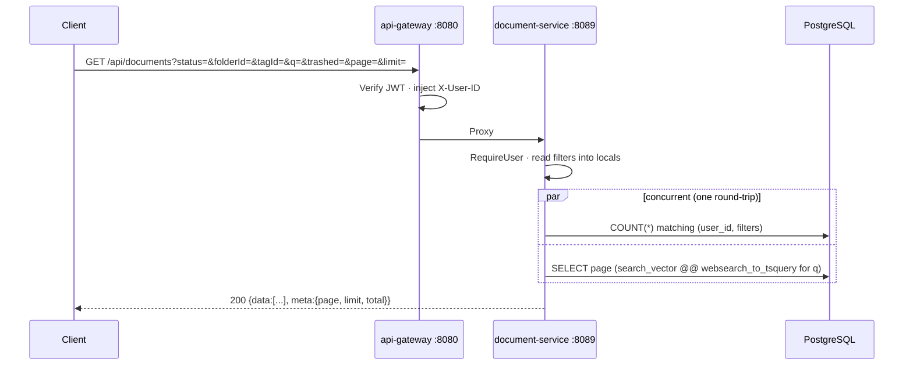
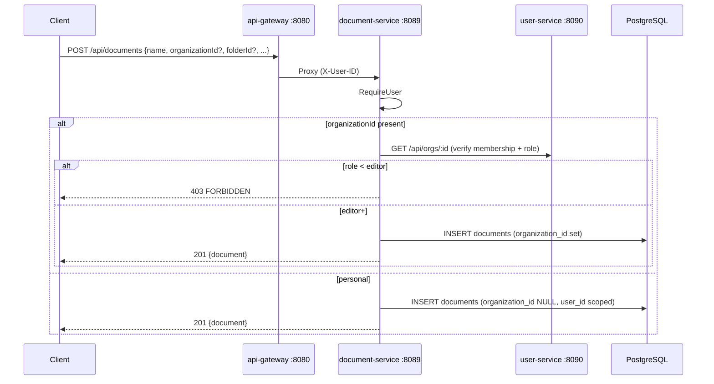
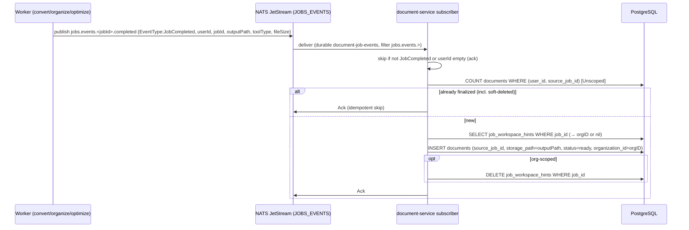
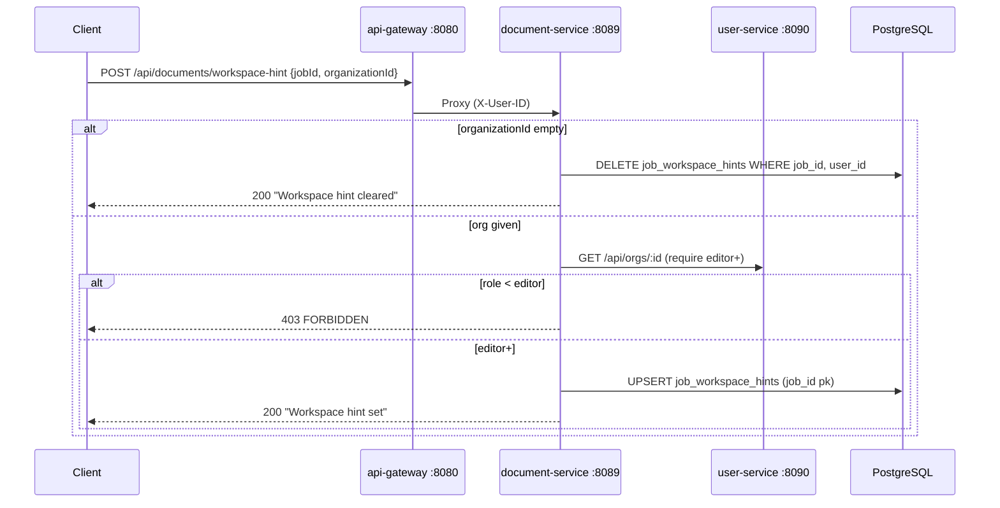
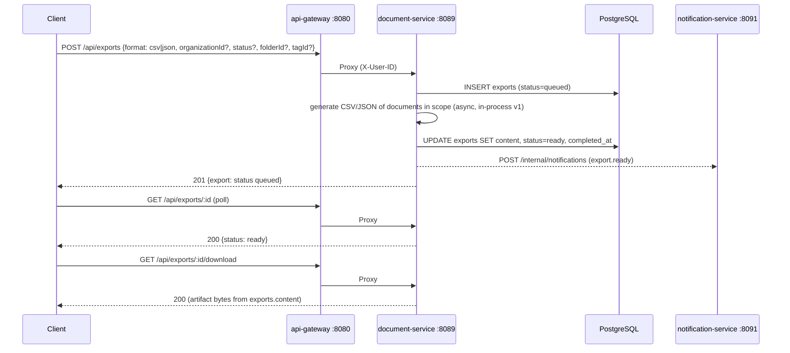

# Document Service -- Sequence Diagrams

Request flows through the `document-service` (port 8089). Identity is the gateway-injected `X-User-ID`; org-scoped requests are RBAC-checked against user-service.

## List Documents (personal)

## Create Document (org-scoped, RBAC)

## Finalize a Completed Job into a Document (NATS subscriber)

## Set Workspace Hint (file future job into an org)

## Create + Download Export

