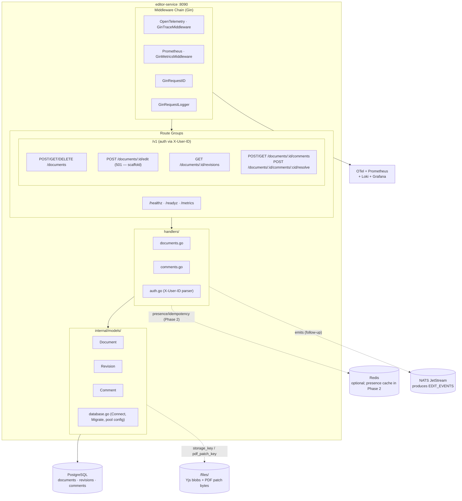

# editor-service -- Architecture

Internal structure and component diagram of the `editor-service` (port `8090`).

## Component Diagram

## Key packages

| Package | Responsibility |
|---|---|
| `main` | Service entrypoint — config → logger → telemetry → DB → NATS → Redis → gin → SIGTERM drain. |
| `handlers` | HTTP request handlers using the shared envelope; auth via `X-User-ID` header. |
| `internal/models` | GORM types (`Document`, `Revision`, `Comment`), DB connection + migrations + pool config. |
| `routes` | gin route table; isolates wiring from main so it can be exercised in tests without a real server. |

## Where things live (dataflow)

| Concept | Persistence |
|---|---|
| Document metadata | Postgres `documents` |
| Revision metadata + commit message | Postgres `revisions` |
| Yjs CRDT update bytes (per revision) | `/files/users/{user_id}/jobs/{doc_id}/revisions/{rev_id}.yjs` (see [STORAGE.md](../architecture/STORAGE.md) §4.4.3) |
| Incremental PDF patch bytes | `/files/.../edits/{rev_id}.delta` |
| Comments + anchor JSON | Postgres `comments` (anchor is opaque JSONB) |
| Index updates (Phase 2) | Meilisearch via `EDIT_EVENTS` subscriber |
| Presence + idempotency cache (Phase 2) | Redis |

## Compliance notes

- **Microservice boundaries** ([CLAUDE.md](../../../CLAUDE.md) §1) — only imports `fyredocs/shared/*`; no cross-service Go imports.
- **Standard response envelope** ([CLAUDE.md](../../../CLAUDE.md) §7) — all HTTP responses use `shared/response`.
- **Own DB schema** ([CLAUDE.md](../../../CLAUDE.md) §3) — `documents`, `revisions`, `comments` are owned by editor-service; other services must call the REST API.
- **Auth defence-in-depth** — local JWT verifier ported from job-service into [`internal/authverify/`](../../../editor-service/internal/authverify/); every `/v1/*` route is gated by the gin auth middleware (verifies signature with dual-key support, checks denylist, populates auth context).
