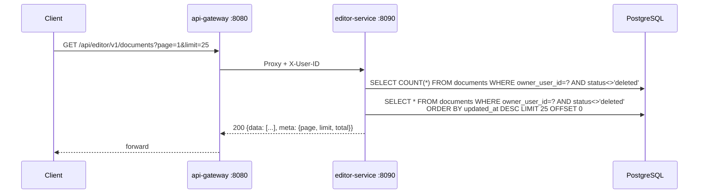
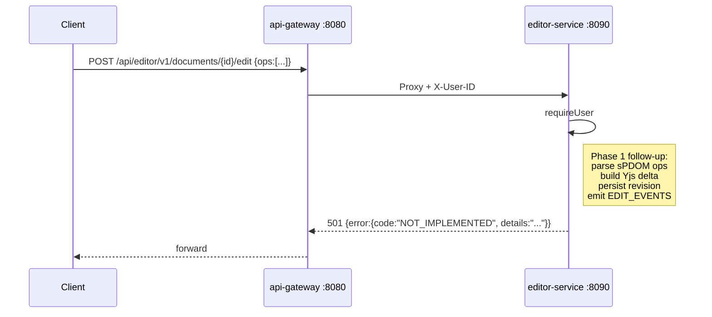
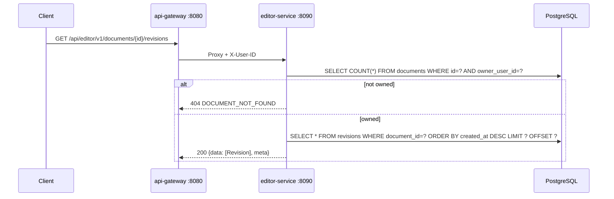
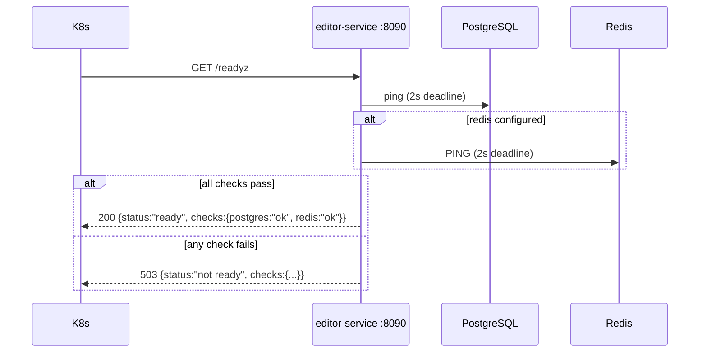

# editor-service -- Sequence Diagrams

Request flows through the `editor-service` (port `8090`).

## Create document

```mermaid
sequenceDiagram
    participant Client
    participant GW as api-gateway :8080
    participant ES as editor-service :8090
    participant PG as PostgreSQL
    participant FS as /files/

    Note over GW: pre-existing upload flow stored bytes at /files/.../uploads/{uploadId}/{name}
    Client->>GW: POST /api/editor/v1/documents {title, storageKey, sizeBytes, pageCount}
    GW->>ES: Proxy + X-User-ID: <uuid>
    ES->>ES: requireUser (parse X-User-ID)
    ES->>ES: validate body (title required, storageKey required, length bounds)
    ES->>PG: INSERT documents (id=UUIDv7, owner_user_id, title, storage_key, status='ready')
    ES-->>GW: 201 {success:true, message:"document created", data: {Document}}
    GW-->>Client: forward
    Note over ES,FS: FS bytes are NOT touched here; storage_key is opaque to editor-service.
```

## List documents



## Edit document (sPDOM op) — scaffolded



## Add comment

```mermaid
sequenceDiagram
    participant Client
    participant GW as api-gateway :8080
    participant ES as editor-service :8090
    participant PG as PostgreSQL

    Client->>GW: POST /api/editor/v1/documents/{id}/comments<br/>{revId, anchor, body}
    GW->>ES: Proxy + X-User-ID
    ES->>ES: requireUser; validate body; validate revId is uuid
    ES->>PG: SELECT * FROM documents WHERE id=? AND owner_user_id=?
    alt document missing
        ES-->>GW: 404 {error:{code:"DOCUMENT_NOT_FOUND"}}
    else owned
        ES->>PG: INSERT comments (id=UUIDv7, document_id, rev_id, anchor, body, author_user_id, resolved=false)
        ES-->>GW: 201 {data: {Comment}}
    end
    GW-->>Client: forward
```

## List revisions



## Readiness probe


