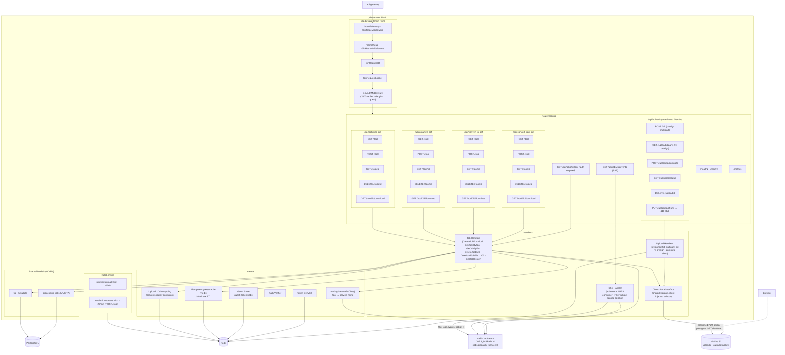
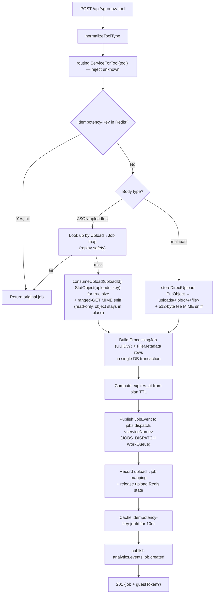
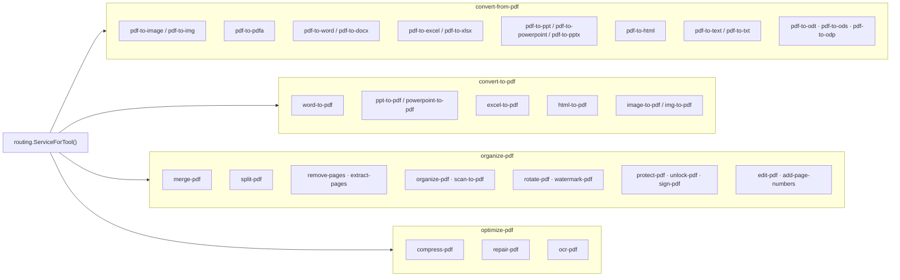
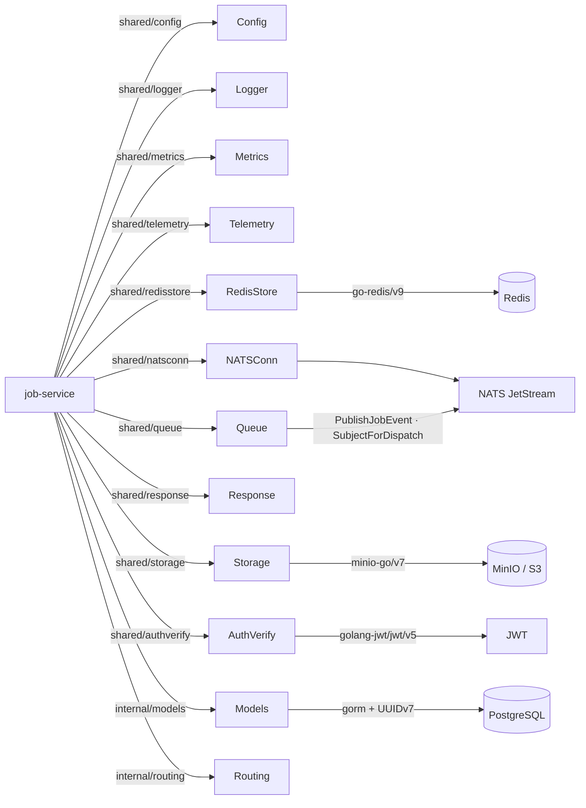

# Job Service -- Architecture

Internal structure and component diagram of the `job-service` (port 8081).

## Component Diagram



## Job Dispatch Flow



## Tool-to-Service Routing Map



## SSE Consumer Lifecycle

```mermaid
flowchart TD
    A["Client opens GET /api/jobs/:id/events"] --> B["Set SSE headers"]
    B --> C["Create ephemeral consumer on JOBS_EVENTS<br/>FilterSubject jobs.events.&lt;jobId&gt;.&gt;<br/>DeliverPolicy=DeliverNewPolicy<br/>InactiveThreshold=1m"]
    C --> D["Send 'connected' event"]
    D --> E["Loop: Fetch up to 1 msg every 5s"]
    E -->|got msg| F["Forward as 'job-update' event"]
    F --> G{"Status terminal?"}
    G -->|yes (completed/failed)| H["Close stream"]
    G -->|no| E
    E -->|no msg / timeout| I["Send 15s keepalive comment"]
    I --> E
    E -->|ctx done / 5min cap| H
    H --> J["DELETE consumer (best-effort)"]
```

## Dependency Graph


