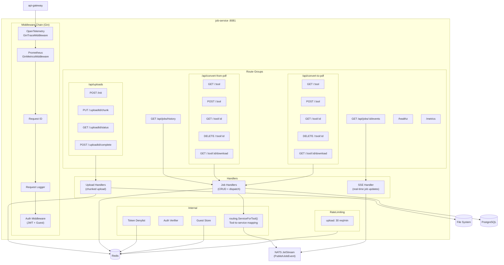
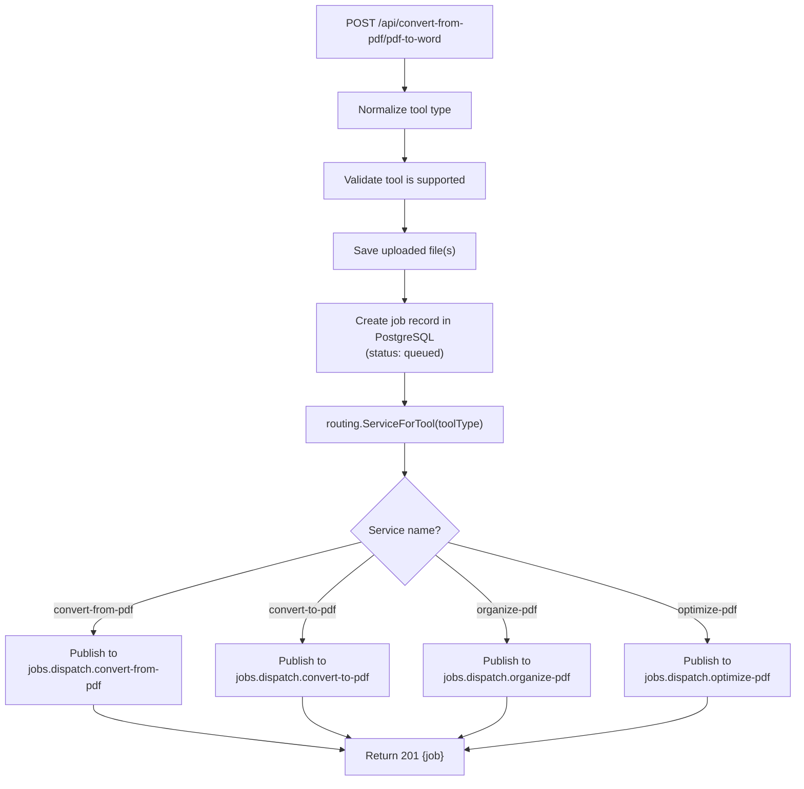
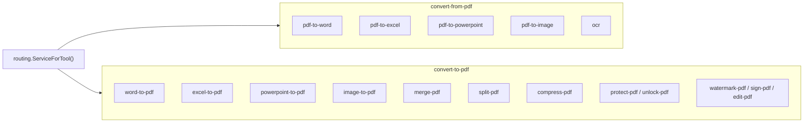
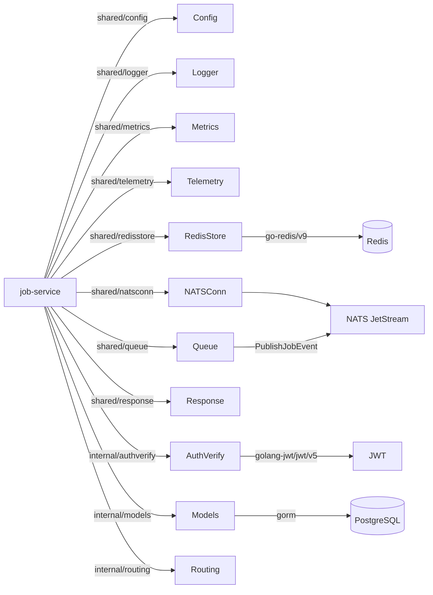

# Job Service -- Architecture

Internal structure and component diagram of the `job-service` (port 8081).

## Component Diagram

## Job Dispatch Flow

## Tool-to-Service Routing Map

## Dependency Graph

