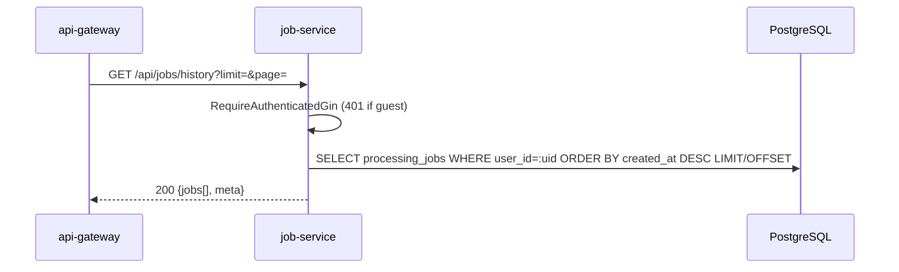

# Job Service -- Sequence Diagrams

Request flows through the `job-service` (port 8081).

## Chunked Upload (3 phases: init → chunks → complete)

```mermaid
sequenceDiagram
    participant Client
    participant GW as api-gateway
    participant JS as job-service
    participant Redis
    participant Disk

    Client->>GW: POST /api/upload/init {fileName, fileSize, totalChunks}
    GW->>JS: Proxy → /api/uploads/init
    JS->>Redis: HSET upload:&lt;uploadId&gt; (fileName, fileSize, totalChunks, createdAt) EX UPLOAD_TTL
    JS-->>Client: 201 {uploadId}

    loop For each chunk index
        Client->>GW: PUT /api/upload/&lt;uploadId&gt;/chunk?index=N (multipart "chunk")
        GW->>JS: Proxy
        JS->>Disk: Save uploads/tmp/&lt;uploadId&gt;/00000N.part
        JS->>Redis: EVAL Lua atomic — EXISTS state · SADD chunk-set · refresh both TTLs · HGETALL state · SCARD chunk-set
        Redis-->>JS: state + receivedChunks
        JS-->>Client: 200 {uploadId, receivedChunks, complete}
    end

    Client->>GW: POST /api/upload/&lt;uploadId&gt;/complete
    GW->>JS: Proxy
    JS->>Redis: HGETALL upload:&lt;uploadId&gt; · SCARD upload:&lt;uploadId&gt;:chunks
    alt all chunks received
        JS->>Disk: Open uploads/&lt;uploadId&gt;/&lt;fileName&gt; · concat 00000.part..N.part · sync
        JS->>JS: stat size > MAX_UPLOAD_MB?
        alt over limit
            JS->>Disk: rm assembled file
            JS-->>Client: 400 FILE_TOO_LARGE
        else within limit
            JS->>Disk: rm uploads/tmp/&lt;uploadId&gt;/
            JS-->>Client: 200 {uploadId}
        end
    else
        JS-->>Client: 400 BAD_REQUEST (not all chunks received)
    end
```

## Create Job (JSON body with uploadIds)

```mermaid
sequenceDiagram
    participant GW as api-gateway
    participant JS as job-service
    participant Redis
    participant PG as PostgreSQL
    participant Disk
    participant NATS

    GW->>JS: POST /api/&lt;group&gt;/:tool {uploadIds, options} · Idempotency-Key?
    JS->>JS: GinAuth · normalize tool · routing.ServiceForTool

    alt Idempotency-Key cache hit
        JS->>Redis: GET idempotency:&lt;key&gt;
        JS->>PG: SELECT processing_jobs WHERE id=...
        JS-->>GW: 201 (original job)
    else
        JS->>JS: findExistingJobForUploads(uploadIds) — replay safety
        alt mapped already
            JS-->>GW: 201 (original job)
        else
            JS->>JS: enforce plan max-files-per-job
            loop For each uploadId
                JS->>Redis: HGETALL upload:&lt;id&gt;
                JS->>Disk: Move uploads/&lt;id&gt;/&lt;file&gt; → uploads/&lt;jobId&gt;/&lt;file&gt;
                JS->>JS: validateMIMEType(toolType, path)
            end

            JS->>PG: BEGIN TX
            JS->>PG: INSERT processing_jobs (id=UUIDv7, tool, status='queued', expires_at, ...)
            JS->>PG: INSERT file_metadata × N
            JS->>PG: COMMIT

            JS->>JS: assignGuestTokenIfNeeded
            JS->>NATS: Publish jobs.dispatch.&lt;serviceName&gt; (JobMessage)
            JS->>Redis: SET upload:&lt;id&gt;:job &lt;jobId&gt;
            JS->>Redis: DEL upload:&lt;id&gt; · upload:&lt;id&gt;:chunks
            JS->>Redis: SETEX idempotency:&lt;key&gt; 10m → jobId
            JS->>NATS: Publish analytics.events.job.created
            JS-->>GW: 201 {job, guestToken?}
        end
    end
```

## Create Job (multipart/form-data)

```mermaid
sequenceDiagram
    participant GW as api-gateway
    participant JS as job-service
    participant PG as PostgreSQL
    participant Disk
    participant NATS

    GW->>JS: POST /api/&lt;group&gt;/:tool · multipart files[] + options
    JS->>JS: enforce plan limits (max files · max file size MB)
    loop For each file
        JS->>JS: validateFileType(toolType, filename)
        JS->>Disk: SaveUploadedFile → uploads/&lt;jobId&gt;/&lt;basename&gt;
        JS->>JS: validateMIMEType(toolType, path)
    end
    JS->>PG: INSERT processing_jobs + file_metadata in TX
    JS->>NATS: Publish jobs.dispatch.&lt;serviceName&gt;
    JS-->>GW: 201 {job}
```

## List Jobs by Tool (paginated)

```mermaid
sequenceDiagram
    participant GW as api-gateway
    participant JS as job-service
    participant Redis
    participant PG as PostgreSQL

    GW->>JS: GET /api/&lt;group&gt;/:tool?limit=25&page=1
    alt authenticated user
        JS->>PG: SELECT processing_jobs WHERE user_id=:uid AND tool_type=:tool ORDER BY created_at DESC LIMIT/OFFSET
    else guest
        JS->>Redis: SMEMBERS guest:&lt;token&gt;:jobs
        JS->>PG: SELECT WHERE id IN (...) AND tool_type=:tool AND user_id IS NULL ORDER BY created_at DESC
    end
    JS-->>GW: 200 {jobs[], meta:{page, limit}}
```

## Get Job History (auth only, all tools)



## Get / Download / Delete (single job)

```mermaid
sequenceDiagram
    participant GW as api-gateway
    participant JS as job-service
    participant PG as PostgreSQL
    participant Disk

    GW->>JS: GET /api/&lt;group&gt;/:tool/:id
    JS->>PG: SELECT processing_jobs WHERE id=:id AND tool_type=:tool
    JS->>JS: authorizeJobAccess (user_id match or guest_token in set)
    JS-->>GW: 200 {job}

    GW->>JS: GET /api/&lt;group&gt;/:tool/:id/download
    JS->>JS: outputFileCache lookup
    alt miss
        JS->>PG: SELECT file_metadata WHERE job_id=:id AND kind='output'
    end
    JS->>Disk: stream file
    JS-->>GW: 200 + Content-Disposition + Content-Type

    GW->>JS: DELETE /api/&lt;group&gt;/:tool/:id
    JS->>PG: SELECT processing_jobs · authorize
    JS->>PG: SELECT file_metadata
    loop each file
        JS->>Disk: os.Remove
    end
    JS->>PG: DELETE file_metadata · DELETE processing_jobs
    JS->>Redis: SREM guest:&lt;token&gt;:jobs &lt;jobId&gt; (best-effort)
    JS-->>GW: 200 / 204
```

## SSE — Real-Time Job Updates

```mermaid
sequenceDiagram
    participant Client
    participant GW as api-gateway
    participant JS as job-service
    participant NATS as JOBS_EVENTS stream
    participant W as Worker

    Client->>GW: GET /api/jobs/&lt;jobId&gt;/events (Accept: text/event-stream)
    GW->>JS: Proxy
    JS->>JS: Set SSE headers · 5-minute timeout context
    JS->>NATS: CreateConsumer(JOBS_EVENTS, FilterSubject="jobs.events.&lt;jobId&gt;.>", DeliverNew, InactiveThreshold=1m)
    JS-->>Client: event: connected · data: {jobId}

    par Worker side
        W->>NATS: Publish jobs.events.&lt;jobId&gt;.progress (every progress tick)
        W->>NATS: Publish jobs.events.&lt;jobId&gt;.completed (or .failed)
    and SSE side
        loop Until ctx done / terminal status
            JS->>NATS: cons.Fetch(1, 5s wait)
            alt got msg
                JS-->>Client: event: job-update · data: {jobId,status,progress,toolType,fileSize?}
                JS->>NATS: ACK
                opt status terminal
                    JS->>JS: close stream
                end
            else no msg / timeout
                JS-->>Client: : keepalive (every 15s)
            end
        end
    end

    JS->>NATS: DeleteConsumer (best-effort cleanup)
    JS-->>Client: connection closed
```

## Failure: Upload Replay Safety

```mermaid
sequenceDiagram
    participant Client
    participant JS as job-service
    participant Redis

    Client->>JS: POST /api/&lt;group&gt;/:tool {uploadIds:[X]}
    JS->>Redis: GET upload:X
    Redis-->>JS: present
    JS->>JS: ... create job J1, release Redis state, record upload:X:job=J1
    JS-->>Client: 201 J1

    Note over Client,JS: Network blip — client retries the same POST

    Client->>JS: POST /api/&lt;group&gt;/:tool {uploadIds:[X]}
    JS->>Redis: GET upload:X:job
    Redis-->>JS: J1
    JS->>JS: findExistingJobForUploads → J1
    JS-->>Client: 201 J1 (idempotent)
```
