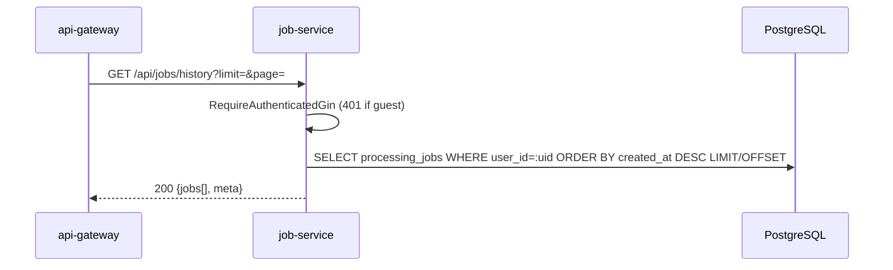

# Job Service -- Sequence Diagrams

Request flows through the `job-service` (port 8081).

## Presigned Multipart Upload (init → browser PUTs to MinIO → complete)

File bytes never pass through the job-service: the browser PUTs each part
directly to MinIO/S3 through presigned URLs (signed against
`S3_PUBLIC_ENDPOINT`, typically the API gateway origin).

```mermaid
sequenceDiagram
    participant Client
    participant GW as api-gateway
    participant JS as job-service
    participant Redis
    participant S3 as MinIO/S3

    Client->>GW: POST /api/uploads/init {fileName, fileSize, contentType}
    GW->>JS: Proxy
    JS->>JS: plan limit on declared size (413 FILE_TOO_LARGE) · partSize=UPLOAD_PART_SIZE_MB · totalParts=ceil (cap 1000)
    JS->>S3: CreateMultipartUpload uploads/&lt;uploadId&gt;/&lt;fileName&gt;
    JS->>JS: presign PUT URL per part (30m expiry)
    JS->>Redis: HSET upload:&lt;uploadId&gt; (fileName, declaredSize, contentType, bucket, key, s3UploadId, partSize, totalParts, createdAt) EX UPLOAD_TTL (30m)
    JS-->>Client: 201 {uploadId, key, partSize, totalParts, urlExpiresAt, parts[{partNumber,url}]}

    loop For each part
        Client->>S3: PUT &lt;presigned part URL&gt; [part bytes] (via gateway/public endpoint)
        S3-->>Client: 200 + ETag
    end

    opt Resume / expired URLs
        Client->>JS: GET /api/uploads/&lt;uploadId&gt;/parts?partNumbers=2,3
        JS->>Redis: HGETALL upload:&lt;uploadId&gt; (404 if gone)
        JS-->>Client: 200 {uploadId, partSize, parts (re-presigned)}
    end

    Client->>GW: POST /api/uploads/&lt;uploadId&gt;/complete {parts:[{partNumber,etag}]}
    GW->>JS: Proxy
    JS->>Redis: HGETALL upload:&lt;uploadId&gt; (404 if expired)
    alt part count != totalParts
        JS-->>Client: 400 UPLOAD_INCOMPLETE
    else
        JS->>S3: CompleteMultipartUpload(etags)
        JS->>S3: StatObject → TRUE size
        alt true size > plan limit
            JS->>S3: RemoveObject
            JS->>Redis: DEL upload:&lt;uploadId&gt;
            JS-->>Client: 413 FILE_TOO_LARGE
        else
            JS->>Redis: HSET upload:&lt;uploadId&gt; size · refresh TTL
            JS-->>Client: 200 {uploadId, fileName, size, complete:true}
        end
    end

    opt Cancel
        Client->>JS: DELETE /api/uploads/&lt;uploadId&gt;
        JS->>S3: AbortMultipartUpload (idempotent)
        JS->>Redis: DEL upload:&lt;uploadId&gt;
        JS-->>Client: 204
    end

    opt Stale frontend bundle (retired protocol)
        Client->>JS: PUT /api/uploads/&lt;uploadId&gt;/chunk
        JS-->>Client: 410 UPLOAD_PROTOCOL_CHANGED "Please refresh the page"
    end
```

## Create Job (JSON body with uploadIds)

```mermaid
sequenceDiagram
    participant GW as api-gateway
    participant JS as job-service
    participant Redis
    participant PG as PostgreSQL
    participant S3 as MinIO/S3
    participant NATS

    GW->>JS: POST /api/&lt;group&gt;/:tool {uploadIds, options} · Idempotency-Key?
    JS->>JS: GinAuth · normalize tool · routing.ServiceForTool · per-IP RATE_LIMIT_JOB_CREATE

    alt Idempotency-Key cache hit
        JS->>Redis: GET idempotency:&lt;key&gt;
        JS->>PG: SELECT processing_jobs WHERE id=...
        JS-->>GW: 201 (original job)
    else
        JS->>JS: findExistingJobForUploads(uploadIds) — replay safety
        alt mapped already
            JS-->>GW: 201 (original job)
        else
            JS->>JS: enforce plan max-files-per-job
            loop For each uploadId (consumeUpload — read-only)
                JS->>Redis: HGETALL upload:&lt;id&gt; (bucket, key, fileName)
                JS->>S3: StatObject(uploads, key) — existence + TRUE size
                JS->>S3: GetObjectRange(key, 0, 512)
                JS->>JS: validateMIMEHead(toolType, head)
            end
            Note over JS,S3: Object stays at uploads/&lt;uploadId&gt;/... — workers read it from there. InputPaths = object keys.

            JS->>PG: BEGIN TX
            JS->>PG: INSERT processing_jobs (id=UUIDv7, tool, status='queued', expires_at, ...)
            JS->>PG: INSERT file_metadata × N (path=&lt;object key&gt;)
            JS->>PG: COMMIT

            JS->>JS: assignGuestTokenIfNeeded
            JS->>NATS: Publish jobs.dispatch.&lt;serviceName&gt; (inputPaths = object keys)
            JS->>Redis: SET idempotency:upload:&lt;id&gt; &lt;jobId&gt;
            JS->>Redis: DEL upload:&lt;id&gt; (session only — object untouched)
            JS->>Redis: SETEX idempotency:&lt;key&gt; 10m → jobId
            JS->>NATS: Publish analytics.events.job.created
            JS-->>GW: 201 {job, guestToken?}
        end
    end
```

## Create Job (multipart/form-data)

```mermaid
sequenceDiagram
    participant GW as api-gateway
    participant JS as job-service
    participant PG as PostgreSQL
    participant S3 as MinIO/S3
    participant NATS

    GW->>JS: POST /api/&lt;group&gt;/:tool · multipart files[] + options
    JS->>JS: enforce plan limits (max files · max file size MB)
    loop For each file (storeDirectUpload)
        JS->>JS: validateFileType(toolType, filename)
        JS->>JS: sniff first 512 bytes → validateMIMEHead
        JS->>S3: PutObject → uploads/&lt;jobId&gt;/&lt;basename&gt; (streamed, head re-prepended)
    end
    JS->>PG: INSERT processing_jobs + file_metadata (path=&lt;object key&gt;) in TX
    JS->>NATS: Publish jobs.dispatch.&lt;serviceName&gt;
    JS-->>GW: 201 {job}
```

## List Jobs by Tool (paginated)

```mermaid
sequenceDiagram
    participant GW as api-gateway
    participant JS as job-service
    participant Redis
    participant PG as PostgreSQL

    GW->>JS: GET /api/&lt;group&gt;/:tool?limit=25&page=1
    alt authenticated user
        JS->>PG: SELECT processing_jobs WHERE user_id=:uid AND tool_type=:tool ORDER BY created_at DESC LIMIT/OFFSET
    else guest
        JS->>Redis: SMEMBERS guest:&lt;token&gt;:jobs
        JS->>PG: SELECT WHERE id IN (...) AND tool_type=:tool AND user_id IS NULL ORDER BY created_at DESC
    end
    JS-->>GW: 200 {jobs[], meta:{page, limit}}
```

## Get Job History (auth only, all tools)



## Get / Download / Delete (single job)

```mermaid
sequenceDiagram
    participant Client
    participant GW as api-gateway
    participant JS as job-service
    participant PG as PostgreSQL
    participant S3 as MinIO/S3

    GW->>JS: GET /api/&lt;group&gt;/:tool/:id
    JS->>PG: SELECT processing_jobs WHERE id=:id AND tool_type=:tool
    JS->>JS: authorizeJobAccess (user_id match or guest_token in set)
    JS-->>GW: 200 {job}

    GW->>JS: GET /api/&lt;group&gt;/:tool/:id/download
    JS->>JS: authorizeJobAccess · status == completed?
    JS->>JS: outputFileCache lookup
    alt miss
        JS->>PG: SELECT file_metadata WHERE job_id=:id AND kind='output'
    end
    alt legacy disk path (starts with "/")
        JS-->>GW: 404 NOT_FOUND "download link has expired"
    else object key
        JS->>JS: PresignGet(outputs, key, 5m, response-content-disposition + response-content-type)
        JS-->>GW: 302 Location: presigned URL
        GW-->>Client: 302
        Client->>S3: GET presigned URL (bytes from object storage)
        S3-->>Client: 200 + Content-Disposition: attachment
    end

    GW->>JS: DELETE /api/&lt;group&gt;/:tool/:id
    JS->>PG: SELECT processing_jobs · authorize
    JS->>PG: SELECT file_metadata
    loop each file (skip legacy "/" paths)
        JS->>S3: RemoveObject(bucketFor(kind), key)
    end
    JS->>PG: DELETE file_metadata · DELETE processing_jobs
    JS->>Redis: SREM guest:&lt;token&gt;:jobs &lt;jobId&gt; (best-effort)
    JS-->>GW: 200 / 204
```

## SSE — Real-Time Job Updates

```mermaid
sequenceDiagram
    participant Client
    participant GW as api-gateway
    participant JS as job-service
    participant NATS as JOBS_EVENTS stream
    participant W as Worker

    Client->>GW: GET /api/jobs/&lt;jobId&gt;/events (Accept: text/event-stream)
    GW->>JS: Proxy
    JS->>JS: Set SSE headers · 5-minute timeout context
    JS->>NATS: CreateConsumer(JOBS_EVENTS, FilterSubject="jobs.events.&lt;jobId&gt;.>", DeliverNew, InactiveThreshold=1m)
    JS-->>Client: event: connected · data: {jobId}

    par Worker side
        W->>NATS: Publish jobs.events.&lt;jobId&gt;.progress (every progress tick)
        W->>NATS: Publish jobs.events.&lt;jobId&gt;.completed (or .failed)
    and SSE side
        loop Until ctx done / terminal status
            JS->>NATS: cons.Fetch(1, 5s wait)
            alt got msg
                JS-->>Client: event: job-update · data: {jobId,status,progress,toolType,fileSize?}
                JS->>NATS: ACK
                opt status terminal
                    JS->>JS: close stream
                end
            else no msg / timeout
                JS-->>Client: : keepalive (every 15s)
            end
        end
    end

    JS->>NATS: DeleteConsumer (best-effort cleanup)
    JS-->>Client: connection closed
```

## Failure: Upload Replay Safety

```mermaid
sequenceDiagram
    participant Client
    participant JS as job-service
    participant Redis

    Client->>JS: POST /api/&lt;group&gt;/:tool {uploadIds:[X]}
    JS->>Redis: GET upload:X
    Redis-->>JS: present
    JS->>JS: ... create job J1, release Redis state, record idempotency:upload:X=J1
    JS-->>Client: 201 J1

    Note over Client,JS: Network blip — client retries the same POST

    Client->>JS: POST /api/&lt;group&gt;/:tool {uploadIds:[X]}
    JS->>Redis: GET idempotency:upload:X
    Redis-->>JS: J1
    JS->>JS: findExistingJobForUploads → J1
    JS-->>Client: 201 J1 (idempotent)
```
