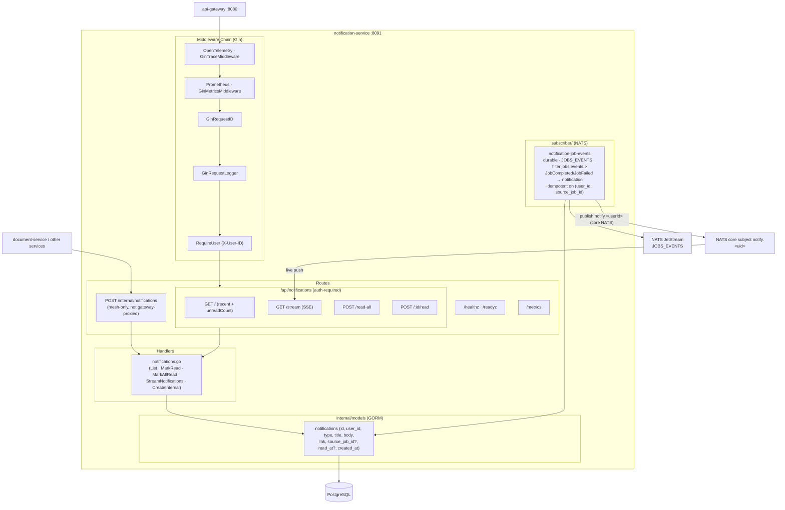
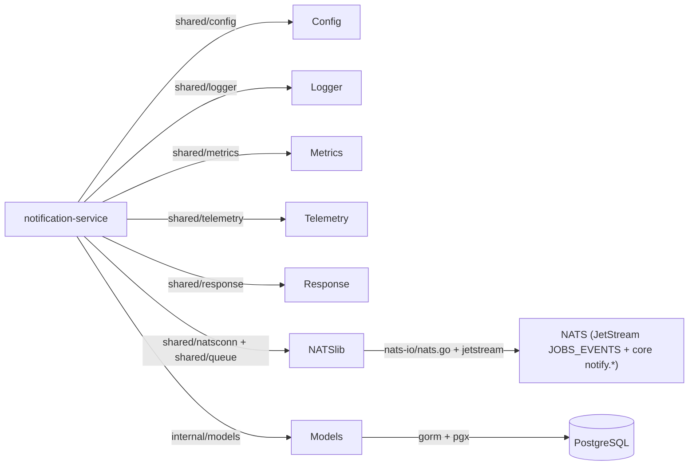

# Notification Service -- Architecture

Internal structure and component diagram of the `notification-service` (port 8091). Owns the in-app notification feed; consumes job events from NATS and pushes live updates over SSE.

## Component Diagram

## Dependency Graph

