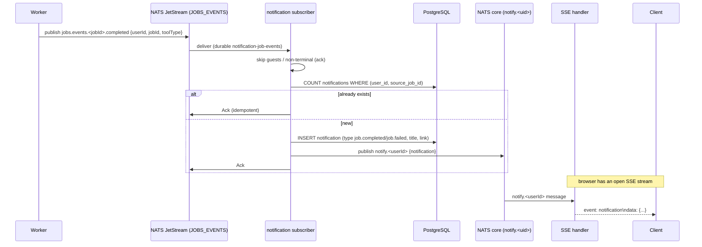
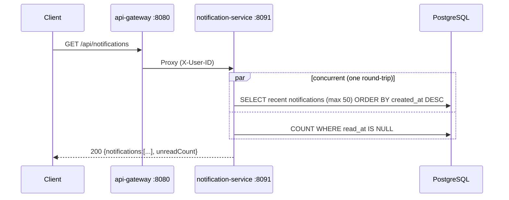
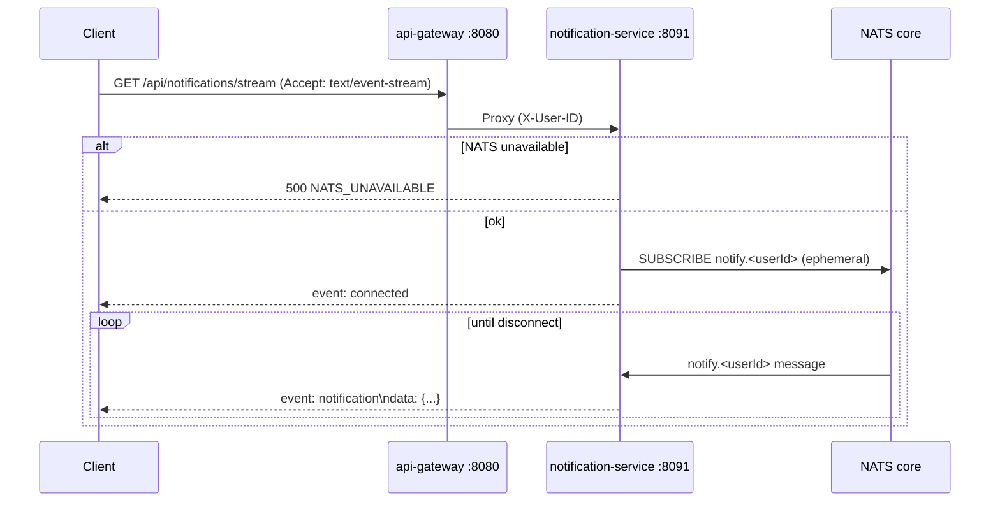
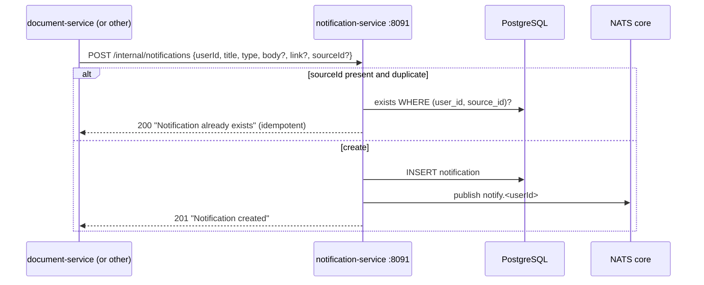

# Notification Service -- Sequence Diagrams

Request flows through the `notification-service` (port 8091).

## Job Event → Notification → Live Bell

## List Notifications (bell open)

## Open Live Stream (SSE)

## Internal Create (mesh call, e.g. export.ready)

