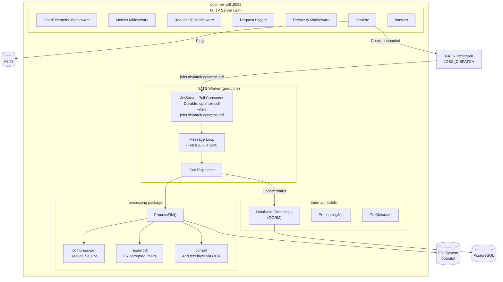
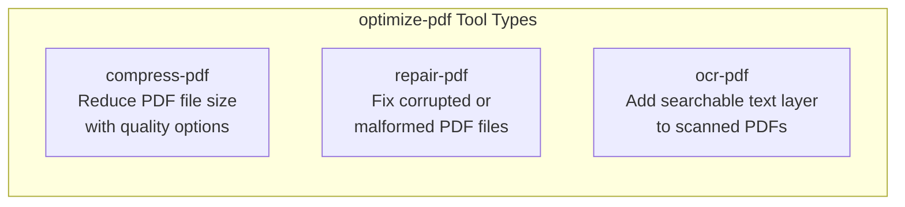
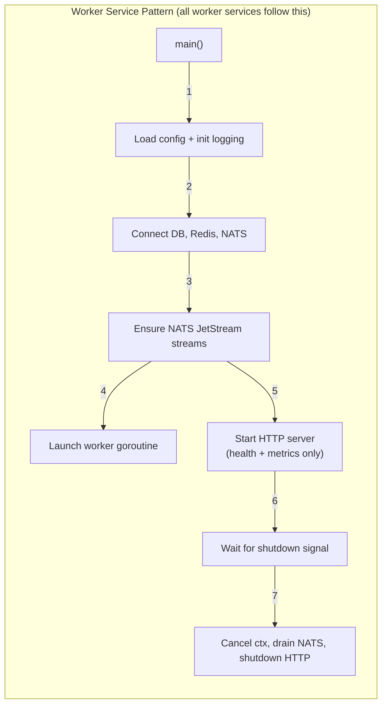

# Optimize-PDF Service -- Architecture

Internal structure and component diagram of the `optimize-pdf` service (port 8085).

## Component Diagram

## Allowed Tool Types

## Service Architecture Pattern

