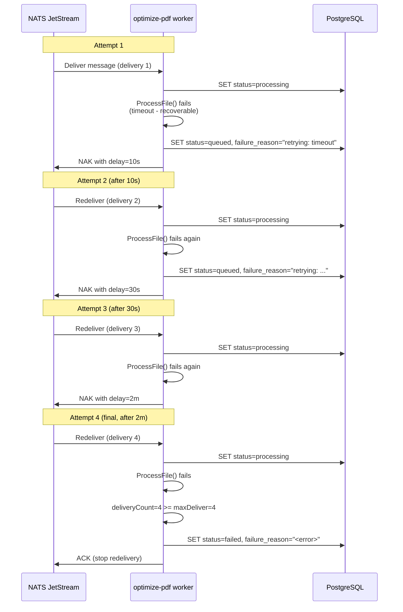

# Optimize-PDF Service -- Sequence Diagrams

Request flows through the `optimize-pdf` worker service.

## Result Cache Short-Circuit

Checked before download on every job: identical input + tool + options reuse a prior output, skipping the Ghostscript/Tesseract OCR entirely. Best-effort — any cache error falls through to a normal run.

```mermaid
sequenceDiagram
    participant W as optimize-pdf worker
    participant Cache as Redis (result cache)
    participant S3 as MinIO / S3
    participant PG as PostgreSQL
    participant EV as JOBS_EVENTS

    W->>S3: StatObject(uploads) per input &rarr; ETags (no download)
    W->>Cache: GET rescache:v1:optimize-pdf:sha256(toolType+options+ETags)
    alt cache hit
        W->>S3: StatObject(outputs) verify cached output exists
        alt output present
            W->>S3: CopyObject cached output &rarr; jobs/&lt;jobId&gt;/&lt;file&gt; (server-side)
            W->>PG: INSERT file_metadata + UPDATE status=completed, progress=100
            W->>EV: completed (download + conversion skipped)
        else expired / missing
            Note over W: fall through to normal conversion
        end
    else miss
        Note over W: normal conversion; on success SET cache key (TTL=RESULT_CACHE_TTL_SECONDS)
    end
```

## Compress PDF Processing

```mermaid
sequenceDiagram
    participant NATS as NATS JetStream
    participant Worker as optimize-pdf worker
    participant Processing as processing.ProcessFile()
    participant PG as PostgreSQL
    participant S3 as MinIO / S3

    NATS->>Worker: Fetch message from<br/>jobs.dispatch.optimize-pdf

    Worker->>Worker: Unmarshal JobPayload<br/>{jobId, toolType: "compress-pdf",<br/>inputPaths: ["users/u1/large.pdf"],<br/>options: {quality: "medium"}}

    Worker->>Worker: Validate toolType in AllowedTools

    Worker->>PG: UPDATE processing_jobs<br/>SET status=processing, progress=20

    Worker->>Worker: MkdirTemp scratch (job-&lt;jobId&gt;-*)
    Worker->>S3: DownloadToFile (uploads bucket → scratch/in/large.pdf)
    alt download fails
        Worker->>NATS: NAK with backoff (recoverable)
    end

    Worker->>Processing: ProcessFile(ctx, jobId, "compress-pdf",<br/>[scratch/in/large.pdf], {quality: "medium"}, scratch/out)

    Processing->>Processing: Compress with quality settings
    Processing-->>Worker: {OutputPath: "scratch/out/compressed.pdf",<br/>Metadata: {originalSize: 50MB, compressedSize: 12MB}}

    Worker->>S3: UploadFromFile (outputs bucket, jobs/&lt;jobId&gt;/compressed.pdf) → size
    alt upload fails
        Worker->>NATS: NAK with backoff (recoverable)
    end
    Worker->>PG: INSERT file_metadata (kind=output, path=object key, size_bytes=uploaded size)
    Worker->>PG: Merge compression metadata
    Worker->>PG: UPDATE status=completed, progress=100

    Worker->>Worker: RemoveAll scratch dir
    Worker->>NATS: ACK message
```

## OCR PDF Processing

```mermaid
sequenceDiagram
    participant NATS as NATS JetStream
    participant Worker as optimize-pdf worker
    participant Processing as processing.ProcessFile()
    participant PG as PostgreSQL
    participant S3 as MinIO / S3

    NATS->>Worker: Fetch message<br/>{toolType: "ocr-pdf", inputPaths: ["users/u1/scanned.pdf"], options: {language: "en"}}

    Worker->>PG: SET status=processing, progress=20

    Worker->>S3: Download scanned.pdf key → scratch/in
    Worker->>Processing: ProcessFile(ctx, jobId, "ocr-pdf",<br/>[scratch/in/scanned.pdf], {language: "en"}, scratch/out)

    Processing->>Processing: Run OCR engine<br/>(extract text from images)
    Processing->>Processing: Add searchable text layer
    Processing-->>Worker: {OutputPath in scratch/out, Metadata}

    Worker->>S3: Upload OCR-enhanced PDF → outputs bucket jobs/&lt;jobId&gt;/...
    Worker->>PG: Record output (object key + uploaded size), merge metadata
    Worker->>PG: SET status=completed, progress=100
    Worker->>NATS: ACK
```

## Repair PDF Processing

```mermaid
sequenceDiagram
    participant NATS as NATS JetStream
    participant Worker as optimize-pdf worker
    participant Processing as processing.ProcessFile()
    participant PG as PostgreSQL
    participant S3 as MinIO / S3

    NATS->>Worker: Fetch message<br/>{toolType: "repair-pdf", inputPaths: ["users/u1/corrupted.pdf"]}

    Worker->>PG: SET status=processing, progress=20

    Worker->>S3: Download corrupted.pdf key → scratch/in
    Worker->>Processing: ProcessFile(ctx, jobId, "repair-pdf",<br/>[scratch/in/corrupted.pdf], {}, scratch/out)

    Processing->>Processing: Analyze and repair structure
    Processing-->>Worker: {OutputPath in scratch/out, Metadata}

    Worker->>S3: Upload repaired PDF → outputs bucket jobs/&lt;jobId&gt;/...
    Worker->>PG: Record output (object key + uploaded size), SET status=completed
    Worker->>NATS: ACK
```

## Failure and Retry Flow


