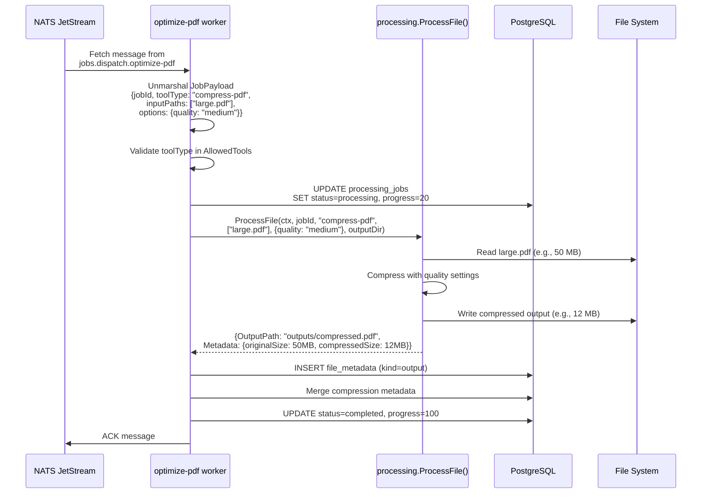
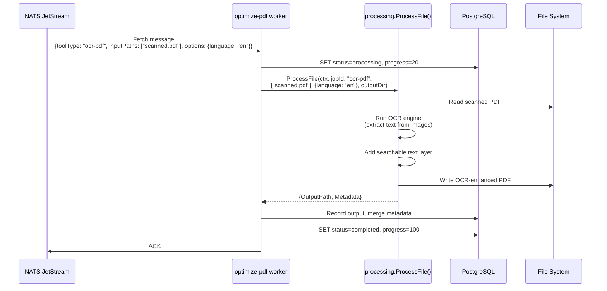
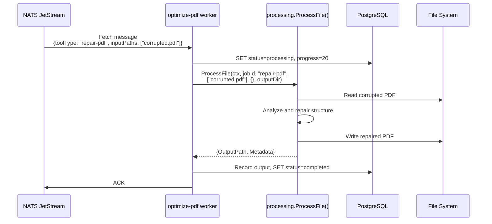
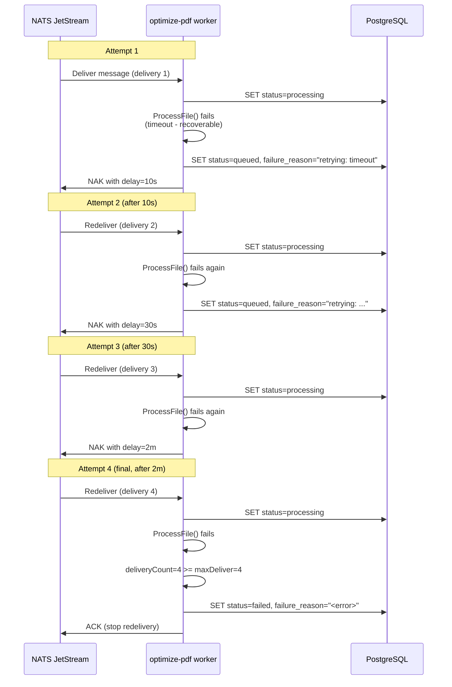

# Optimize-PDF Service -- Sequence Diagrams

Request flows through the `optimize-pdf` worker service.

## Compress PDF Processing

## OCR PDF Processing

## Repair PDF Processing

## Failure and Retry Flow

