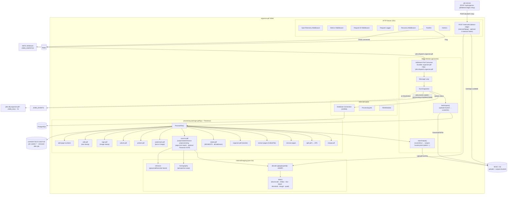
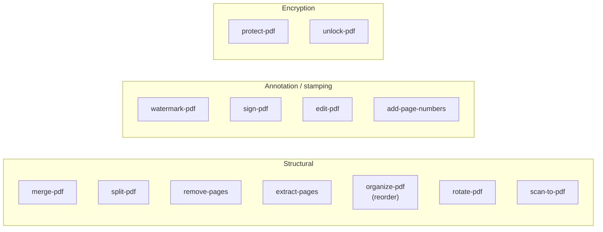
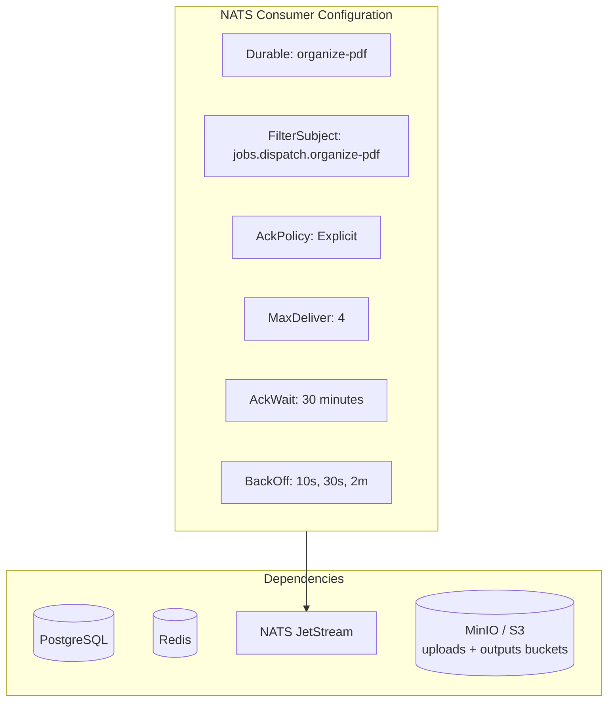

# Organize-PDF Service -- Architecture

Internal structure and component diagram of the `organize-pdf` service (port 8084).

## Component Diagram

## Allowed Tool Types

The whitelist in `main.go:59` is the authoritative source — 13 tools.

## Worker Configuration

