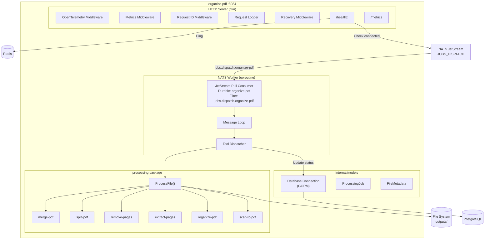
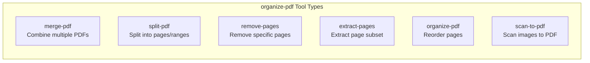
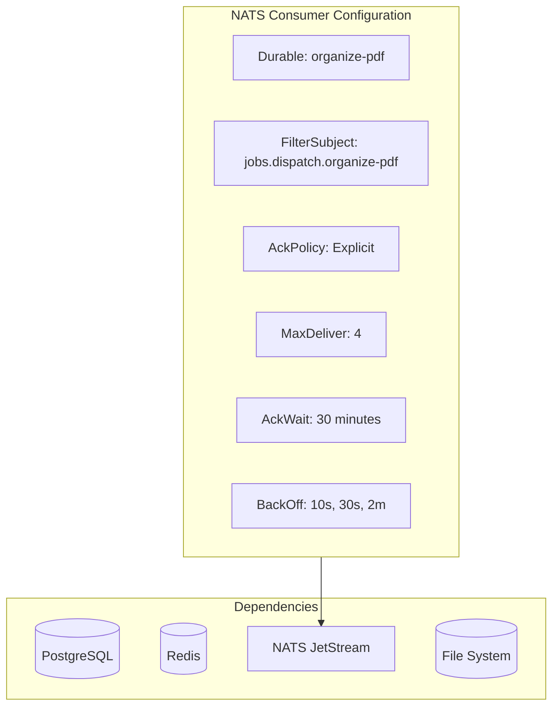

# Organize-PDF Service -- Architecture

Internal structure and component diagram of the `organize-pdf` service (port 8084).

## Component Diagram

```mermaid
graph TB
    subgraph organize-pdf[" organize-pdf :8084 "]
        direction TB

        subgraph HTTP["HTTP Server (Gin)"]
            TRACE["OpenTelemetry Middleware"]
            METRICS["Metrics Middleware"]
            REQID["Request ID Middleware"]
            LOGGER["Request Logger"]
            RECOVERY["Recovery Middleware"]
            HEALTHZ["/healthz"]
            METRICSEP["/metrics"]
        end

        subgraph Worker["NATS Worker (goroutine)"]
            CONSUMER["JetStream Pull Consumer<br/>Durable: organize-pdf<br/>Filter: jobs.dispatch.organize-pdf"]
            MSGLOOP["Message Loop"]
            DISPATCH["Tool Dispatcher"]
        end

        subgraph Processing["processing package"]
            PROC["ProcessFile()"]
            MERGE["merge-pdf"]
            SPLIT["split-pdf"]
            REMOVE["remove-pages"]
            EXTRACT["extract-pages"]
            ORGANIZE["organize-pdf"]
            SCAN["scan-to-pdf"]
        end

        subgraph Models["internal/models"]
            DB_CONN["Database Connection<br/>(GORM)"]
            JOB_MODEL["ProcessingJob"]
            FILE_MODEL["FileMetadata"]
        end
    end

    NATS["NATS JetStream<br/>JOBS_DISPATCH"] -->|jobs.dispatch.organize-pdf| CONSUMER
    CONSUMER --> MSGLOOP --> DISPATCH

    DISPATCH --> PROC
    PROC --> MERGE
    PROC --> SPLIT
    PROC --> REMOVE
    PROC --> EXTRACT
    PROC --> ORGANIZE
    PROC --> SCAN

    DISPATCH -->|Update status| DB_CONN
    DB_CONN --> PG[(PostgreSQL)]
    HEALTHZ -->|Ping| Redis[(Redis)]
    HEALTHZ -->|Check connected| NATS
    PROC --> Disk[(File System<br/>outputs/)]
```

## Allowed Tool Types

```mermaid
graph LR
    subgraph Tools["organize-pdf Tool Types"]
        A["merge-pdf<br/>Combine multiple PDFs"]
        B["split-pdf<br/>Split into pages/ranges"]
        C["remove-pages<br/>Remove specific pages"]
        D["extract-pages<br/>Extract page subset"]
        E["organize-pdf<br/>Reorder pages"]
        F["scan-to-pdf<br/>Scan images to PDF"]
    end
```

## Worker Configuration

```mermaid
graph TD
    subgraph ConsumerConfig["NATS Consumer Configuration"]
        A["Durable: organize-pdf"]
        B["FilterSubject: jobs.dispatch.organize-pdf"]
        C["AckPolicy: Explicit"]
        D["MaxDeliver: 4"]
        E["AckWait: 30 minutes"]
        F["BackOff: 10s, 30s, 2m"]
    end

    subgraph Dependencies
        PG[(PostgreSQL)]
        Redis[(Redis)]
        NATS["NATS JetStream"]
        Disk[(File System)]
    end

    ConsumerConfig --> NATS
```
