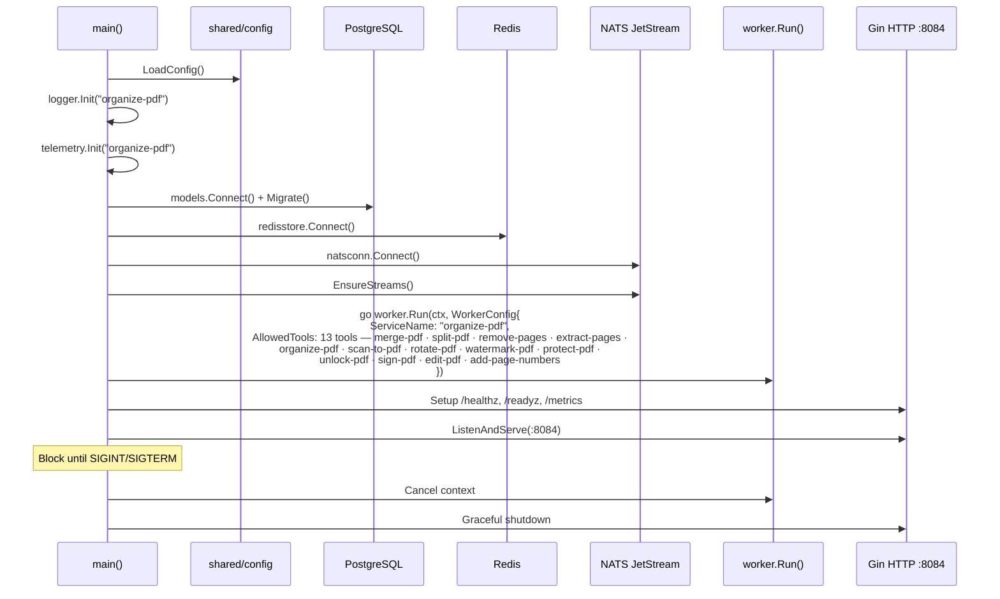

# Organize-PDF Service -- Sequence Diagrams

Request flows through the `organize-pdf` worker service.

## Result Cache Short-Circuit

Checked before download on every job: identical input + tool + options reuse a prior output, skipping the pdfcpu operation entirely. Best-effort — any cache error falls through to a normal run.

```mermaid
sequenceDiagram
    participant W as organize-pdf worker
    participant Cache as Redis (result cache)
    participant S3 as MinIO / S3
    participant PG as PostgreSQL
    participant EV as JOBS_EVENTS

    W->>S3: StatObject(uploads) per input &rarr; ETags (no download)
    W->>Cache: GET rescache:v1:organize-pdf:sha256(toolType+options+ETags)
    alt cache hit
        W->>S3: StatObject(outputs) verify cached output exists
        alt output present
            W->>S3: CopyObject cached output &rarr; jobs/&lt;jobId&gt;/&lt;file&gt; (server-side)
            W->>PG: INSERT file_metadata + UPDATE status=completed, progress=100
            W->>EV: completed (download + conversion skipped)
        else expired / missing
            Note over W: fall through to normal conversion
        end
    else miss
        Note over W: normal conversion; on success SET cache key (TTL=RESULT_CACHE_TTL_SECONDS)
    end
```

## Split PDF Processing

```mermaid
sequenceDiagram
    participant NATS as NATS JetStream
    participant Worker as organize-pdf worker
    participant Processing as processing.ProcessFile()
    participant PG as PostgreSQL
    participant S3 as MinIO / S3

    NATS->>Worker: Fetch message from<br/>jobs.dispatch.organize-pdf

    Worker->>Worker: Unmarshal JobPayload<br/>{jobId, toolType: "split-pdf", inputPaths: ["users/u1/doc.pdf"], options: {pages: "1-3,5"}}

    Worker->>Worker: Validate toolType in AllowedTools

    Worker->>PG: UPDATE processing_jobs<br/>SET status=processing, progress=20

    Worker->>Worker: MkdirTemp scratch (job-&lt;jobId&gt;-*)
    Worker->>S3: DownloadToFile (uploads bucket → scratch/in/doc.pdf)
    alt download fails
        Worker->>NATS: NAK with backoff (recoverable)
    end

    Worker->>Processing: ProcessFile(ctx, jobId, "split-pdf", [scratch/in/doc.pdf], {pages: "1-3,5"}, scratch/out)

    Processing->>Processing: Split by page ranges
    Processing->>Processing: Package into ZIP archive in scratch/out

    Processing-->>Worker: {OutputPath: "scratch/out/<jobId>.zip", Metadata: {pages: 4}}

    Worker->>S3: UploadFromFile (outputs bucket, jobs/&lt;jobId&gt;/&lt;jobId&gt;.zip) → size
    alt upload fails
        Worker->>NATS: NAK with backoff (recoverable)
    end
    Worker->>PG: INSERT file_metadata (kind=output, path=object key, size_bytes=uploaded size)
    Worker->>PG: Merge metadata into job
    Worker->>PG: UPDATE status=completed, progress=100

    Worker->>Worker: RemoveAll scratch dir
    Worker->>NATS: ACK message
```

## Rotate PDF Processing

```mermaid
sequenceDiagram
    participant NATS as NATS JetStream
    participant Worker as organize-pdf worker
    participant Processing as processing.ProcessFile()
    participant PG as PostgreSQL
    participant S3 as MinIO / S3

    NATS->>Worker: Fetch message from<br/>jobs.dispatch.organize-pdf

    Worker->>Worker: Unmarshal JobPayload<br/>{toolType: "rotate-pdf", options: {rotation: 90, applyToPages: "all"}}

    Worker->>PG: UPDATE processing_jobs SET status=processing, progress=20

    Worker->>S3: Download input key → scratch/in/doc.pdf
    Worker->>Processing: ProcessFile(ctx, jobId, "rotate-pdf", [scratch/in/doc.pdf], {rotation: 90, applyToPages: "all"}, scratch/out)

    Processing->>Processing: Parse rotation=90, applyToPages="all"
    Processing->>Processing: Build pdfcpu page selection (nil = all pages)
    Processing->>Processing: api.RotateFile(inputPath, outputPath, 90, nil, nil)

    Processing-->>Worker: {OutputPath: "scratch/out/<jobId>.pdf"}

    Worker->>S3: Upload outputs bucket jobs/&lt;jobId&gt;/&lt;jobId&gt;.pdf
    Worker->>PG: INSERT file_metadata (kind=output, path=object key)
    Worker->>PG: UPDATE status=completed, progress=100
    Worker->>NATS: ACK message
```

## Merge PDF Processing

```mermaid
sequenceDiagram
    participant NATS as NATS JetStream
    participant Worker as organize-pdf worker
    participant Processing as processing.ProcessFile()
    participant PG as PostgreSQL
    participant S3 as MinIO / S3

    NATS->>Worker: Fetch message<br/>{toolType: "merge-pdf", inputPaths: [keys a.pdf, b.pdf, c.pdf]}

    Worker->>PG: SET status=processing, progress=20

    Worker->>S3: Download 3 keys (uploads bucket → scratch/in)
    Worker->>Processing: ProcessFile(ctx, jobId, "merge-pdf", [3 local paths], {}, scratch/out)

    Processing->>Processing: Merge in order
    Processing-->>Worker: {OutputPath in scratch/out, Metadata}

    Worker->>S3: Upload merged output → outputs bucket jobs/&lt;jobId&gt;/...
    Worker->>PG: Record output (object key + uploaded size), SET status=completed
    Worker->>NATS: ACK
```

## Extract Pages Processing

```mermaid
sequenceDiagram
    participant NATS as NATS JetStream
    participant Worker as organize-pdf worker
    participant Processing as processing.ProcessFile()
    participant PG as PostgreSQL
    participant S3 as MinIO / S3

    NATS->>Worker: Fetch message<br/>{toolType: "extract-pages", inputPaths: ["users/u1/report.pdf"], options: {pages: "2,4,6-10"}}

    Worker->>PG: SET status=processing

    Worker->>S3: Download report.pdf key → scratch/in
    Worker->>Processing: ProcessFile(ctx, jobId, "extract-pages", [scratch/in/report.pdf], {pages: "2,4,6-10"}, scratch/out)

    Processing->>Processing: Extract specified pages
    Processing-->>Worker: {OutputPath in scratch/out, Metadata}

    Worker->>S3: Upload output → outputs bucket jobs/&lt;jobId&gt;/...
    Worker->>PG: Record output (object key + uploaded size), SET status=completed
    Worker->>NATS: ACK
```

## Service Startup



## Watermark / Sign / Edit / Page Numbers (annotation paths)

```mermaid
sequenceDiagram
    participant NATS as JOBS_DISPATCH
    participant W as organize-pdf worker
    participant Proc as processing.ProcessFile
    participant PC as pdfcpu
    participant PG as PostgreSQL
    participant S3 as MinIO / S3
    participant EV as JOBS_EVENTS

    NATS->>W: msg {toolType: watermark-pdf | sign-pdf | edit-pdf | add-page-numbers, options: {...}}
    W->>PG: status=processing, progress=20
    W->>EV: jobs.events.&lt;jobId&gt;.processing
    W->>S3: Download input key → scratch/in
    W->>Proc: ProcessFile(toolType, [scratch/in/in.pdf], options, scratch/out)
    alt watermark-pdf
        Proc->>PC: pdfcpu add text or image watermark (position, opacity, fontSize, color)
    else sign-pdf
        Proc->>PC: pdfcpu image stamp on selected page (decode base64 → temp PNG)
    else edit-pdf
        Proc->>PC: pdfcpu text stamp at (x,y) on page
    else add-page-numbers
        Proc->>PC: pdfcpu add page numbers (position + format template)
    end
    PC-->>Proc: scratch/out/&lt;jobId&gt;.pdf
    Proc-->>W: OutputPath
    W->>S3: Upload outputs bucket jobs/&lt;jobId&gt;/&lt;jobId&gt;.pdf
    W->>PG: file_metadata kind=output (path=object key) · status=completed · progress=100
    W->>EV: jobs.events.&lt;jobId&gt;.completed
    W->>NATS: ACK
```

## Protect / Unlock (encryption paths)

```mermaid
sequenceDiagram
    participant NATS as JOBS_DISPATCH
    participant W as organize-pdf worker
    participant Proc as processing.ProcessFile
    participant PC as pdfcpu
    participant PG as PostgreSQL

    NATS->>W: msg {toolType: protect-pdf or unlock-pdf, options: {password}}
    alt missing/short password
        W->>PG: status=failed, reason "missing password" / "password too short"
    else
        W->>W: Download input key from uploads bucket → scratch/in
        W->>Proc: ProcessFile(toolType, [scratch/in/in.pdf], {password}, scratch/out)
        alt protect-pdf
            Proc->>PC: pdfcpu encrypt with user/owner password
        else unlock-pdf
            Proc->>PC: pdfcpu decrypt with provided password
        end
        PC-->>W: scratch/out/&lt;jobId&gt;.pdf
        W->>W: Upload to outputs bucket jobs/&lt;jobId&gt;/&lt;jobId&gt;.pdf
        W->>PG: file_metadata (path=object key) + status=completed
    end
    W->>NATS: ACK
```

## Failure → DLQ

```mermaid
sequenceDiagram
    participant W as organize-pdf worker
    participant NATS as JOBS_DISPATCH
    participant DLQ as JOBS_DLQ
    participant PG as PostgreSQL
    participant EV as JOBS_EVENTS

    Note over W: ProcessFile fails
    W->>W: classifyError → CONVERSION_FAILED / TIMEOUT / OUTPUT_FAILED / INVALID_PAYLOAD
    alt deliveryCount &lt; MaxDeliver (4)
        W->>PG: status=queued · failure_reason "retrying: ..."
        W->>NATS: Nak(delay=BackOff[deliveryCount])
    else deliveryCount == MaxDeliver
        W->>PG: status=failed · failure_reason [CODE] msg
        W->>EV: jobs.events.&lt;jobId&gt;.failed
        W->>DLQ: Publish jobs.dlq.organize-pdf
        W->>NATS: ACK
    end
```
