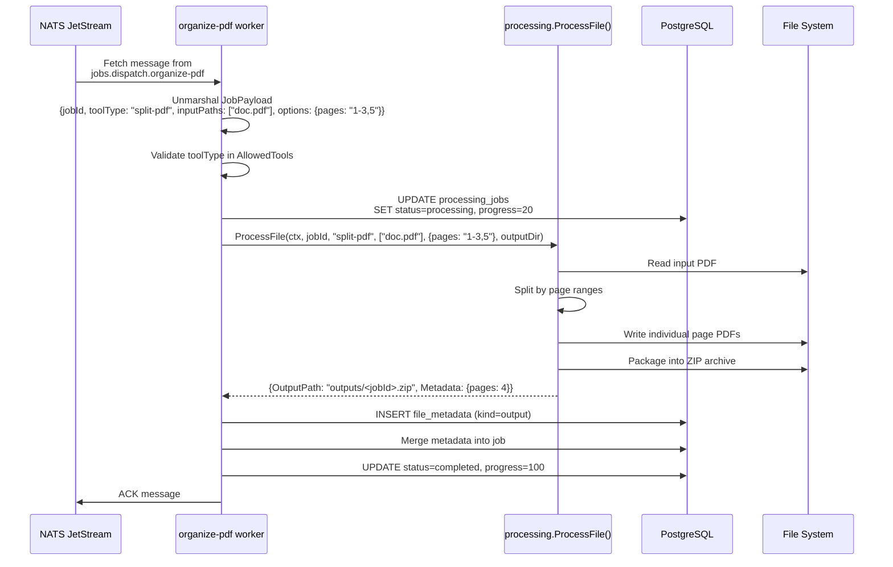
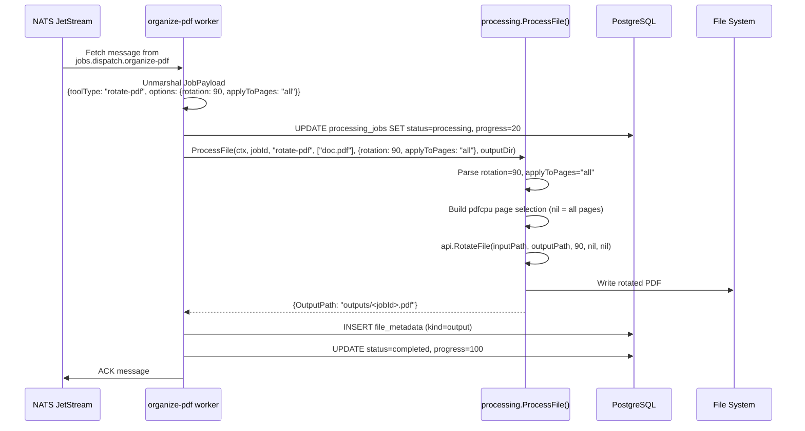
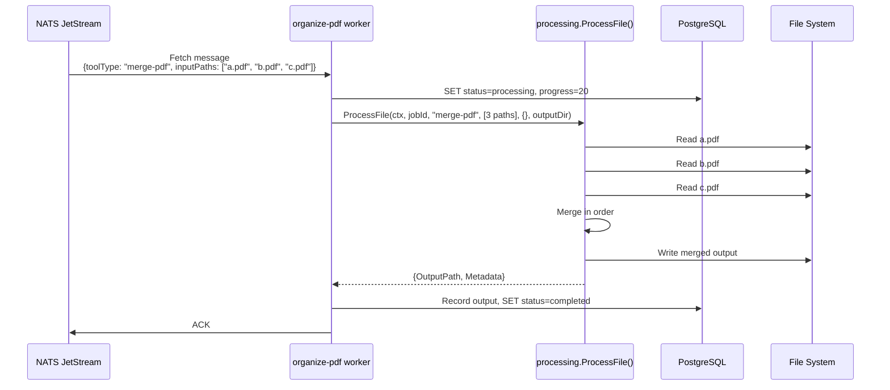
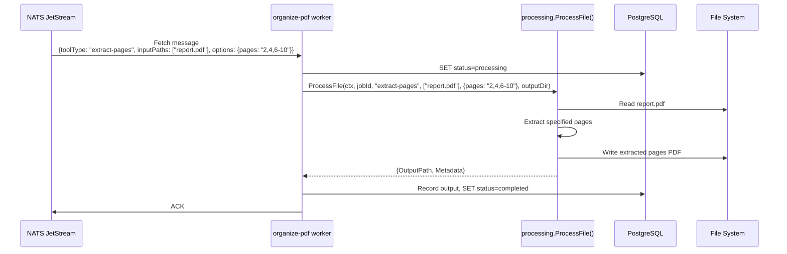
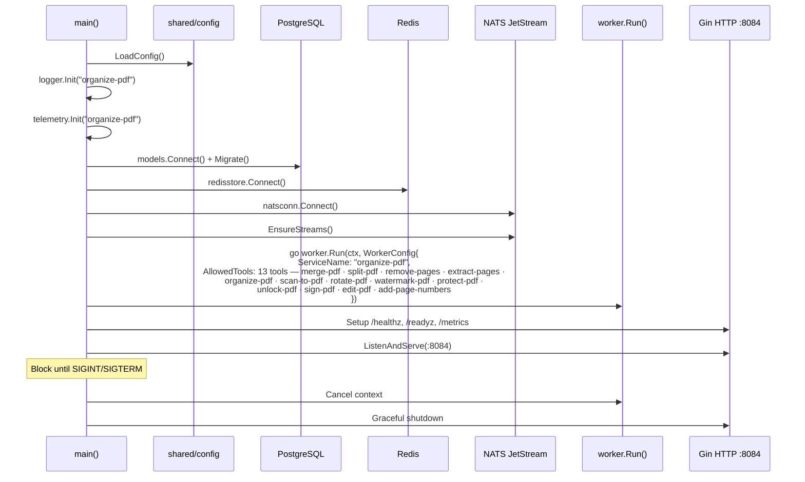

# Organize-PDF Service -- Sequence Diagrams

Request flows through the `organize-pdf` worker service.

## Split PDF Processing



## Rotate PDF Processing



## Merge PDF Processing



## Extract Pages Processing



## Service Startup



## Watermark / Sign / Edit / Page Numbers (annotation paths)

```mermaid
sequenceDiagram
    participant NATS as JOBS_DISPATCH
    participant W as organize-pdf worker
    participant Proc as processing.ProcessFile
    participant PC as pdfcpu
    participant PG as PostgreSQL
    participant Disk as File System
    participant EV as JOBS_EVENTS

    NATS->>W: msg {toolType: watermark-pdf | sign-pdf | edit-pdf | add-page-numbers, options: {...}}
    W->>PG: status=processing, progress=20
    W->>EV: jobs.events.&lt;jobId&gt;.processing
    W->>Proc: ProcessFile(toolType, [in.pdf], options, outputDir)
    alt watermark-pdf
        Proc->>PC: pdfcpu add text or image watermark (position, opacity, fontSize, color)
    else sign-pdf
        Proc->>PC: pdfcpu image stamp on selected page (decode base64 → temp PNG)
    else edit-pdf
        Proc->>PC: pdfcpu text stamp at (x,y) on page
    else add-page-numbers
        Proc->>PC: pdfcpu add page numbers (position + format template)
    end
    PC-->>Disk: outputs/&lt;jobId&gt;.pdf
    Proc-->>W: OutputPath
    W->>PG: file_metadata kind=output · status=completed · progress=100
    W->>EV: jobs.events.&lt;jobId&gt;.completed
    W->>NATS: ACK
```

## Protect / Unlock (encryption paths)

```mermaid
sequenceDiagram
    participant NATS as JOBS_DISPATCH
    participant W as organize-pdf worker
    participant Proc as processing.ProcessFile
    participant PC as pdfcpu
    participant PG as PostgreSQL

    NATS->>W: msg {toolType: protect-pdf or unlock-pdf, options: {password}}
    alt missing/short password
        W->>PG: status=failed, reason "missing password" / "password too short"
    else
        W->>Proc: ProcessFile(toolType, [in.pdf], {password})
        alt protect-pdf
            Proc->>PC: pdfcpu encrypt with user/owner password
        else unlock-pdf
            Proc->>PC: pdfcpu decrypt with provided password
        end
        PC-->>W: outputs/&lt;jobId&gt;.pdf
        W->>PG: file_metadata + status=completed
    end
    W->>NATS: ACK
```

## Failure → DLQ

```mermaid
sequenceDiagram
    participant W as organize-pdf worker
    participant NATS as JOBS_DISPATCH
    participant DLQ as JOBS_DLQ
    participant PG as PostgreSQL
    participant EV as JOBS_EVENTS

    Note over W: ProcessFile fails
    W->>W: classifyError → CONVERSION_FAILED / TIMEOUT / OUTPUT_FAILED / INVALID_PAYLOAD
    alt deliveryCount &lt; MaxDeliver (4)
        W->>PG: status=queued · failure_reason "retrying: ..."
        W->>NATS: Nak(delay=BackOff[deliveryCount])
    else deliveryCount == MaxDeliver
        W->>PG: status=failed · failure_reason [CODE] msg
        W->>EV: jobs.events.&lt;jobId&gt;.failed
        W->>DLQ: Publish jobs.dlq.organize-pdf
        W->>NATS: ACK
    end
```
