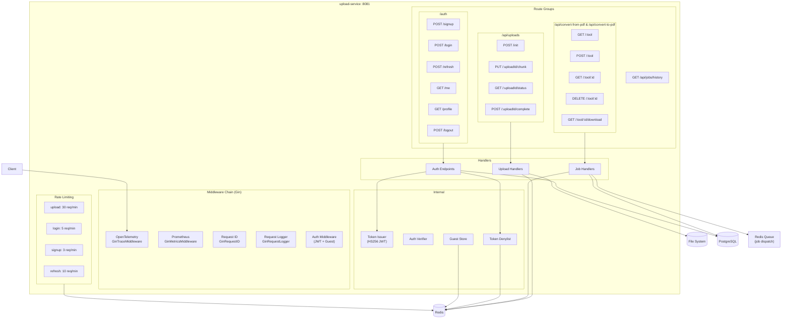
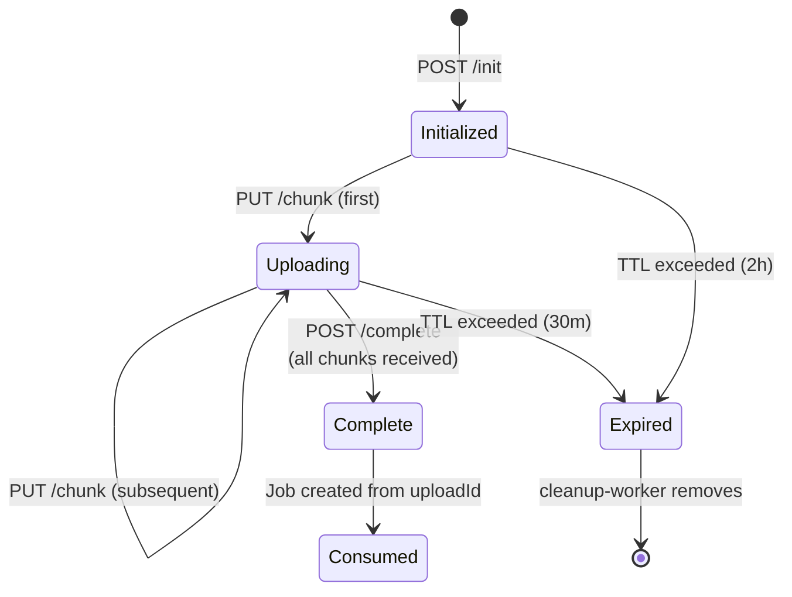
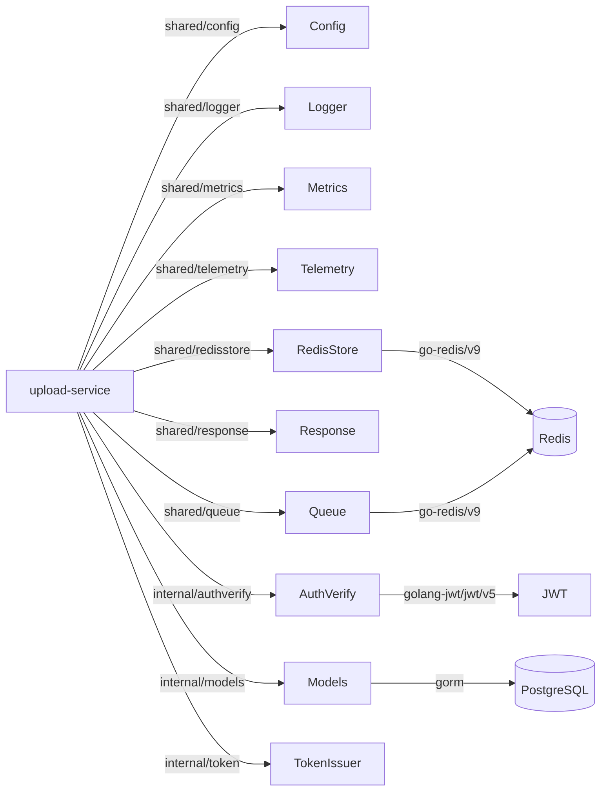

# Upload Service -- Architecture

Internal structure and component diagram of the `upload-service` (port 8081).

Note: In the current architecture, `upload-service` and `job-service` share a nearly identical role. The `upload-service` is a standalone deployment option that includes auth endpoints alongside upload and job endpoints.

## Component Diagram

## Upload State Machine

## Dependency Graph

