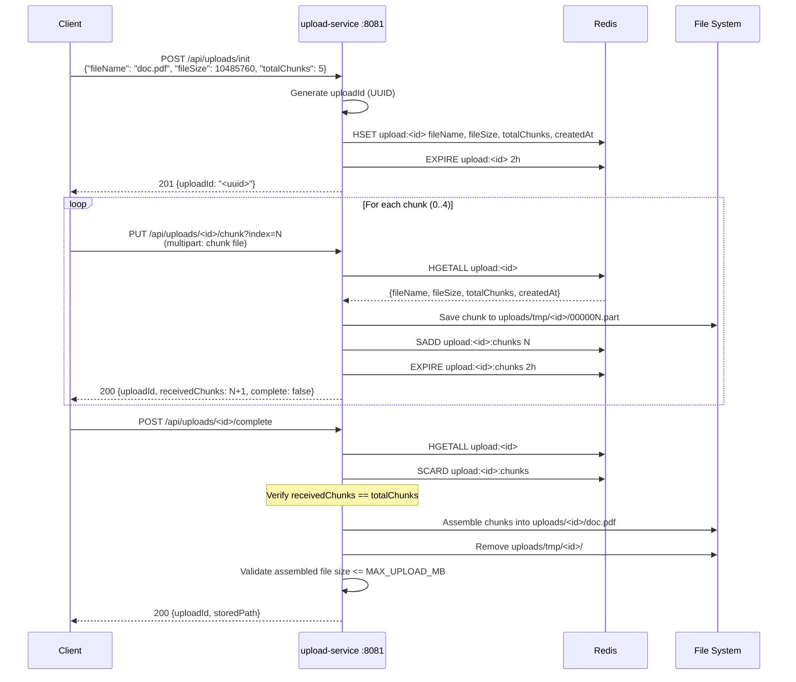
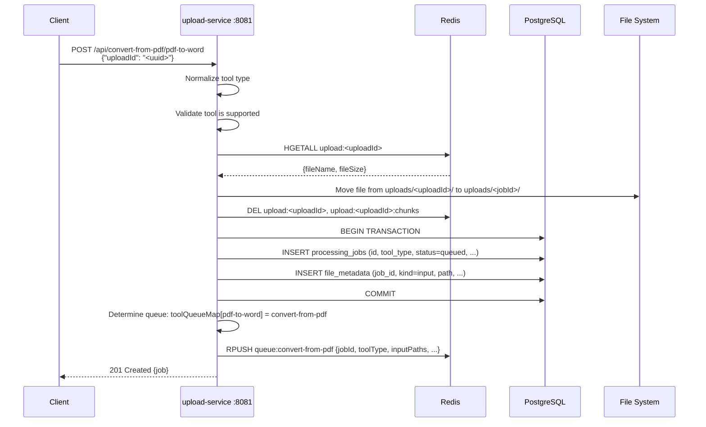
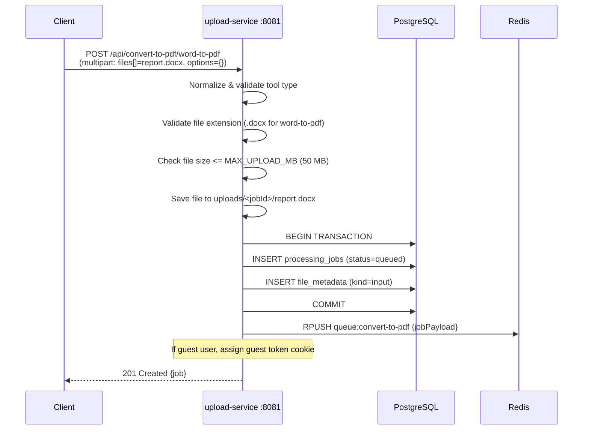
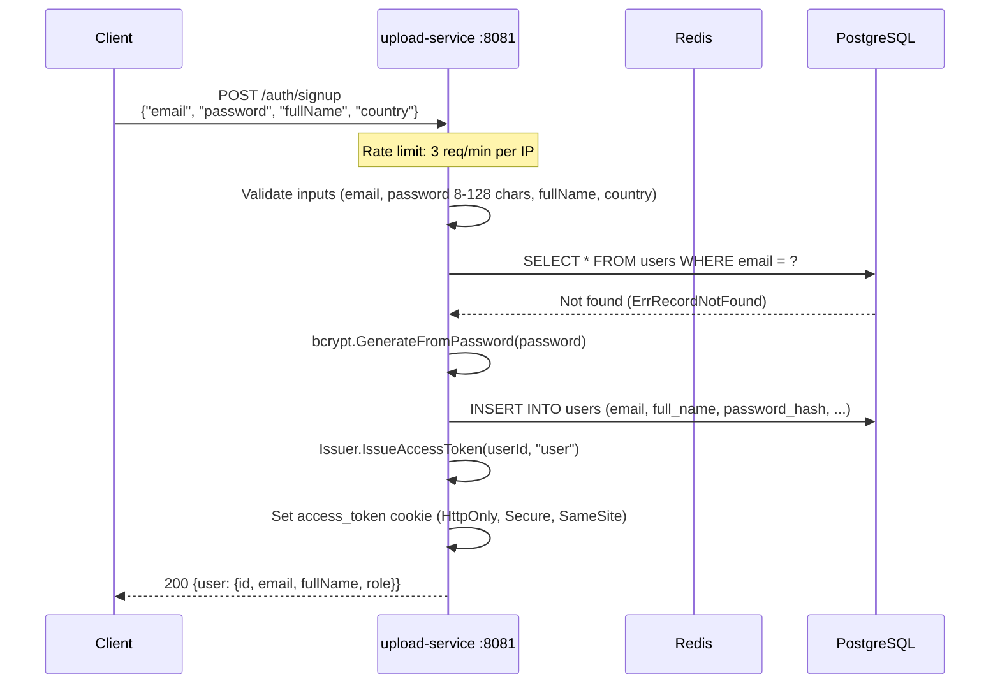

# Upload Service -- Sequence Diagrams

Request flows through the `upload-service`.

## Chunked File Upload Flow

## Job Creation from Upload

## Multipart Direct Upload with Job Creation

## User Signup

