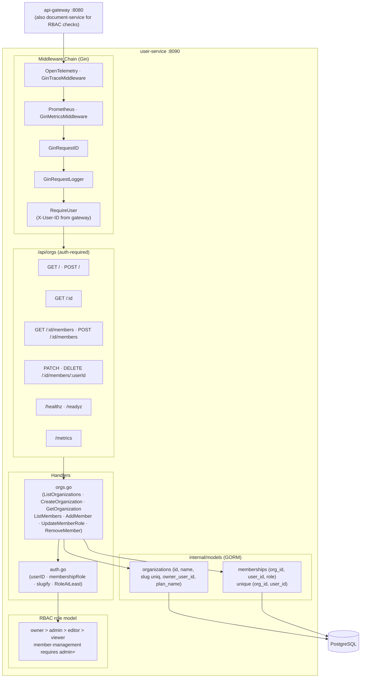
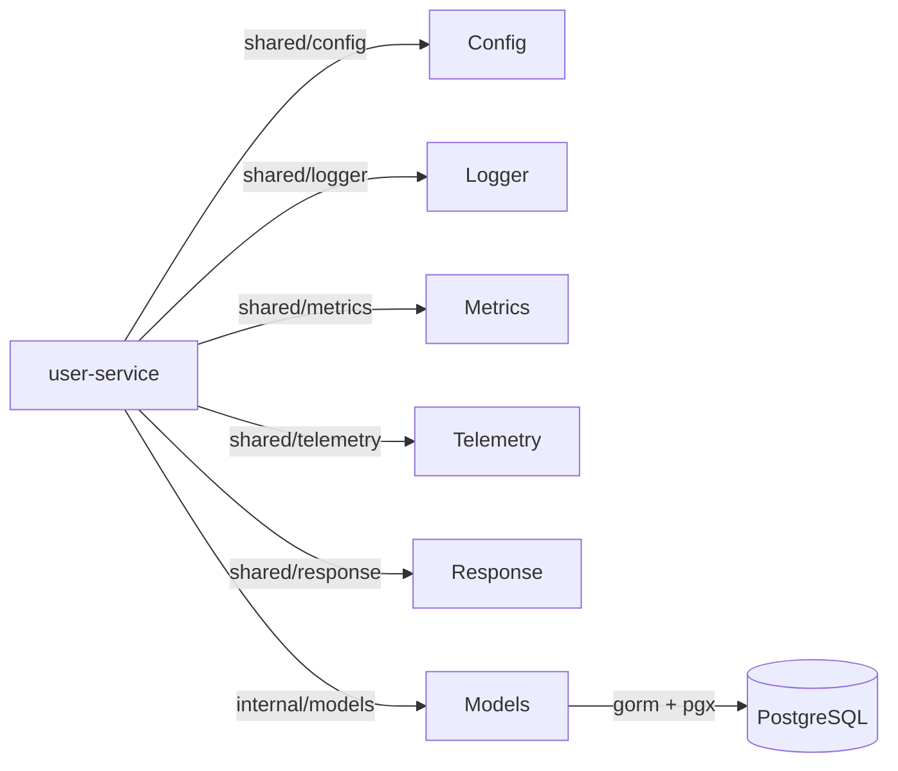

# User Service -- Architecture

Internal structure and component diagram of the `user-service` (port 8090). Owns organizations, memberships, and the RBAC role model. No NATS.

## Component Diagram

## Dependency Graph

