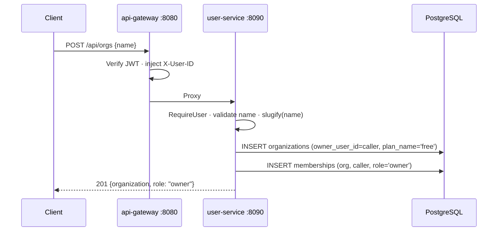
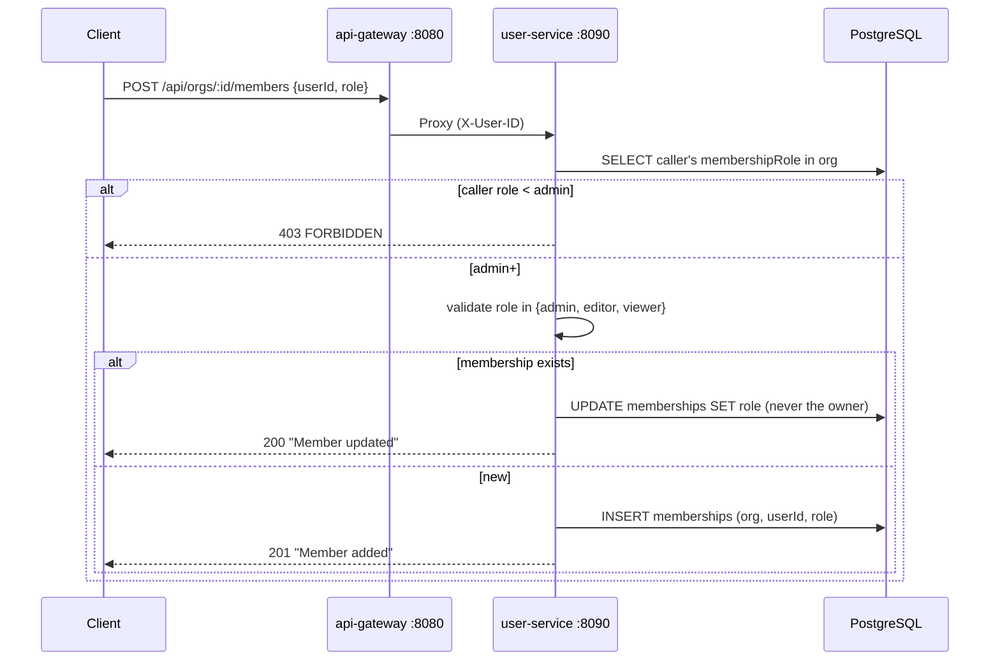
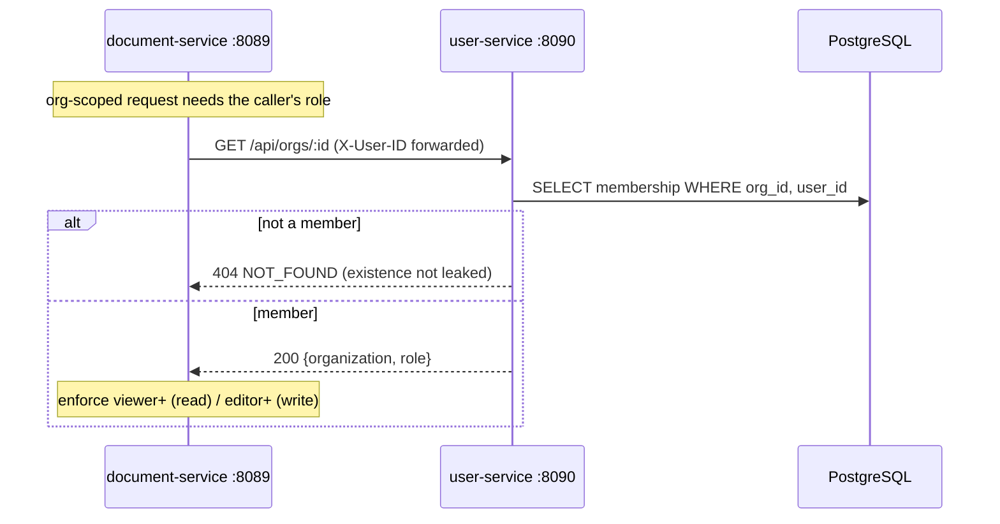

# User Service -- Sequence Diagrams

Request flows through the `user-service` (port 8090). Identity is the gateway-injected `X-User-ID`; org-level RBAC comes from the caller's membership role.

## Create Organization

## Add / Update Member (admin+)

## RBAC Check from document-service (mesh call)

