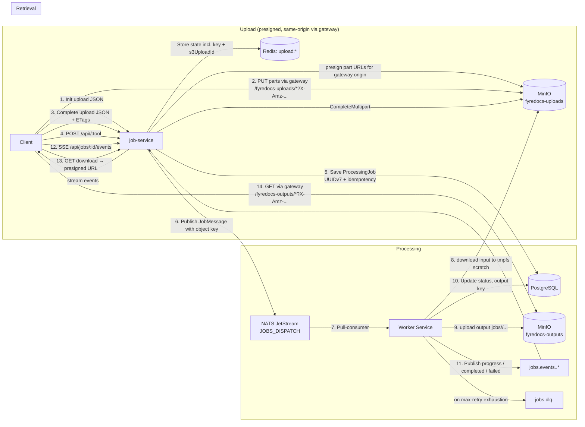
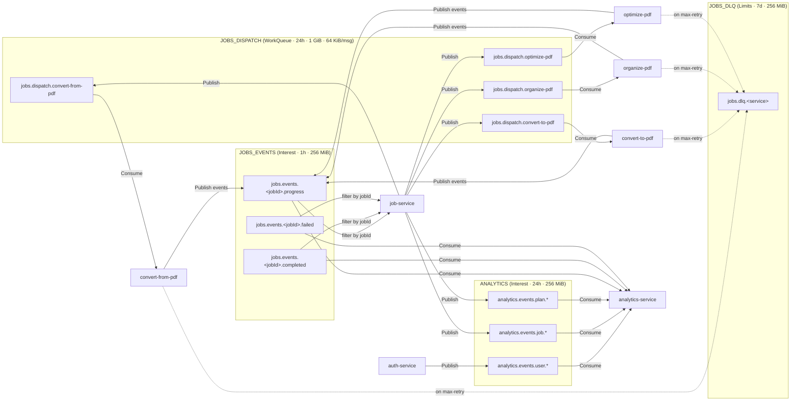
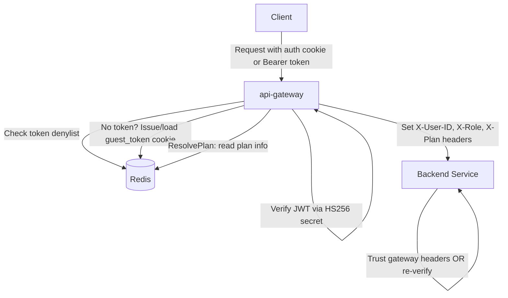
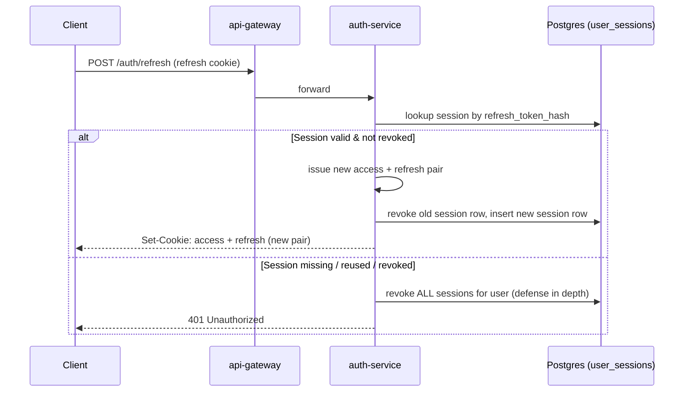

# System Overview

High-level architecture of the Fyredocs PDF processing platform.

## Service Topology

```mermaid
graph TB
    subgraph Clients
        WebApp["Web Application<br/>(React / SPA)"]
        CLI["CLI / API Consumer"]
    end

    subgraph Gateway["API Gateway :8080"]
        GW["api-gateway<br/>net/http reverse proxy<br/>JWT + guest verify, plan resolve"]
        SPA["Static SPA<br/>(when SPA_DIR set)"]
    end

    subgraph Core["Core Services"]
        AUTH["auth-service :8086<br/>Gin · DB-backed sessions"]
        JOB["job-service :8081<br/>Gin · uploads, jobs, SSE"]
    end

    subgraph Workers["Worker Services (NATS consumers)"]
        CFP["convert-from-pdf :8082<br/>pdf2docx + LibreOffice + poppler"]
        CTP["convert-to-pdf :8083<br/>LibreOffice via unoserver (concurrent)"]
        ORG["organize-pdf :8084<br/>pdfcpu + Tesseract"]
        OPT["optimize-pdf :8085<br/>Ghostscript + Tesseract"]
    end

    subgraph Analytics["Analytics"]
        AN["analytics-service :8087<br/>Gin + NATS subscriber"]
    end

    subgraph Background
        CW["cleanup-worker :8088<br/>Ticker · 4-phase cleanup<br/>(jobs · upload sessions · stale multiparts · backfill)"]
    end

    subgraph Infrastructure
        PG[(PostgreSQL)]
        RD[(Redis)]
        NATS["NATS JetStream<br/>JOBS_DISPATCH · JOBS_EVENTS · JOBS_DLQ · ANALYTICS<br/>(payloads = object keys; MaxMsgSize/MaxBytes capped)"]
        S3[("MinIO :9000 (internal)<br/>fyredocs-uploads · fyredocs-outputs<br/>bootstrap: minio-init (buckets · lifecycle · app user)")]
    end

    WebApp -->|HTTPS| GW
    CLI -->|HTTPS| GW
    WebApp -.->|SPA assets| SPA

    GW -->|/auth/*| AUTH
    GW -->|/api/upload/*| JOB
    GW -->|/api/jobs/*| JOB
    GW -->|/api/{convert,organize,optimize}-pdf/*| JOB
    GW -->|/admin/*| AN
    GW -->|plan info| RD
    GW -->|"/fyredocs-uploads/* · /fyredocs-outputs/*<br/>presigned proxy (Host preserved)"| S3

    JOB -->|jobs.dispatch.*| NATS
    NATS -->|jobs.dispatch.convert-from-pdf| CFP
    NATS -->|jobs.dispatch.convert-to-pdf| CTP
    NATS -->|jobs.dispatch.organize-pdf| ORG
    NATS -->|jobs.dispatch.optimize-pdf| OPT

    CFP -->|jobs.events.<jobId>.*| NATS
    CTP -->|jobs.events.<jobId>.*| NATS
    ORG -->|jobs.events.<jobId>.*| NATS
    OPT -->|jobs.events.<jobId>.*| NATS
    NATS -->|SSE filter consumer| JOB

    AUTH --> PG
    AUTH --> RD
    JOB --> PG
    JOB --> RD
    JOB --> NATS
    CFP --> PG
    CFP --> RD
    CTP --> PG
    CTP --> RD
    ORG --> PG
    ORG --> RD
    OPT --> PG
    OPT --> RD
    AN --> PG
    AN --> NATS
    AUTH -->|analytics.events.*| NATS
    JOB -->|analytics.events.*| NATS
    JOB -->|presign · stat · multipart| S3
    CFP -->|input download · output upload| S3
    CTP -->|input download · output upload| S3
    ORG -->|input download · output upload| S3
    OPT -->|input download · output upload| S3
    CW --> PG
    CW --> RD
    CW -->|RemoveObject · AbortMultipart| S3
    GW --> RD
```

## Data Flow Overview



## NATS JetStream Streams



## Authentication Flow



## Refresh Token Rotation


