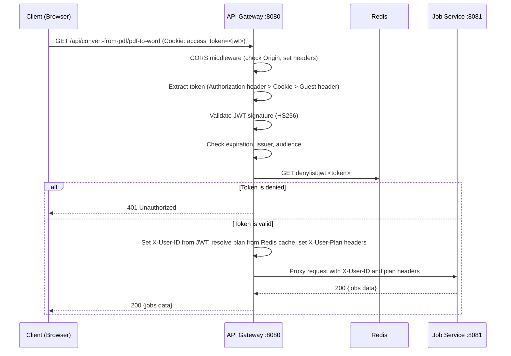
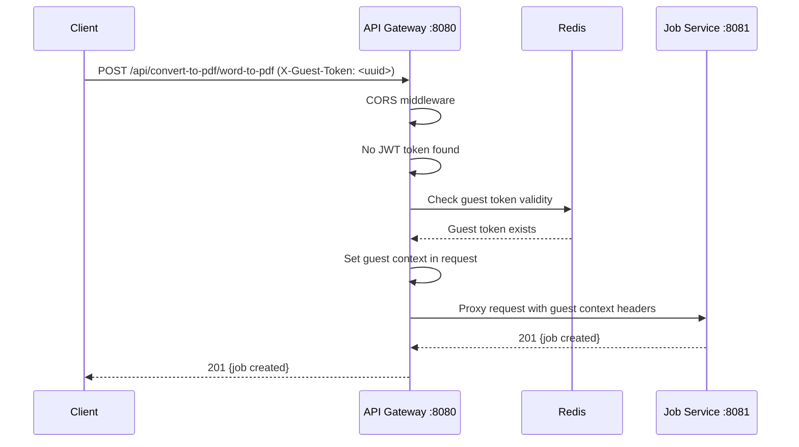
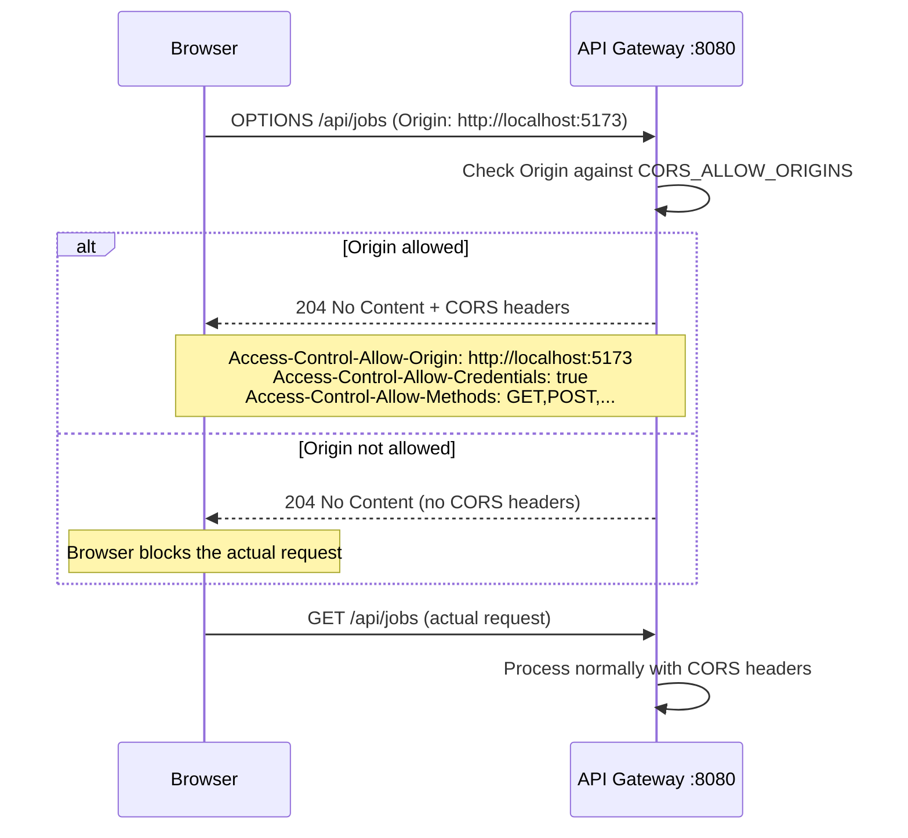
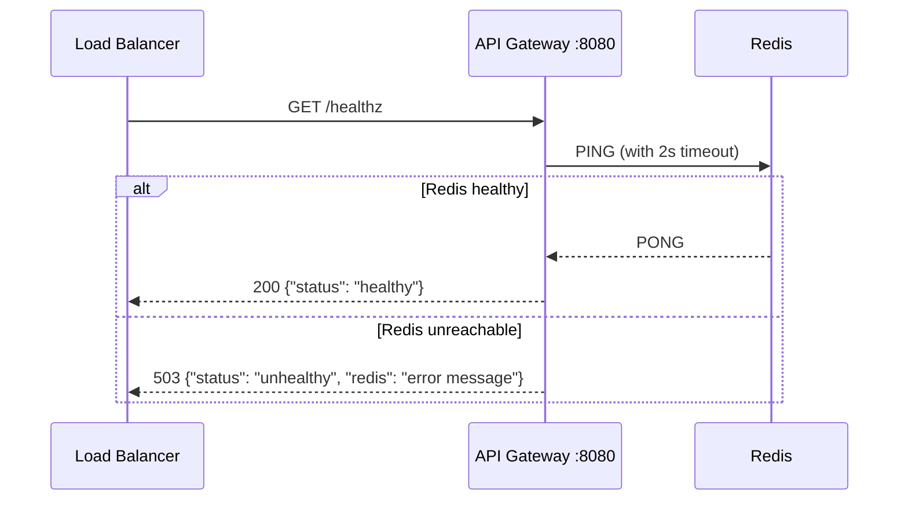

# API Gateway Service

## Overview

The API Gateway is the central entry point for all client requests to the EsyDocs backend. It handles request routing, CORS, rate limiting, and authentication middleware before forwarding requests to the appropriate backend services.

**Port**: 8080
**Type**: HTTP Reverse Proxy
**Framework**: Go net/http

## Architecture

The API Gateway acts as a reverse proxy that:
- Routes incoming HTTP requests to backend services
- Enforces CORS policies for browser clients
- Validates JWT tokens from cookies or Authorization headers
- Manages guest access tokens
- Provides centralized rate limiting
- Adds security response headers (X-Content-Type-Options, X-Frame-Options, X-XSS-Protection, Referrer-Policy, Permissions-Policy) via `withSecurityHeaders()` middleware
- Enforces request body size limit (1MB for non-upload routes) via `withMaxBodySize()` middleware
- Performs graceful shutdown with 30-second drain on SIGTERM/SIGINT

### Request Flow

```
Client Request
    ↓
[API Gateway :8080]
    ↓
Authentication Middleware
    ├─ Check Authorization header (Bearer token)
    ├─ Check access_token cookie
    └─ Check X-Guest-Token header
    ↓
Route to Backend Service
    ├─ /api/upload → upload-service:8081
    ├─ /api/convert-from-pdf → upload-service:8081
    ├─ /api/convert-to-pdf → upload-service:8081
    ├─ /api/jobs → upload-service:8081
    └─ /auth → upload-service:8081
```

## Routing Configuration

### Service Routing Map

| Path Prefix | Target Service | Purpose |
|-------------|---------------|---------|
| `/auth/*` | upload-service:8081 | Authentication endpoints |
| `/api/upload/*` | upload-service:8081 | File upload management |
| `/api/jobs/*` | upload-service:8081 | Job status and management |
| `/api/convert-from-pdf/*` | convert-from-pdf:8082 | PDF → Other formats |
| `/api/convert-to-pdf/*` | convert-to-pdf:8083 | Other formats → PDF |
| `/api/organize-pdf/*` | organize-pdf:8084 | PDF organization (merge, split, etc.) |
| `/api/optimize-pdf/*` | optimize-pdf:8085 | PDF optimization (compress, repair, OCR) |
| `/healthz` | api-gateway (local) | Health check |
| `/readyz` | api-gateway (local) | Readiness probe — verifies Redis connectivity, returns 200/503 with check details |

**Note**: The API Gateway routes requests directly to the appropriate processing service. Each service manages its own job creation, queuing, and processing through Redis queues.

### Proxy Transport Configuration

The reverse proxy uses a custom `http.Transport` tuned for long-running conversions:

| Setting | Value | Rationale |
|---------|-------|-----------|
| `ResponseHeaderTimeout` | 5 minutes | Allows long PDF conversions to complete |
| `IdleConnTimeout` | 90 seconds | Reclaim idle backend connections |
| `MaxIdleConnsPerHost` | 20 | Connection pool per backend service |
| `MaxIdleConns` | 100 | Global idle connection pool limit |

### Response Streaming

The reverse proxy sets `FlushInterval = -1` to stream responses immediately to the client without buffering. This is critical for file download performance — without it, the proxy buffers the entire upstream response before forwarding, which can add significant latency for multi-megabyte files.

## Environment Variables

### Required

| Variable | Description | Example |
|----------|-------------|---------|
| `JWT_HS256_SECRET` | **REQUIRED** - JWT signing secret (min 32 chars) | `your-64-char-hex-secret` |
| `PORT` | Gateway listening port | `8080` |
| `UPLOAD_SERVICE_URL` | Upload service base URL | `http://upload-service:8081` |
| `CONVERT_FROM_PDF_URL` | Convert From PDF service URL | `http://convert-from-pdf:8082` |
| `CONVERT_TO_PDF_URL` | Convert To PDF service URL | `http://convert-to-pdf:8083` |
| `ORGANIZE_PDF_URL` | Organize PDF service URL | `http://organize-pdf:8084` |
| `OPTIMIZE_PDF_URL` | Optimize PDF service URL | `http://optimize-pdf:8085` |
| `REDIS_ADDR` | Redis server address | `redis:6379` |

### Optional (with defaults)

#### JWT Configuration
| Variable | Description | Default |
|----------|-------------|---------|
| `JWT_ALLOWED_ALGS` | Allowed JWT algorithms | `HS256` |
| `JWT_ISSUER` | Expected token issuer | `esydocs` |
| `JWT_AUDIENCE` | Expected token audience | `esydocs-api` |
| `JWT_CLOCK_SKEW` | Allowed clock skew for token validation | `60s` |

#### Authentication
| Variable | Description | Default |
|----------|-------------|---------|
| `AUTH_GUEST_PREFIX` | Guest token Redis key prefix | `guest` |
| `AUTH_GUEST_SUFFIX` | Guest token Redis key suffix | `jobs` |
| `AUTH_DENYLIST_ENABLED` | Enable token denylist (logout) | `true` |
| `AUTH_DENYLIST_PREFIX` | Denylist Redis key prefix | `denylist:jwt` |
| `ACCESS_TOKEN_COOKIE_NAME` | Cookie name for access token | `access_token` |

#### Redis
| Variable | Description | Default |
|----------|-------------|---------|
| `REDIS_PASSWORD` | Redis password (if required) | `""` (none) |
| `REDIS_DB` | Redis database number | `0` |

#### CORS Configuration
| Variable | Description | Default |
|----------|-------------|---------|
| `CORS_ALLOW_ORIGINS` | Allowed origins (comma-separated) | `http://localhost:5173,http://localhost:3000` |
| `CORS_ALLOW_METHODS` | Allowed HTTP methods | `GET,POST,PUT,PATCH,DELETE,OPTIONS` |
| `CORS_ALLOW_HEADERS` | Allowed request headers | `Authorization,Content-Type,X-User-ID,X-Guest-Token` |
| `CORS_ALLOW_CREDENTIALS` | Allow credentials (cookies) | `true` |

## Authentication Middleware

The API Gateway validates authentication for all proxied requests using middleware that checks tokens in this priority order:

### 1. Authorization Header (Highest Priority)
```http
Authorization: Bearer eyJhbGc...
```
Used by API clients, mobile apps, and testing tools.

### 2. HTTP-Only Cookie
```http
Cookie: access_token=eyJhbGc...
```
Primary method for browser clients. Automatically sent by browsers.

### 3. Guest Token Header (Lowest Priority)
```http
X-Guest-Token: guest-token-uuid
```
For unauthenticated users accessing guest features.

### Token Validation

The middleware:
1. Extracts the token from the request
2. Validates JWT signature using `JWT_HS256_SECRET`
3. Checks token expiration
4. Verifies issuer and audience (if configured)
5. Checks token denylist (if logout was called)
6. Sets `X-User-ID`, `X-User-Plan`, `X-User-Plan-Max-File-MB`, and `X-User-Plan-Max-Files` headers for downstream services

### Plan Headers Forwarded to Downstream Services

For authenticated requests the gateway reads the user's plan info from **Redis** (key `user:plan:{userID}`, written by auth-service) and forwards:

| Header | Source | Example |
|--------|--------|---------|
| `X-User-Plan` | Redis cache `plan` | `free` |
| `X-User-Plan-Max-File-MB` | Redis cache `max_file_mb` | `25` |
| `X-User-Plan-Max-Files` | Redis cache `max_files` | `10` |

If the Redis key is missing (e.g., cache expired), defaults to the free plan (25 MB, 10 files).

For anonymous requests (no valid token, no guest token), the gateway forwards anonymous-plan defaults:

| Header | Default Value |
|--------|---------------|
| `X-User-Plan` | `anonymous` |
| `X-User-Plan-Max-File-MB` | `10` |
| `X-User-Plan-Max-Files` | `5` |

These headers are cleared from incoming client requests before proxying (`ClearUserHeaders`) to prevent spoofing.

### Bypass Paths

The following paths skip authentication:
- `/healthz` - Health check endpoint
- `/readyz` - Readiness check endpoint
- `/auth/signup` - User registration
- `/auth/login` - User login
- `/auth/plans` - Public plan listing
- OPTIONS requests (CORS preflight)

## CORS Configuration

The gateway enforces CORS policies to allow browser-based frontends to make requests.

### Production Configuration

For production, set specific origins:

```yaml
environment:
  CORS_ALLOW_ORIGINS: "https://yourdomain.com"
  CORS_ALLOW_CREDENTIALS: "true"
```

### Development Configuration

For local development with multiple frontend ports:

```yaml
environment:
  CORS_ALLOW_ORIGINS: "http://localhost:3000,http://localhost:5173"
  CORS_ALLOW_CREDENTIALS: "true"
```

### Important Notes

- **Credentials Required**: `CORS_ALLOW_CREDENTIALS` must be `true` for cookie-based authentication
- **No Wildcards**: When credentials are enabled, origins cannot be `*`
- **Exact Match**: Origins must exactly match (including protocol and port)
- **Startup Warning**: A startup warning is logged if `CORS_ALLOW_ORIGINS=*` is used with `CORS_ALLOW_CREDENTIALS=true`, as this effectively disables CORS protection.

## Deployment

### Docker Compose

The API Gateway is configured in [docker-compose.yml](../docker-compose.yml):

```yaml
api-gateway:
  build:
    context: ./api-gateway
    dockerfile: Dockerfile
  ports:
    - "8080:8080"
  environment:
    PORT: "8080"
    UPLOAD_SERVICE_URL: http://upload-service:8081
    JWT_HS256_SECRET: ${JWT_HS256_SECRET}
    # ... other env vars
  depends_on:
    - redis
    - upload-service
```

### Local Development

1. Ensure dependencies are running:
   ```bash
   docker compose up -d redis upload-service
   ```

2. Set environment variables:
   ```bash
   export JWT_HS256_SECRET=$(openssl rand -hex 32)
   export UPLOAD_SERVICE_URL=http://localhost:8081
   export REDIS_ADDR=localhost:6379
   ```

3. Run the gateway:
   ```bash
   cd api-gateway
   go run main.go
   ```

### Production Deployment

#### Security Checklist

- [ ] Generate a strong JWT secret (`openssl rand -hex 32`)
- [ ] Set specific CORS origins (no wildcards)
- [ ] Use HTTPS in production
- [ ] Update `AUTH_COOKIE_SECURE=true` (enforced by upload-service)
- [ ] Configure proper DNS/load balancer
- [ ] Enable request logging and monitoring
- [ ] Set up rate limiting at load balancer level

## Health Check

The API Gateway exposes two health endpoints:

- `/healthz` = **liveness** (is the process alive?)
- `/readyz` = **readiness** (can it serve traffic? checks all dependencies)

### Liveness: `/healthz`

```http
GET /healthz
```

**Response**: `OK` (200)

### Readiness: `/readyz`

```http
GET /readyz
```

**Response** (200 when all checks pass, 503 when any check fails):
```json
{
  "status": "ready",
  "checks": {
    "redis": "ok"
  }
}
```

Use these endpoints for:
- Docker health checks (`/healthz` for liveness probe)
- Kubernetes / load balancer readiness probes (`/readyz`)
- Monitoring system checks

## Troubleshooting

### Common Issues

#### 1. 401 Unauthorized on Valid Requests

**Symptoms**: Requests with valid tokens return 401

**Possible Causes**:
- JWT secret mismatch between services
- Token expired (check expiry time)
- Token in denylist (user logged out)
- Clock skew between services

**Solutions**:
```bash
# Check if JWT secret is set
docker compose exec api-gateway env | grep JWT_HS256_SECRET

# Verify Redis connection
docker compose exec api-gateway redis-cli -h redis ping

# Check denylist
docker compose exec redis redis-cli keys "denylist:jwt:*"
```

#### 2. CORS Errors

**Symptoms**: Browser shows CORS error in console

**Possible Causes**:
- Origin not in `CORS_ALLOW_ORIGINS`
- Credentials enabled but origin is wildcard
- Missing `credentials: 'include'` in frontend

**Solutions**:
```bash
# Check CORS configuration
docker compose exec api-gateway env | grep CORS

# Update allowed origins
docker compose up -d api-gateway
```

**Frontend fix**:
```javascript
fetch('http://localhost:8080/api/jobs', {
  credentials: 'include'  // Required!
});
```

#### 3. Service Unavailable (502/503)

**Symptoms**: Gateway returns 502 Bad Gateway or 503 Service Unavailable

**Possible Causes**:
- Upload service not running
- Upload service not healthy
- Network issues between containers

**Solutions**:
```bash
# Check service status
docker compose ps

# Check upload-service logs
docker compose logs upload-service

# Restart services
docker compose restart api-gateway upload-service
```

#### 4. Cookie Not Being Sent

**Symptoms**: Authenticated requests fail, cookie exists in browser

**Possible Causes**:
- CORS credentials not enabled
- Cookie domain mismatch
- SameSite restriction

**Solutions**:
```bash
# Verify CORS credentials
docker compose exec api-gateway env | grep CORS_ALLOW_CREDENTIALS

# Check cookie settings in upload-service
docker compose exec upload-service env | grep AUTH_COOKIE
```

### Debug Logging

To enable debug logging, add to environment:

```yaml
environment:
  LOG_LEVEL: "debug"
```

Then check logs:
```bash
docker compose logs -f api-gateway
```

## Monitoring

### Key Metrics to Monitor

- **Request Rate**: Requests per second through gateway
- **Response Times**: P50, P95, P99 latencies
- **Error Rate**: 4xx and 5xx responses
- **Service Health**: Backend service availability
- **Redis Connection**: Connection pool metrics

### Recommended Tools

- **Prometheus**: Metrics collection
- **Grafana**: Visualization
- **ELK Stack**: Log aggregation
- **Datadog/New Relic**: APM

## Sequence Diagrams

### Authenticated Request Flow



### Guest User Request Flow



### CORS Preflight Flow



### Health Check Flow



## Error Flows

### Gateway Error Responses

| Error Code | HTTP Status | Condition |
|------------|-------------|-----------|
| `401 Unauthorized` | 401 | Invalid, expired, or revoked JWT token |
| `401 Unauthorized` | 401 | Missing authentication on protected route |
| `502 Bad Gateway` | 502 | Backend service unreachable |
| `503 Service Unavailable` | 503 | Health check failed (Redis down) |
| `204 No Content` | 204 | CORS preflight response |

### Authentication Bypass Paths

The following paths skip JWT authentication:
- `/healthz` -- Health check endpoint
- `/readyz` -- Readiness check endpoint
- `/auth/signup` -- User registration
- `/auth/login` -- User login
- `/auth/plans` -- Public plan listing
- `OPTIONS` requests -- CORS preflight

### Backend Service Failure Handling

When a backend service is unreachable:
1. The reverse proxy returns 502 Bad Gateway
2. No retry is attempted at the gateway level
3. The client should retry with exponential backoff

## Related Documentation

- [Auth Service](./AUTH_SERVICE.md) - Detailed authentication documentation
- [Job Service](./JOB_SERVICE.md) - Backend service documentation
- [Main README](../README.md) - Overall architecture and deployment

## Support

For issues or questions:
- Check service logs: `docker compose logs -f api-gateway`
- Review environment variables: `docker compose exec api-gateway env`
- Verify service connectivity: `docker compose exec api-gateway ping upload-service`
